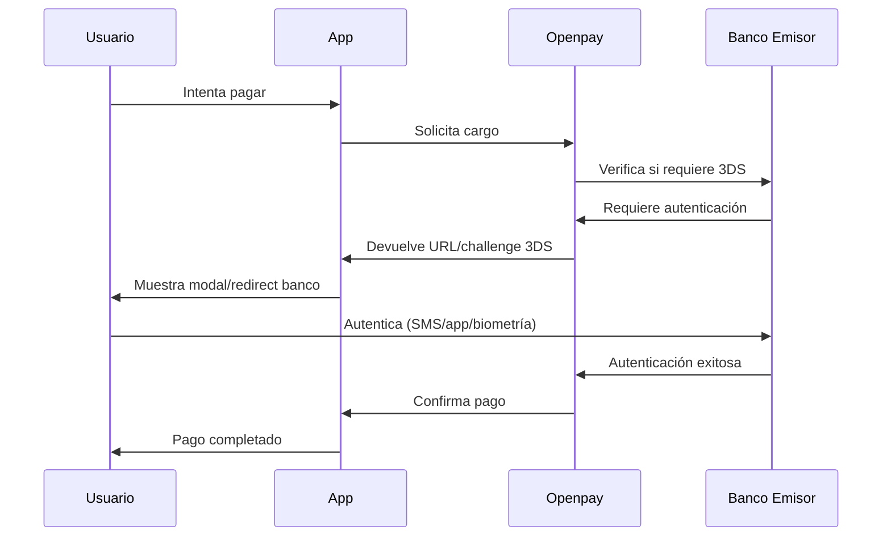
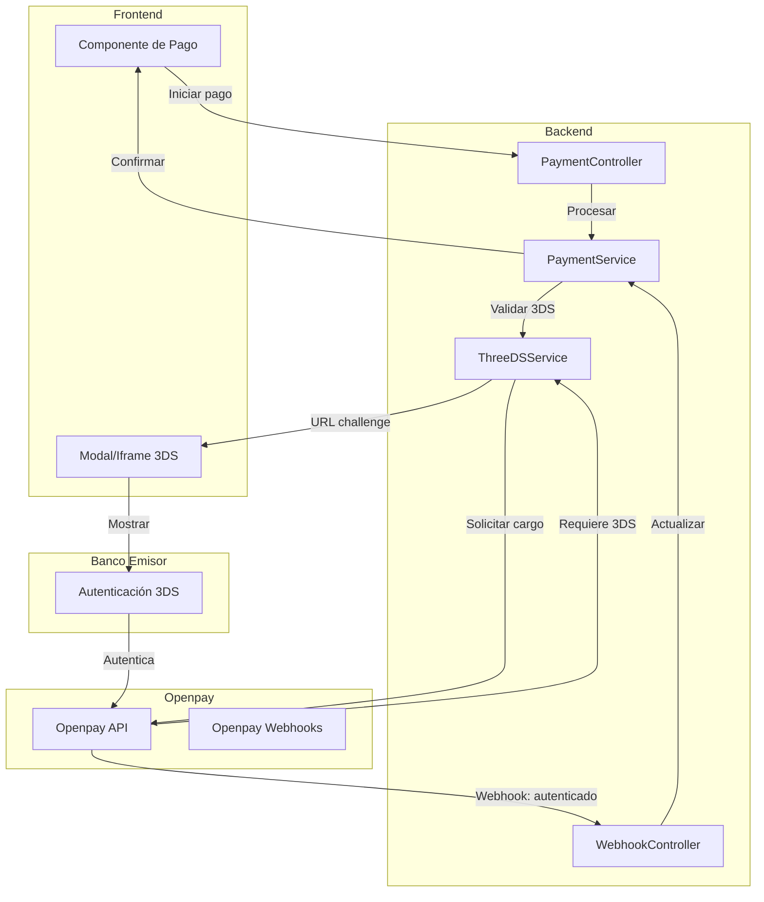
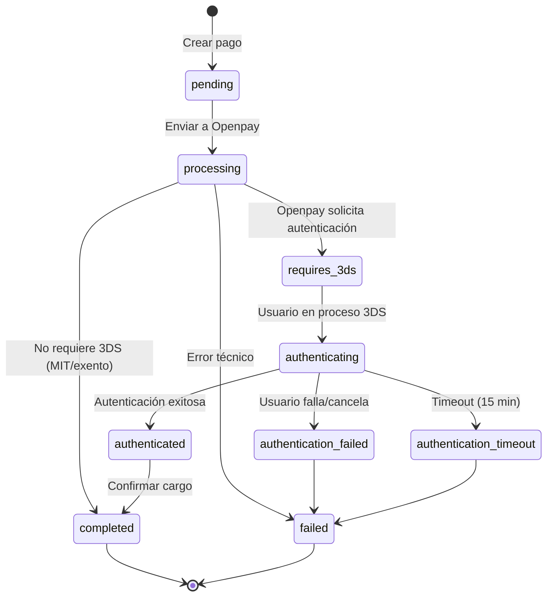
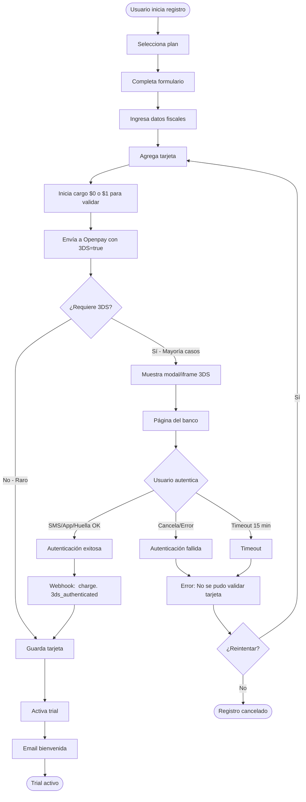
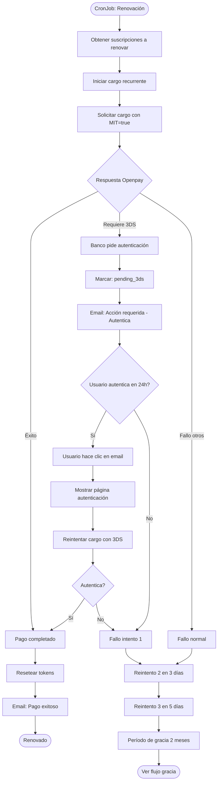
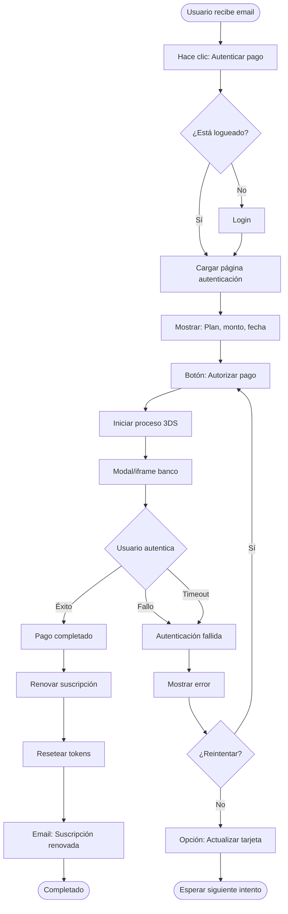

# Integración 3D Secure (3DS) con Openpay
## Sistema de Suscripciones - Agenda Médica SaaS

**Versión:** 1.0  
**Fecha:** Enero 2026  
**Autor:** Equipo Técnico

---

## 📑 Tabla de Contenidos

1. [¿Qué es 3D Secure?](#qué-es-3d-secure)
2. [¿Por qué Openpay lo exige?](#por-qué-openpay-lo-exige)
3. [Impacto en el Sistema](#impacto-en-el-sistema)
4. [Arquitectura de Integración](#arquitectura-de-integración)
5. [Flujos Detallados con 3DS](#flujos-detallados-con-3ds)
6. [Implementación Técnica](#implementación-técnica)
7. [Manejo de Errores](#manejo-de-errores)
8. [Testing y Validación](#testing-y-validación)
9. [Monitoreo y Métricas](#monitoreo-y-métricas)
10. [Preguntas Frecuentes](#preguntas-frecuentes)

---

## ¿Qué es 3D Secure?

**3D Secure (3DS)** es un protocolo de seguridad para pagos con tarjeta que añade una capa adicional de autenticación del titular de la tarjeta durante transacciones en línea.

### Versiones

**3DS 1.0 (Legacy):**
- Redirect completo a página del banco
- UX disruptiva (usuario sale del sitio)
- Tasa de abandono: 10-30%
- No optimizado para mobile

**3DS 2.0 (Actual):**
- Autenticación en iframe/modal/in-app
- Soporte para biometría (huella, Face ID)
- Más datos contextuales (menos fricción)
- Optimizado para mobile
- Tasa de abandono:  2-8%

### ¿Cómo funciona?



### Beneficios

✅ **Seguridad:** Reduce fraude hasta 70%  
✅ **Liability shift:** Responsabilidad de fraude pasa al banco  
✅ **Compliance:** Cumple normativas PSD2, regulaciones locales  
✅ **Menos chargebacks:** Reduce disputas fraudulentas  

### Desventajas

⚠️ **Fricción:** Paso adicional para el usuario  
⚠️ **Complejidad técnica:** Manejo de redirects, timeouts, estados  
⚠️ **Tasa de abandono:** Algunos usuarios abandonan en autenticación  

---

## ¿Por qué Openpay lo exige?

### Normativa y Regulaciones

**México:**
- Recomendado por Banxico desde 2023
- Bancos emisores cada vez más lo requieren
- No es obligatorio legalmente (aún), pero **Openpay lo exige para reducir fraude**

**Colombia:**
- Superintendencia Financiera lo promueve
- Algunos bancos lo requieren obligatoriamente
- **Openpay lo implementa como estándar**

### Política de Openpay

Desde **2024**, Openpay requiere 3DS en: 

✅ **Todos los primeros pagos** (alta de tarjeta)  
✅ **Pagos de alto riesgo** (monto elevado, cambio de patrón)  
⚠️ **Pagos recurrentes** (depende del banco emisor - MIT)  

### ¿Qué pasa si no lo implementas? 

❌ Rechazos de pago automáticos  
❌ Tasas de aprobación bajas (<60%)  
❌ No puedes procesar ciertos tipos de tarjetas  
❌ Penalizaciones por alto índice de fraude  

---

## Impacto en el Sistema

### Funcionalidades Afectadas

| Funcionalidad | Nivel de Impacto | Tipo de Cambio |
|---------------|------------------|----------------|
| **Registro + Trial** | 🟡 MEDIO | Agregar flujo 3DS en primer pago |
| **Primer pago (post-trial)** | 🟡 MEDIO | Requiere autenticación usuario |
| **Renovaciones automáticas** | 🔴 ALTO | MIT/exención o notificar usuario |
| **Upgrade de plan** | 🟡 MEDIO | Autenticación durante upgrade |
| **Downgrade de plan** | 🟢 NINGUNO | No cobra inmediato |
| **Reintentos de pago** | 🔴 ALTO | Distinguir fallos por 3DS requerido |
| **Período de gracia** | 🟡 MEDIO | Flujo especial si fallo fue por 3DS |
| **Reactivación** | 🟡 MEDIO | Puede requerir autenticación |
| **Pago manual (transferencia)** | 🟢 NINGUNO | No aplica |

### Cambios Requeridos

**Backend:**
- ✅ Nuevos estados de pago (`pending_3ds`, `authenticated`)
- ✅ Manejo de webhooks 3DS de Openpay
- ✅ Lógica para MIT (Merchant Initiated Transactions)
- ✅ Detección de tipo de fallo de pago
- ✅ Notificaciones de acción requerida

**Frontend:**
- ✅ Componente para mostrar iframe/modal 3DS
- ✅ Manejo de redirects (3DS 1.0)
- ✅ Callbacks después de autenticación
- ✅ Timeouts y reintentos
- ✅ UX para comunicar autenticación requerida

**Base de Datos:**
- ✅ Campos adicionales en tabla `payments`
- ✅ Estados ENUM actualizados

**Notificaciones:**
- ✅ Email #20:  "Autenticación de pago requerida"

---

## Arquitectura de Integración

### Diagrama de Componentes



### Estados de Pago con 3DS



### MIT (Merchant Initiated Transactions)

**¿Qué es MIT?**

Es una **exención de 3DS** para pagos recurrentes donde:
- El **primer pago** tuvo autenticación 3DS exitosa
- Los **pagos subsecuentes** se marcan como "iniciados por comerciante"
- El banco **puede** (no está obligado) aprobar sin 3DS

**Implementación en Openpay:**

```php
// Primer pago (requiere 3DS)
$charge = $openpay->charges->create([
    'method' => 'card',
    'source_id' => $tokenId,
    'amount' => 100,
    'currency' => 'MXN',
    'description' => 'Trial - Plan Pro',
    'use_3d_secure' => true, // Obligatorio para almacenar tarjeta
    'device_session_id' => $deviceSessionId
]);

// Pagos recurrentes subsecuentes (MIT)
$charge = $openpay->charges->create([
    'method' => 'card',
    'source_id' => $storedCardId,
    'amount' => 300,
    'currency' => 'MXN',
    'description' => 'Renovación mensual - Plan Pro',
    'use_3d_secure' => false, // MIT:  no requiere 3DS
    'mit_type' => 'recurring', // Marcar como transacción recurrente
    'merchant_initiated' => true
]);
```

**⚠️ IMPORTANTE:** El banco emisor puede **rechazar MIT** y pedir 3DS de todos modos.

---

## Flujos Detallados con 3DS

### Flujo 1: Registro + Trial con 3DS



**Código Backend (Laravel):**

```php
// PaymentService. php
public function processTrialPayment(User $user, Plan $plan, string $tokenId): Payment
{
    $payment = Payment::create([
        'user_id' => $user->id,
        'amount' => 1. 00, // Cargo de validación
        'currency' => $user->country === 'MX' ? 'MXN' : 'COP',
        'method' => 'card',
        'status' => 'pending',
        'description' => "Validación tarjeta - Trial {$plan->name}"
    ]);

    try {
        $charge = $this->openpayService->createCharge([
            'source_id' => $tokenId,
            'method' => 'card',
            'amount' => 1. 00,
            'currency' => $payment->currency,
            'description' => $payment->description,
            'use_3d_secure' => true, // OBLIGATORIO
            'device_session_id' => request()->input('device_session_id'),
            'redirect_url' => route('payments.3ds-callback', $payment->id)
        ]);

        if ($charge->status === 'charge_pending') {
            // Requiere 3DS
            $payment->update([
                'status' => 'requires_3ds',
                'three_ds_status' => 'pending',
                'three_ds_redirect_url' => $charge->payment_method->url,
                'openpay_transaction_id' => $charge->id
            ]);

            return $payment; // Frontend mostrará modal 3DS
        }

        // No requirió 3DS (raro)
        $this->handleSuccessfulPayment($payment, $charge);
        
    } catch (\Exception $e) {
        $payment->update(['status' => 'failed']);
        throw $e;
    }

    return $payment;
}
```

**Código Frontend (JavaScript):**

```javascript
// payment.js
async function processTrialPayment(planId, cardData) {
    try {
        // 1. Tokenizar tarjeta con Openpay. js
        const deviceSessionId = OpenPay.deviceData.setup();
        const token = await tokenizeCard(cardData);
        
        // 2. Enviar al backend
        const response = await fetch('/api/payments/trial', {
            method: 'POST',
            headers: { 'Content-Type': 'application/json' },
            body: JSON.stringify({
                plan_id: planId,
                token_id: token. id,
                device_session_id: deviceSessionId
            })
        });
        
        const payment = await response.json();
        
        // 3. Verificar si requiere 3DS
        if (payment.status === 'requires_3ds') {
            // Mostrar modal/iframe 3DS
            await show3DSChallenge(payment. three_ds_redirect_url, payment.id);
        } else if (payment.status === 'completed') {
            // Éxito directo (raro)
            showSuccess('Trial activado');
        }
        
    } catch (error) {
        showError('Error al procesar pago:  ' + error.message);
    }
}

function show3DSChallenge(url, paymentId) {
    return new Promise((resolve, reject) => {
        // Opción A: Redirect completo (3DS 1.0)
        window.location.href = url;
        
        // Opción B: Modal/iframe (3DS 2.0 - preferido)
        const modal = document.getElementById('3ds-modal');
        const iframe = document.getElementById('3ds-iframe');
        
        iframe.src = url;
        modal.style.display = 'block';
        
        // Escuchar callback
        window.addEventListener('message', function handler(event) {
            if (event.data.type === '3ds-complete') {
                window.removeEventListener('message', handler);
                modal.style.display = 'none';
                
                // Verificar resultado
                checkPaymentStatus(paymentId).then(resolve).catch(reject);
            }
        });
        
        // Timeout 15 minutos
        setTimeout(() => {
            reject(new Error('Timeout de autenticación'));
        }, 15 * 60 * 1000);
    });
}
```

---

### Flujo 2: Renovación Automática con MIT



**Código Backend:**

```php
// Jobs/ProcessSubscriptionRenewal.php
public function handle()
{
    $subscriptions = Subscription::where('next_billing_date', '<=', now())
        ->where('status', 'active')
        ->get();

    foreach ($subscriptions as $subscription) {
        try {
            $payment = $this->paymentService->processRecurringPayment($subscription);
            
            if ($payment->status === 'requires_3ds') {
                // Banco requiere autenticación
                $this->handleAuthenticationRequired($subscription, $payment);
            }
            
        } catch (\Exception $e) {
            Log::error('Renewal failed', [
                'subscription_id' => $subscription->id,
                'error' => $e->getMessage()
            ]);
        }
    }
}

private function handleAuthenticationRequired(Subscription $subscription, Payment $payment)
{
    $payment->update([
        'authentication_required_notified_at' => now()
    ]);
    
    // Email al usuario
    Mail::to($subscription->user)->send(
        new PaymentAuthenticationRequired($subscription, $payment)
    );
    
    // No marcar como fallo inmediato, dar 24h
    // Si no autentica, el CronJob de verificación lo procesará
}
```

---

### Flujo 3: Usuario Autentica Pago Pendiente



**Rutas y Controlador:**

```php
// routes/web.php
Route::get('/payments/{payment}/authenticate', [PaymentController::class, 'showAuthenticationPage'])
    ->name('payments.authenticate')
    ->middleware('auth');

Route::post('/payments/{payment}/retry-with-auth', [PaymentController::class, 'retryWithAuthentication'])
    ->name('payments.retry-auth')
    ->middleware('auth');

// PaymentController. php
public function showAuthenticationPage(Payment $payment)
{
    // Validar que el pago pertenece al usuario
    abort_unless($payment->subscription->user_id === auth()->id(), 403);
    
    abort_unless($payment->status === 'requires_3ds', 404);
    
    return view('payments.authenticate', [
        'payment' => $payment,
        'subscription' => $payment->subscription,
        'plan' => $payment->subscription->plan
    ]);
}

public function retryWithAuthentication(Payment $payment)
{
    abort_unless($payment->subscription->user_id === auth()->id(), 403);
    
    try {
        $charge = $this->openpayService->retryCharge($payment->openpay_transaction_id, [
            'use_3d_secure' => true,
            'redirect_url' => route('payments.3ds-callback', $payment->id)
        ]);
        
        if ($charge->status === 'charge_pending') {
            $payment->update([
                'three_ds_redirect_url' => $charge->payment_method->url,
                'three_ds_status' => 'pending'
            ]);
            
            return response()->json([
                'requires_3ds' => true,
                'redirect_url' => $charge->payment_method->url
            ]);
        }
        
        // Pago exitoso directo
        $this->paymentService->handleSuccessfulPayment($payment, $charge);
        
        return response()->json(['status' => 'completed']);
        
    } catch (\Exception $e) {
        return response()->json(['error' => $e->getMessage()], 500);
    }
}
```

---

## Implementación Técnica

### Cambios en Base de Datos

```sql
-- Agregar campos 3DS a tabla payments
ALTER TABLE payments 
ADD COLUMN requires_3ds BOOLEAN DEFAULT FALSE COMMENT '¿El pago requiere autenticación 3DS?',
ADD COLUMN three_ds_status ENUM('not_required', 'pending', 'authenticated', 'failed', 'timeout') DEFAULT 'not_required',
ADD COLUMN three_ds_redirect_url VARCHAR(500) NULL COMMENT 'URL del banco para autenticación',
ADD COLUMN three_ds_version VARCHAR(10) NULL COMMENT 'Versión de 3DS (1.0 o 2.0)',
ADD COLUMN authentication_required_notified_at TIMESTAMP NULL COMMENT 'Cuándo se notificó al usuario',
ADD INDEX idx_3ds_status (three_ds_status),
ADD INDEX idx_auth_notified (authentication_required_notified_at);

-- Actualizar ENUM de status para incluir nuevos estados
ALTER TABLE payments 
MODIFY COLUMN status ENUM(
    'pending',
    'processing',
    'requires_3ds',
    'authenticating',
    'authenticated',
    'completed',
    'failed',
    'refunded',
    'cancelled'
) NOT NULL DEFAULT 'pending';

-- Agregar campo MIT a subscriptions
ALTER TABLE subscriptions
ADD COLUMN mit_enabled BOOLEAN DEFAULT FALSE COMMENT 'Merchant Initiated Transaction habilitado',
ADD COLUMN first_payment_3ds_completed BOOLEAN DEFAULT FALSE COMMENT 'Primer pago con 3DS exitoso';
```

### Webhooks de Openpay

**Webhook 1: charge.pending (Requiere 3DS)**

```json
{
  "type": "charge.pending",
  "event_date": "2026-01-09T10:30:00Z",
  "data": {
    "id": "tr4n54ct10n1d",
    "status": "charge_pending",
    "amount":  300.00,
    "currency":  "MXN",
    "order_id": "payment_123",
    "payment_method": {
      "type": "redirect",
      "url": "https://sandbox-api.openpay.mx/v1/threed-secure/.. .",
      "requires_3d_secure": true
    },
    "3d_secure":  {
      "version": "2.0",
      "challenge_required": true
    }
  }
}
```

**Handler:**

```php
// WebhookController.php
public function handleChargePending(array $data)
{
    $payment = Payment::where('openpay_transaction_id', $data['id'])->firstOrFail();
    
    if ($data['payment_method']['requires_3d_secure']) {
        $payment->update([
            'status' => 'requires_3ds',
            'three_ds_status' => 'pending',
            'three_ds_redirect_url' => $data['payment_method']['url'],
            'three_ds_version' => $data['3d_secure']['version'] ?? '1.0',
            'requires_3ds' => true
        ]);
        
        event(new PaymentRequiresAuthentication($payment));
    }
}
```

**Webhook 2: charge.succeeded (Autenticación exitosa)**

```json
{
  "type": "charge.succeeded",
  "event_date": "2026-01-09T10:35:00Z",
  "data": {
    "id": "tr4n54ct10n1d",
    "status": "completed",
    "amount": 300.00,
    "currency": "MXN",
    "3d_secure": {
      "authenticated": true,
      "eci": "05"
    }
  }
}
```

**Handler:**

```php
public function handleChargeSucceeded(array $data)
{
    $payment = Payment::where('openpay_transaction_id', $data['id'])->firstOrFail();
    
    $payment->update([
        'status' => 'completed',
        'three_ds_status' => 'authenticated',
        'paid_at' => now()
    ]);
    
    // Activar/renovar suscripción
    $this->subscriptionService->activateFromPayment($payment);
    
    event(new PaymentSuccessful($payment));
}
```

**Webhook 3: charge.failed (Autenticación fallida)**

```json
{
  "type": "charge.failed",
  "event_date": "2026-01-09T10:40:00Z",
  "data": {
    "id": "tr4n54ct10n1d",
    "status": "failed",
    "error_code": "3001",
    "description": "3D Secure authentication failed",
    "3d_secure": {
      "authenticated": false,
      "reason": "user_cancelled"
    }
  }
}
```

**Handler:**

```php
public function handleChargeFailed(array $data)
{
    $payment = Payment::where('openpay_transaction_id', $data['id'])->firstOrFail();
    
    $is3DSFailure = isset($data['3d_secure']) && ! $data['3d_secure']['authenticated'];
    
    $payment->update([
        'status' => 'failed',
        'three_ds_status' => $is3DSFailure ? 'failed' : 'not_required',
        'error_code' => $data['error_code'],
        'error_message' => $data['description']
    ]);
    
    // Si es fallo por 3DS, lógica diferente a fallo por fondos
    if ($is3DSFailure) {
        event(new PaymentAuthenticationFailed($payment));
    } else {
        event(new PaymentFailed($payment));
    }
}
```

### Eventos Laravel

```php
// Events/PaymentRequiresAuthentication.php
class PaymentRequiresAuthentication
{
    public Payment $payment;
    
    public function __construct(Payment $payment)
    {
        $this->payment = $payment;
    }
}

// Listeners/SendAuthenticationRequiredNotification.php
class SendAuthenticationRequiredNotification
{
    public function handle(PaymentRequiresAuthentication $event)
    {
        $payment = $event->payment;
        $user = $payment->subscription->user;
        
        Mail::to($user)->send(new PaymentAuthenticationRequired($payment));
        
        // Opcionalmente:  SMS, push notification
        if ($user->phone) {
            SMS::send($user->phone, "Tu pago requiere autenticación.  Ingresa aquí: " . route('payments.authenticate', $payment->id));
        }
    }
}
```

### Jobs

```php
// Jobs/CheckPending3DSPayments.php
class CheckPending3DSPayments implements ShouldQueue
{
    public function handle()
    {
        // Pagos que llevan más de 15 minutos en autenticación (timeout)
        $timedOutPayments = Payment::where('status', 'requires_3ds')
            ->where('updated_at', '<', now()->subMinutes(15))
            ->get();
        
        foreach ($timedOutPayments as $payment) {
            $payment->update([
                'status' => 'failed',
                'three_ds_status' => 'timeout',
                'error_message' => 'Authentication timeout'
            ]);
            
            event(new PaymentAuthenticationTimeout($payment));
        }
        
        // Pagos que llevan más de 24h sin autenticar (primera notificación)
        $pendingPayments = Payment::where('status', 'requires_3ds')
            ->where('three_ds_status', 'pending')
            ->whereNull('authentication_required_notified_at')
            ->where('created_at', '<', now()->subHours(24))
            ->get();
        
        foreach ($pendingPayments as $payment) {
            // Marcar como intento fallido y proceder con reintentos normales
            $this->paymentService->handleFailedPayment($payment, '3DS authentication not completed');
        }
    }
}
```

---

## Manejo de Errores

### Códigos de Error 3DS de Openpay

| Código | Descripción | Acción Recomendada |
|--------|-------------|-------------------|
| `3001` | 3DS authentication failed | Usuario canceló o falló autenticación → Reintentar |
| `3002` | 3DS timeout | Usuario no completó en tiempo → Reintentar |
| `3003` | 3DS not available | Banco no soporta 3DS → Intentar sin 3DS (MIT) |
| `3004` | Card not enrolled in 3DS | Tarjeta no inscrita → Intentar sin 3DS |
| `3005` | Technical error 3DS | Error técnico → Reintentar más tarde |

### Estrategia de Reintentos

```php
public function handleFailedPayment(Payment $payment, string $reason)
{
    $attempt = PaymentRetry::where('payment_id', $payment->id)->count() + 1;
    
    PaymentRetry::create([
        'payment_id' => $payment->id,
        'attempt' => $attempt,
        'tried_at' => now(),
        'result' => $reason
    ]);
    
    if ($attempt < 3) {
        // Programar reintento
        $retryAt = $this->calculateRetryTime($attempt);
        
        ProcessPaymentRetry::dispatch($payment)->delay($retryAt);
        
        Mail::to($payment->subscription->user)->send(
            new PaymentRetryScheduled($payment, $retryAt)
        );
    } else {
        // Entrar en período de gracia
        $this->enterGracePeriod($payment->subscription);
    }
}

private function calculateRetryTime(int $attempt): Carbon
{
    return match($attempt) {
        1 => now()->addDays(3),  // Primer reintento:  3 días
        2 => now()->addDays(5),  // Segundo reintento: 5 días
        default => now()->addWeek()
    };
}
```

---

## Testing y Validación

### Tarjetas de Prueba Openpay (Sandbox)

**Tarjetas que REQUIEREN 3DS:**

```
Visa: 4111 1111 1111 1111
MasterCard: 5555 5555 5555 4444
CVV: 123
Exp: 12/25
Nombre: Juan Pérez

Resultado:  Requiere 3DS → Autenticación exitosa
```

**Tarjetas que FALLAN 3DS:**

```
Visa: 4000 0000 0000 0002
Resultado: Requiere 3DS → Autenticación fallida (usuario cancela)
```

**Tarjetas que NO requieren 3DS (exentas):**

```
Visa: 4242 4242 4242 4242
Resultado: Aprobado sin 3DS
```

### Casos de Prueba

**TC-3DS-001: Registro con 3DS exitoso**
```
DADO que un usuario nuevo se registra
CUANDO agrega una tarjeta que requiere 3DS
Y completa la autenticación exitosamente
ENTONCES el trial se activa
Y la tarjeta queda guardada para pagos futuros
```

**TC-3DS-002: Registro con 3DS fallido**
```
DADO que un usuario nuevo se registra
CUANDO agrega una tarjeta que requiere 3DS
Y cancela o falla la autenticación
ENTONCES el registro NO se completa
Y el usuario puede reintentar con otra tarjeta
```

**TC-3DS-003: Renovación automática con MIT exitoso**
```
DADO que una suscripción tiene fecha de renovación hoy
Y el primer pago tuvo 3DS exitoso
CUANDO el CronJob procesa la renovación
ENTONCES el pago se aprueba sin requerir 3DS (MIT)
Y la suscripción se renueva automáticamente
```

**TC-3DS-004: Renovación que requiere 3DS**
```
DADO que una suscripción tiene fecha de renovación hoy
CUANDO el banco rechaza MIT y pide 3DS
ENTONCES el sistema envía email al usuario
Y el pago queda en estado "requires_3ds"
CUANDO el usuario hace clic y autentica
ENTONCES el pago se completa y la suscripción se renueva
```

**TC-3DS-005: Timeout de autenticación**
```
DADO que un pago requiere 3DS
CUANDO el usuario NO completa la autenticación en 15 minutos
ENTONCES el pago se marca como fallido por timeout
Y se procede con lógica de reintentos normal
```

### Script de Prueba Automatizado

```php
// tests/Feature/ThreeDSecurePaymentTest.php
class ThreeDSecurePaymentTest extends TestCase
{
    use RefreshDatabase;
    
    /** @test */
    public function trial_payment_requires_3ds_authentication()
    {
        $user = User::factory()->create();
        $plan = Plan::factory()->create();
        
        // Mock Openpay response
        $this->mockOpenpay([
            'status' => 'charge_pending',
            'payment_method' => [
                'requires_3d_secure' => true,
                'url' => 'https://bank.com/3ds'
            ]
        ]);
        
        $response = $this->actingAs($user)
            ->postJson('/api/payments/trial', [
                'plan_id' => $plan->id,
                'token_id' => 'tok_test'
            ]);
        
        $response->assertOk();
        $response->assertJson([
            'status' => 'requires_3ds',
            'three_ds_redirect_url' => 'https://bank.com/3ds'
        ]);
        
        $this->assertDatabaseHas('payments', [
            'user_id' => $user->id,
            'status' => 'requires_3ds',
            'three_ds_status' => 'pending'
        ]);
    }
    
    /** @test */
    public function webhook_completes_payment_after_successful_3ds()
    {
        $payment = Payment::factory()->create([
            'status' => 'requires_3ds',
            'three_ds_status' => 'pending'
        ]);
        
        $webhookPayload = [
            'type' => 'charge.succeeded',
            'data' => [
                'id' => $payment->openpay_transaction_id,
                'status' => 'completed',
                '3d_secure' => ['authenticated' => true]
            ]
        ];
        
        $this->postJson('/webhooks/openpay', $webhookPayload);
        
        $payment->refresh();
        
        $this->assertEquals('completed', $payment->status);
        $this->assertEquals('authenticated', $payment->three_ds_status);
        $this->assertNotNull($payment->paid_at);
    }
}
```

---

## Monitoreo y Métricas

### Métricas Clave a Monitorear

| Métrica | Objetivo | Alerta si |
|---------|----------|-----------|
| **Tasa de autenticación 3DS exitosa** | >85% | <80% |
| **Tasa de abandono en 3DS** | <15% | >20% |
| **Tiempo promedio de autenticación** | <2 min | >5 min |
| **% pagos que requieren 3DS** | Benchmark | Cambio súbito ±20% |
| **% MIT exitosos (sin 3DS)** | >70% | <60% |
| **Timeouts de autenticación** | <5% | >10% |

### Dashboard de Monitoreo

```php
// Queries para métricas
// Tasa de éxito 3DS
$threeDSSuccessRate = Payment::where('requires_3ds', true)
    ->where('created_at', '>=', now()->subDays(30))
    ->selectRaw('
        COUNT(*) as total,
        SUM(CASE WHEN three_ds_status = "authenticated" THEN 1 ELSE 0 END) as authenticated,
        (SUM(CASE WHEN three_ds_status = "authenticated" THEN 1 ELSE 0 END) / COUNT(*)) * 100 as success_rate
    ')
    ->first();

// Tasa de abandono
$abandonRate = Payment::where('requires_3ds', true)
    ->where('created_at', '>=', now()->subDays(30))
    ->where('three_ds_status', 'timeout')
    ->count() / Payment::where('requires_3ds', true)->where('created_at', '>=', now()->subDays(30))->count() * 100;

// Tiempo promedio de autenticación
$avgAuthTime = Payment::where('requires_3ds', true)
    ->where('three_ds_status', 'authenticated')
    ->selectRaw('AVG(TIMESTAMPDIFF(SECOND, created_at, updated_at)) as avg_seconds')
    ->first()->avg_seconds;
```

### Logs Estructurados

```php
Log::channel('payments')->info('3DS authentication required', [
    'payment_id' => $payment->id,
    'user_id' => $payment->subscription->user_id,
    'amount' => $payment->amount,
    'currency' => $payment->currency,
    '3ds_version' => $payment->three_ds_version,
    'openpay_transaction_id' => $payment->openpay_transaction_id
]);

Log::channel('payments')->info('3DS authentication completed', [
    'payment_id' => $payment->id,
    'duration_seconds' => $payment->updated_at->diffInSeconds($payment->created_at),
    'result' => $payment->three_ds_status
]);
```

---

## Preguntas Frecuentes

### ¿Todos los pagos requieren 3DS? 

**No. ** Depende de:
- **Primer pago:** Casi siempre requiere 3DS (Openpay lo exige)
- **Pagos recurrentes:** MIT (exención) permite NO requerir 3DS, pero el banco puede pedirlo
- **Monto:** Pagos de alto monto tienen más probabilidad de requerir 3DS
- **Comportamiento:** Cambios en patrón de compra pueden activar 3DS

### ¿Qué pasa si un usuario no puede completar 3DS?

1. **Opción 1:** Intentar con otra tarjeta
2. **Opción 2:** Pago manual con transferencia bancaria
3. **Opción 3:** Contactar soporte para ayuda

### ¿Cuánto tiempo tiene el usuario para autenticar?

**15 minutos** desde que se inicia el proceso 3DS.  Después, timeout automático.

### ¿Puedo desactivar 3DS? 

**No.** Openpay lo requiere obligatoriamente para: 
- Cumplimiento normativo
- Reducción de fraude
- Protección de chargebacks

### ¿3DS afectará mis tasas de conversión?

**Impacto esperado:**
- **3DS 1.0:** -10% a -30% conversión (por fricción)
- **3DS 2.0:** -2% a -8% conversión (mejor UX)

**Mitigación:**
- Usar 3DS 2.0 (modal, no redirect)
- UX clara y tranquilizadora
- Mensajes de "Autenticación por tu seguridad"
- Soporte en tiempo real

### ¿Qué bancos son más estrictos con 3DS?

**En México:**
- BBVA: Muy estricto (casi siempre pide 3DS)
- Santander: Medio
- Banorte: Medio
- Citibanamex: Medio-bajo

**En Colombia:**
- Bancolombia: Estricto
- Davivienda: Medio
- Banco de Bogotá: Medio

*Esto puede cambiar según políticas de cada banco.*

---

## Recursos Adicionales

**Documentación Oficial Openpay:**
- [3D Secure México](https://www.openpay.mx/docs/3d-secure. html)
- [3D Secure Colombia](https://www.openpay.co/docs/3d-secure.html)

**Preguntas Técnicas para Openpay:**
```
1. ¿Qué versión de 3DS soportan actualmente?  (1.0, 2.0, ambas)
2. ¿Cómo implementar 3DS 2.0 con iframe/modal en lugar de redirect?
3. ¿Qué porcentaje de transacciones requieren 3DS en MX y CO actualmente?
4. ¿Cómo funciona MIT exactamente?  ¿Garantías de aprobación?
5. ¿Webhooks específicos para eventos 3DS?
6. ¿Tiempo de timeout configurable?
7. ¿Recomendaciones para optimizar tasa de aprobación con 3DS?
```

**Contacto Soporte Openpay:**
- México: soporte@openpay.mx
- Colombia: soporte@openpay.co
- Teléfono MX: +52 55 xxxx xxxx
- Teléfono CO: +57 1 xxxx xxxx

---

**Versión:** 1.0  
**Última actualización:** Enero 2026  
**Próxima revisión:** Trimestral (o al cambiar políticas de Openpay)

---