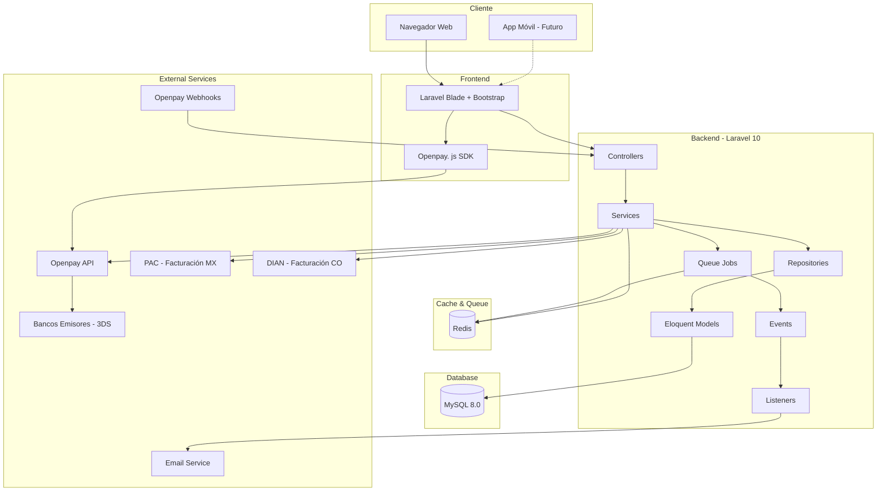
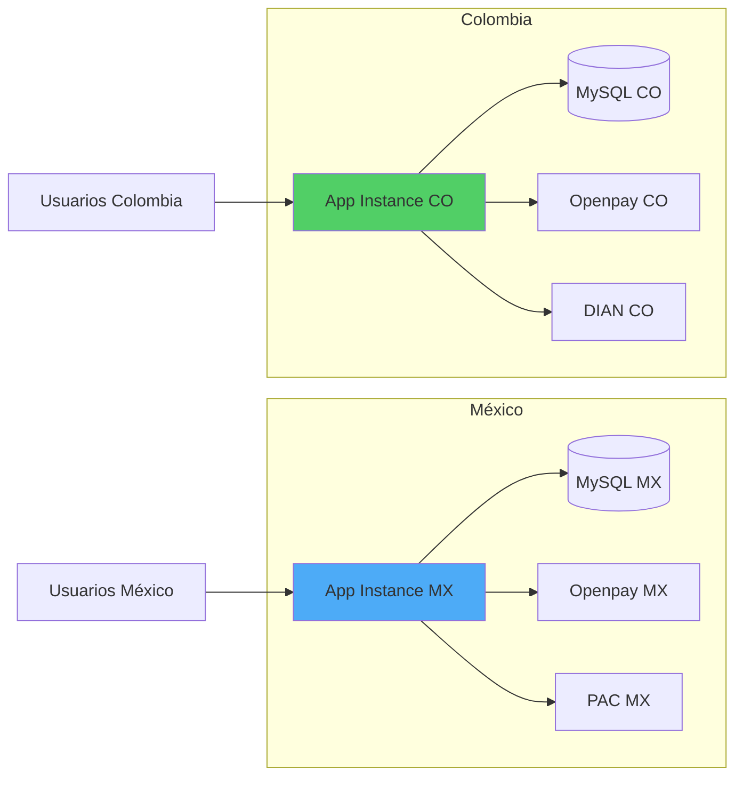
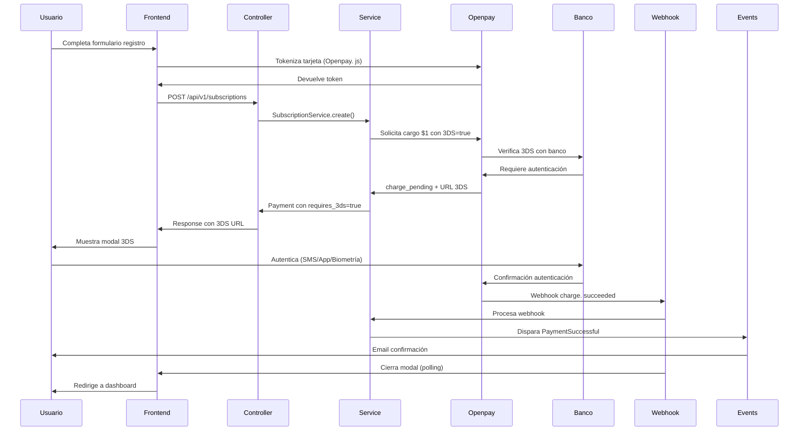
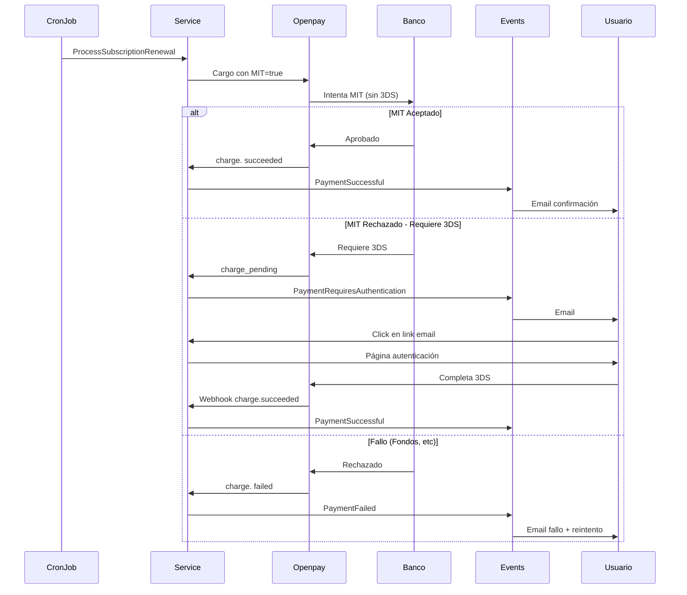

# Arquitectura del Sistema
## Sistema de Suscripciones - Agenda Médica SaaS

**Versión:** 1.1  
**Fecha:** Enero 2026  
**Actualización:** Componentes 3D Secure (3DS)

---

## 📑 Tabla de Contenidos

1. [Visión General](#visión-general)
2. [Diagrama de Arquitectura](#diagrama-de-arquitectura)
3. [Componentes del Sistema](#componentes-del-sistema)
4. [Capas de la Aplicación](#capas-de-la-aplicación)
5. [Flujo de Datos](#flujo-de-datos)
6. [Integraciones Externas](#integraciones-externas)
7. [Jobs y Colas](#jobs-y-colas)
8. [Eventos y Listeners](#eventos-y-listeners)
9. [Servicios](#servicios)
10. [Seguridad](#seguridad)
11. [Escalabilidad](#escalabilidad)
12. [Deployment](#deployment)

---

## Visión General

### Stack Tecnológico

**Backend:**
- Framework: Laravel 10.x
- Lenguaje: PHP 8.1+
- Base de Datos: MySQL 8.0
- Cache: Redis
- Queue: Redis Queue

**Frontend:**
- Framework: Bootstrap 5.x (CSS)
- JavaScript:  Vanilla JS + Alpine.js (opcional)
- Templating: Blade (Laravel)

**Infraestructura:**
- Servidor: Apache/Nginx
- OS: Linux (Ubuntu 22.04 LTS)
- Hosting: VPS / Cloud (DigitalOcean, AWS, Linode)
- Storage: Local Filesystem / S3 (futuro)

**Integraciones:**
- Pagos: Openpay (México y Colombia)
- Email:  SMTP / Mailgun / SendGrid
- Facturación: PAC (México) / DIAN (Colombia) - Externo

### Principios de Arquitectura

✅ **SOLID Principles**
✅ **DDD (Domain-Driven Design)** - Parcial
✅ **Repository Pattern**
✅ **Service Pattern**
✅ **Event-Driven Architecture**
✅ **API-First Approach**
✅ **Separation of Concerns**

---

## Diagrama de Arquitectura

### Arquitectura de Alto Nivel



### Arquitectura Multi-País



**Características:**
- 2 instancias independientes (no multi-tenancy)
- Base de datos separada por país
- Configuración de Openpay separada (API keys diferentes)
- Código compartido, configuración diferente

---

## Componentes del Sistema

### 1. Controllers

**Responsabilidad:** Manejar requests HTTP, validar input, delegar a Services, devolver responses. 

```
app/Http/Controllers/
├── Api/
│   ├── AuthController.php
│   ├── SubscriptionController.php
│   ├── PaymentController.php        # 🔒 Incluye endpoints 3DS
│   ├── TokenController.php
│   ├── CouponController.php
│   ├── ReferralController.php
│   └── InvoiceController.php
├── Admin/
│   ├── DashboardController.php
│   ├── UserManagementController.php
│   ├── PlanManagementController.php
│   ├── CouponManagementController.php
│   └── InvoiceManagementController.php
├── WebhookController.php            # 🔒 Procesa webhooks Openpay (3DS)
└── Web/
    ├── DashboardController.php
    ├── ProfileController.php
    └── SubscriptionManagementController.php
```

**Ejemplo:  PaymentController**
```php
<?php

namespace App\Http\Controllers\Api;

use App\Http\Controllers\Controller;
use App\Services\PaymentService;
use Illuminate\Http\Request;

class PaymentController extends Controller
{
    public function __construct(
        private PaymentService $paymentService
    ) {}
    
    /**
     * 🆕 Reintentar pago con autenticación 3DS
     */
    public function retryWithAuthentication(Request $request, $paymentId)
    {
        $request->validate([
            'user_id' => 'required|exists:users,id'
        ]);
        
        $payment = $this->paymentService->retryPaymentWith3DS($paymentId, $request->user());
        
        return response()->json([
            'data' => [
                'payment_id' => $payment->id,
                'status' => $payment->status,
                'requires_3ds' => $payment->requires_3ds,
                'three_ds_redirect_url' => $payment->three_ds_redirect_url
            ]
        ]);
    }
    
    /**
     * 🆕 Verificar estado de pago (polling desde frontend)
     */
    public function checkStatus($paymentId)
    {
        $payment = $this->paymentService->getPaymentStatus($paymentId, auth()->user());
        
        return response()->json([
            'data' => [
                'id' => $payment->id,
                'status' => $payment->status,
                'three_ds_status' => $payment->three_ds_status,
                'paid_at' => $payment->paid_at
            ]
        ]);
    }
}
```

---

### 2. Services

**Responsabilidad:** Lógica de negocio compleja, orquestar operaciones, interactuar con APIs externas.

```
app/Services/
├── SubscriptionService.php
├── PaymentService.php              # 🔒 Lógica 3DS
├── TokenService.php
├── CouponService.php
├── ReferralService.php
├── InvoiceService.php
├── Openpay/
│   ├── OpenpayService.php          # 🔒 API de Openpay con 3DS
│   └── OpenpayWebhookService.php   # 🔒 Procesamiento webhooks 3DS
├── Billing/
│   ├── BillingService.php
��   ├── PACService.php              # México
│   └── DIANService.php             # Colombia
└── Notification/
    └── NotificationService.php
```

**Ejemplo: PaymentService (con 3DS)**
```php
<?php

namespace App\Services;

use App\Models\Payment;
use App\Models\Subscription;
use App\Services\Openpay\OpenpayService;
use App\Events\PaymentRequiresAuthentication;

class PaymentService
{
    public function __construct(
        private OpenpayService $openpayService
    ) {}
    
    /**
     * Procesar pago de renovación con MIT
     */
    public function processRecurringPayment(Subscription $subscription): Payment
    {
        $payment = Payment::create([
            'subscription_id' => $subscription->id,
            'amount' => $subscription->plan->getPrice($subscription->user->country),
            'currency' => $subscription->user->country === 'MX' ? 'MXN' : 'COP',
            'method' => 'card',
            'status' => 'pending',
            'attempt' => 1
        ]);
        
        try {
            // Intentar con MIT (sin 3DS)
            $charge = $this->openpayService->createRecurringCharge([
                'source_id' => $subscription->card_token,
                'amount' => $payment->amount,
                'currency' => $payment->currency,
                'description' => "Renovación - {$subscription->plan->name}",
                'merchant_initiated' => true,
                'mit_type' => 'recurring'
            ]);
            
            $payment->update([
                'openpay_transaction_id' => $charge['id'],
                'status' => 'processing'
            ]);
            
            // Verificar si Openpay requiere 3DS
            if ($charge['status'] === 'charge_pending' && $charge['payment_method']['requires_3d_secure']) {
                // Banco requiere 3DS
                $payment->update([
                    'status' => 'requires_3ds',
                    'requires_3ds' => true,
                    'three_ds_status' => 'pending',
                    'three_ds_redirect_url' => $charge['payment_method']['url'],
                    'three_ds_version' => $charge['3d_secure']['version'] ?? '1.0'
                ]);
                
                event(new PaymentRequiresAuthentication($payment));
            }
            
        } catch (\Exception $e) {
            $payment->update([
                'status' => 'failed',
                'error_message' => $e->getMessage()
            ]);
        }
        
        return $payment;
    }
    
    /**
     * 🆕 Reintentar pago con 3DS
     */
    public function retryPaymentWith3DS(int $paymentId, User $user): Payment
    {
        $payment = Payment::findOrFail($paymentId);
        
        // Verificar que el pago pertenece al usuario
        abort_unless($payment->subscription->user_id === $user->id, 403);
        
        // Verificar que el pago requiere 3DS
        abort_unless($payment->requires_3ds, 422, 'Este pago no requiere autenticación');
        
        try {
            // Reintentar cargo con 3DS habilitado
            $charge = $this->openpayService->retryCharge($payment->openpay_transaction_id, [
                'use_3d_secure' => true,
                'redirect_url' => route('payments.3ds-callback', $payment->id)
            ]);
            
            $payment->update([
                'three_ds_redirect_url' => $charge['payment_method']['url'],
                'three_ds_status' => 'pending'
            ]);
            
        } catch (\Exception $e) {
            throw $e;
        }
        
        return $payment;
    }
}
```

---

### 3. Repositories

**Responsabilidad:** Abstracción de acceso a datos, queries complejas. 

```
app/Repositories/
├── SubscriptionRepository.php
├── PaymentRepository.php
├── TokenUsageRepository.php
├── CouponRepository.php
└── UserRepository.php
```

**Ejemplo: PaymentRepository**
```php
<?php

namespace App\Repositories;

use App\Models\Payment;
use Carbon\Carbon;

class PaymentRepository
{
    /**
     * 🆕 Obtener pagos que requieren 3DS sin notificar
     */
    public function getPending3DSPaymentsNotNotified()
    {
        return Payment:: where('requires_3ds', true)
            ->where('three_ds_status', 'pending')
            ->whereNull('authentication_required_notified_at')
            ->where('created_at', '<', Carbon::now()->subHours(24))
            ->get();
    }
    
    /**
     * 🆕 Obtener pagos con timeout de 3DS
     */
    public function getTimedOut3DSPayments()
    {
        return Payment::where('status', 'requires_3ds')
            ->where('updated_at', '<', Carbon::now()->subMinutes(15))
            ->get();
    }
    
    /**
     * Obtener pagos fallidos para reintento
     */
    public function getPaymentsForRetry()
    {
        return Payment::where('status', 'failed')
            ->where('attempt', '<', 3)
            ->whereHas('retries', function($query) {
                $query->where('tried_at', '<', Carbon::now()->subDays(3));
            })
            ->get();
    }
}
```

---

### 4. Models

**Responsabilidad:** Representar entidades de BD, relaciones, accesores/mutadores.

```
app/Models/
├── User.php
├── Plan.php
├── Subscription.php              # 🔒 Campos MIT y 3DS
├── Payment. php                   # 🔒 Campos 3DS completos
├── TokenUsage.php
├── Coupon.php
├── UserCoupon.php
├── Referral.php
├── BillingData.php
├── Invoice.php
├── PaymentRetry.php
├── GracePeriod.php
├── Notification.php
└── AuditLog.php
```

**Ejemplo: Payment Model (con 3DS)**
```php
<?php

namespace App\Models;

use Illuminate\Database\Eloquent\Model;
use Illuminate\Database\Eloquent\Factories\HasFactory;

class Payment extends Model
{
    use HasFactory;
    
    protected $fillable = [
        'subscription_id',
        'amount',
        'currency',
        'method',
        'status',
        'openpay_transaction_id',
        'attempt',
        'paid_at',
        'error_code',
        'error_message',
        'requires_3ds',                           // 🆕
        'three_ds_status',                        // 🆕
        'three_ds_redirect_url',                  // 🆕
        'three_ds_version',                       // 🆕
        'authentication_required_notified_at'     // 🆕
    ];
    
    protected $casts = [
        'amount' => 'decimal: 2',
        'paid_at' => 'datetime',
        'requires_3ds' => 'boolean',
        'authentication_required_notified_at' => 'datetime'
    ];
    
    // Relaciones
    public function subscription()
    {
        return $this->belongsTo(Subscription::class);
    }
    
    public function retries()
    {
        return $this->hasMany(PaymentRetry::class);
    }
    
    public function invoice()
    {
        return $this->hasOne(Invoice::class);
    }
    
    // 🆕 Scopes
    public function scopeRequires3DS($query)
    {
        return $query->where('requires_3ds', true);
    }
    
    public function scopePending3DS($query)
    {
        return $query->where('status', 'requires_3ds')
            ->where('three_ds_status', 'pending');
    }
    
    // Accesores
    public function getFormattedAmountAttribute()
    {
        return number_format($this->amount, 2) . ' ' . $this->currency;
    }
    
    // 🆕 Helpers
    public function requiresUserAuthentication(): bool
    {
        return $this->requires_3ds && $this->three_ds_status === 'pending';
    }
}
```

---

## Jobs y Colas

### Configuración de Colas

```php
// config/queue.php
return [
    'default' => env('QUEUE_CONNECTION', 'redis'),
    
    'connections' => [
        'redis' => [
            'driver' => 'redis',
            'connection' => 'default',
            'queue' => env('REDIS_QUEUE', 'default'),
            'retry_after' => 90,
            'block_for' => null,
        ],
    ],
    
    'failed' => [
        'driver' => env('QUEUE_FAILED_DRIVER', 'database-uuids'),
        'database' => env('DB_CONNECTION', 'mysql'),
        'table' => 'failed_jobs',
    ],
];
```

### Jobs Principales

```
app/Jobs/
├── ProcessSubscriptionRenewal.php     # CronJob diario
├── ProcessPaymentRetry.php
├── SendNotificationEmail.php
├── CheckPending3DSPayments.php        # 🆕 CronJob verificar timeouts 3DS
├─�� ProcessGracePeriodReminder.php
├── GenerateInvoice.php
└── CleanupExpiredData.php
```

**Ejemplo: ProcessSubscriptionRenewal (con 3DS)**
```php
<?php

namespace App\Jobs;

use App\Models\Subscription;
use App\Services\PaymentService;
use Carbon\Carbon;
use Illuminate\Bus\Queueable;
use Illuminate\Contracts\Queue\ShouldQueue;
use Illuminate\Foundation\Bus\Dispatchable;
use Illuminate\Queue\InteractsWithQueue;
use Illuminate\Queue\SerializesModels;

class ProcessSubscriptionRenewal implements ShouldQueue
{
    use Dispatchable, InteractsWithQueue, Queueable, SerializesModels;
    
    public $tries = 3;
    public $timeout = 120;
    
    public function handle(PaymentService $paymentService)
    {
        // Obtener suscripciones a renovar hoy
        $subscriptions = Subscription::where('next_billing_date', '<=', Carbon::today())
            ->where('status', 'active')
            ->get();
        
        foreach ($subscriptions as $subscription) {
            try {
                // Intentar renovación (incluye lógica MIT y detección 3DS)
                $payment = $paymentService->processRecurringPayment($subscription);
                
                // Si requiere 3DS, el service ya disparó el evento
                // No hacer nada más aquí
                
            } catch (\Exception $e) {
                \Log::error('Renewal failed', [
                    'subscription_id' => $subscription->id,
                    'error' => $e->getMessage()
                ]);
            }
        }
    }
}
```

**🆕 Ejemplo: CheckPending3DSPayments**
```php
<?php

namespace App\Jobs;

use App\Models\Payment;
use App\Repositories\PaymentRepository;
use Carbon\Carbon;
use Illuminate\Bus\Queueable;
use Illuminate\Contracts\Queue\ShouldQueue;
use Illuminate\Foundation\Bus\Dispatchable;

class CheckPending3DSPayments implements ShouldQueue
{
    use Dispatchable, Queueable;
    
    public function handle(PaymentRepository $paymentRepository)
    {
        // 1. Marcar como timeout pagos que llevan >15 min en autenticación
        $timedOut = $paymentRepository->getTimedOut3DSPayments();
        
        foreach ($timedOut as $payment) {
            $payment->update([
                'status' => 'failed',
                'three_ds_status' => 'timeout',
                'error_message' => '3DS authentication timeout'
            ]);
            
            event(new \App\Events\PaymentAuthenticationTimeout($payment));
        }
        
        // 2. Marcar como fallo pagos sin autenticar después de 24h
        $notAuthenticated = $paymentRepository->getPending3DSPaymentsNotNotified();
        
        foreach ($notAuthenticated as $payment) {
            $payment->update([
                'status' => 'failed',
                'three_ds_status' => 'timeout',
                'error_message' => 'User did not complete 3DS authentication in 24h'
            ]);
            
            // Iniciar flujo de reintentos
            event(new \App\Events\PaymentFailed($payment));
        }
    }
}
```

### Programación de CronJobs

```php
// app/Console/Kernel.php
protected function schedule(Schedule $schedule)
{
    // Renovaciones diarias a las 00:00
    $schedule->job(new ProcessSubscriptionRenewal())
        ->dailyAt('00:00')
        ->environments(['production']);
    
    // 🆕 Verificar pagos 3DS cada 5 minutos
    $schedule->job(new CheckPending3DSPayments())
        ->everyFiveMinutes()
        ->environments(['production']);
    
    // Recordatorios de gracia cada día
    $schedule->job(new ProcessGracePeriodReminder())
        ->dailyAt('09:00');
    
    // Limpiar datos expirados semanalmente
    $schedule->job(new CleanupExpiredData())
        ->weekly()
        ->sundays()
        ->at('02:00');
}
```

---

## Eventos y Listeners

### Eventos Principales

```
app/Events/
├── PaymentSuccessful.php
├── PaymentFailed.php
├── PaymentRequiresAuthentication.php    # 🆕
├── PaymentAuthenticated.php             # 🆕
├── PaymentAuthenticationTimeout.php     # 🆕
├── SubscriptionCreated.php
├── SubscriptionRenewed.php
├── SubscriptionCancelled.php
├── SubscriptionEnterGrace.php
├── TokensConsumed.php
├── TokensThresholdReached.php
├── ReferralCompleted.php
└── InvoiceRequested.php
```

**🆕 Ejemplo: PaymentRequiresAuthentication Event**
```php
<?php

namespace App\Events;

use App\Models\Payment;
use Illuminate\Broadcasting\InteractsWithSockets;
use Illuminate\Foundation\Events\Dispatchable;
use Illuminate\Queue\SerializesModels;

class PaymentRequiresAuthentication
{
    use Dispatchable, InteractsWithSockets, SerializesModels;
    
    public Payment $payment;
    
    public function __construct(Payment $payment)
    {
        $this->payment = $payment;
    }
}
```

### Listeners Principales

```
app/Listeners/
├── SendPaymentConfirmationEmail.php
├── SendPaymentFailedEmail.php
├── SendAuthenticationRequiredEmail.php   # 🆕 Email #20
├── ActivateSubscription.php
├── ResetTokens.php
├── SendGracePeriodNotification.php
├── SendTokensAlertEmail.php
├── ProcessReferralBenefits.php
└── LogPaymentActivity.php
```

**🆕 Ejemplo: SendAuthenticationRequiredEmail Listener**
```php
<?php

namespace App\Listeners;

use App\Events\PaymentRequiresAuthentication;
use App\Mail\PaymentAuthenticationRequired;
use Illuminate\Support\Facades\Mail;

class SendAuthenticationRequiredEmail
{
    public function handle(PaymentRequiresAuthentication $event)
    {
        $payment = $event->payment;
        $user = $payment->subscription->user;
        
        // Marcar que se notificó
        $payment->update([
            'authentication_required_notified_at' => now()
        ]);
        
        // Enviar email
        Mail::to($user->email)->send(
            new PaymentAuthenticationRequired($payment)
        );
    }
}
```

### Registro de Eventos

```php
// app/Providers/EventServiceProvider.php
protected $listen = [
    PaymentSuccessful::class => [
        ActivateSubscription::class,
        ResetTokens::class,
        SendPaymentConfirmationEmail::class,
        LogPaymentActivity::class,
    ],
    
    PaymentFailed::class => [
        SendPaymentFailedEmail::class,
        SchedulePaymentRetry::class,
        LogPaymentActivity::class,
    ],
    
    // 🆕 Eventos 3DS
    PaymentRequiresAuthentication::class => [
        SendAuthenticationRequiredEmail:: class,
        LogPaymentActivity::class,
    ],
    
    PaymentAuthenticated::class => [
        ActivateSubscription::class,
        ResetTokens::class,
        SendPaymentConfirmationEmail::class,
    ],
    
    PaymentAuthenticationTimeout::class => [
        SendPaymentFailedEmail::class,
        SchedulePaymentRetry::class,
    ],
];
```

---

## Flujo de Datos

### Flujo de Registro con 3DS



### Flujo de Renovación con MIT



---

## Integraciones Externas

### 1. Openpay

**Configuración:**
```php
// config/openpay.php
return [
    'mexico' => [
        'merchant_id' => env('OPENPAY_MX_MERCHANT_ID'),
        'private_key' => env('OPENPAY_MX_PRIVATE_KEY'),
        'public_key' => env('OPENPAY_MX_PUBLIC_KEY'),
        'sandbox' => env('OPENPAY_MX_SANDBOX', true),
        'webhook_secret' => env('OPENPAY_MX_WEBHOOK_SECRET'),
    ],
    
    'colombia' => [
        'merchant_id' => env('OPENPAY_CO_MERCHANT_ID'),
        'private_key' => env('OPENPAY_CO_PRIVATE_KEY'),
        'public_key' => env('OPENPAY_CO_PUBLIC_KEY'),
        'sandbox' => env('OPENPAY_CO_SANDBOX', true),
        'webhook_secret' => env('OPENPAY_CO_WEBHOOK_SECRET'),
    ],
];
```

**SDK Usage:**
```php
<?php

namespace App\Services\Openpay;

use Openpay\Openpay as OpenpaySDK;

class OpenpayService
{
    private OpenpaySDK $openpay;
    
    public function __construct()
    {
        $country = auth()->user()->country ?? 'MX';
        $config = config("openpay." . strtolower($country));
        
        $this->openpay = OpenpaySDK::getInstance(
            $config['merchant_id'],
            $config['private_key']
        );
        
        OpenpaySDK::setSandboxMode($config['sandbox']);
    }
    
    /**
     * 🔒 Crear cargo recurrente con MIT
     */
    public function createRecurringCharge(array $data): array
    {
        $chargeRequest = [
            'source_id' => $data['source_id'],
            'method' => 'card',
            'amount' => $data['amount'],
            'currency' => $data['currency'],
            'description' => $data['description'],
            'merchant_initiated' => true,
            'mit_type' => 'recurring',
            'use_3d_secure' => false  // Intenta sin 3DS primero
        ];
        
        return $this->openpay->charges->create($chargeRequest);
    }
    
    /**
     * 🔒 Crear cargo con 3DS obligatorio
     */
    public function createChargeWith3DS(array $data): array
    {
        $chargeRequest = [
            'source_id' => $data['token_id'],
            'method' => 'card',
            'amount' => $data['amount'],
            'currency' => $data['currency'],
            'description' => $data['description'],
            'use_3d_secure' => true,
            'device_session_id' => $data['device_session_id'],
            'redirect_url' => $data['redirect_url']
        ];
        
        return $this->openpay->charges->create($chargeRequest);
    }
}
```

### 2. Email (SMTP)

**Providers soportados:**
- Mailgun
- SendGrid
- Amazon SES
- SMTP genérico

**Configuración:**
```php
// config/mail.php
return [
    'default' => env('MAIL_MAILER', 'smtp'),
    'mailers' => [
        'smtp' => [
            'transport' => 'smtp',
            'host' => env('MAIL_HOST', 'smtp.mailgun.org'),
            'port' => env('MAIL_PORT', 587),
            'encryption' => env('MAIL_ENCRYPTION', 'tls'),
            'username' => env('MAIL_USERNAME'),
            'password' => env('MAIL_PASSWORD'),
        ],
    ],
    'from' => [
        'address' => env('MAIL_FROM_ADDRESS', 'no-reply@plataforma.com'),
        'name' => env('MAIL_FROM_NAME', 'Plataforma'),
    ],
];
```

### 3. Facturación (PAC/DIAN)

**México - PAC (Externo):**
- Integración manual (por ahora)
- Admin genera factura en plataforma del PAC
- Descarga PDF y sube al sistema

**Colombia - DIAN (Externo):**
- Similar a México
- Admin genera en plataforma DIAN
- Descarga y sube

**Futuro:** Integración API automática

---

## Seguridad

### 1. Autenticación

**Laravel Sanctum:**
```php
// config/sanctum.php
return [
    'stateful' => explode(',', env('SANCTUM_STATEFUL_DOMAINS', sprintf(
        '%s%s',
        'localhost,localhost:3000,127.0.0.1,127.0.0.1:8000,:: 1',
        env('APP_URL') ?  ','. parse_url(env('APP_URL'), PHP_URL_HOST) : ''
    ))),
    
    'expiration' => null,  // Tokens no expiran
];
```

### 2. Validación de Webhooks

```php
// Middleware:  VerifyOpenpayWebhook
public function handle(Request $request, Closure $next)
{
    $signature = $request->header('X-Openpay-Signature');
    $payload = $request->getContent();
    
    $country = $request->input('transaction. currency') === 'MXN' ? 'mexico' : 'colombia';
    $secret = config("openpay.{$country}. webhook_secret");
    
    $calculated = hash_hmac('sha256', $payload, $secret);
    
    if (! hash_equals($signature, $calculated)) {
        \Log::warning('Invalid webhook signature', [
            'ip' => $request->ip(),
            'signature' => $signature
        ]);
        abort(401);
    }
    
    return $next($request);
}
```

### 3. Rate Limiting

```php
// app/Http/Kernel.php
protected $middlewareGroups = [
    'api' => [
        'throttle:api',  // 60 requests/min
        \Illuminate\Routing\Middleware\SubstituteBindings::class,
    ],
];

// routes/api.php
Route::middleware('throttle:100,1')->group(function () {
    // Endpoints de autenticación (100 req/min)
    Route::post('/auth/login', [AuthController::class, 'login']);
});

Route::middleware('throttle:60,1')->group(function () {
    // APIs normales (60 req/min)
});
```

### 4. Encriptación

```php
// Datos sensibles encriptados en BD
use Illuminate\Support\Facades\Crypt;

// Guardar
$user->card_token = Crypt::encryptString($cardToken);

// Leer
$cardToken = Crypt::decryptString($user->card_token);
```

### 5. CSRF Protection

```blade
<!-- Blade templates -->
<form method="POST" action="/subscriptions">
    @csrf
    <!-- form fields -->
</form>
```

---

## Escalabilidad

### 1. Horizontal Scaling

**Load Balancer:**
```
                    [Load Balancer]
                          |
            +-------------+-------------+
            |             |             |
      [App Server 1] [App Server 2] [App Server 3]
            |             |             |
            +-------------+-------------+
                          |
                  [MySQL Master]
                          |
                  [MySQL Replica]
```

### 2. Caching Strategy

```php
// Cache de planes (raramente cambian)
$plans = Cache::remember('plans: active', 3600, function () {
    return Plan::where('active', true)->get();
});

// Cache de suscripción del usuario (invalidar en cambios)
$subscription = Cache::remember("subscription:{$userId}", 600, function () use ($userId) {
    return Subscription::where('user_id', $userId)
        ->where('status', 'active')
        ->with('plan')
        ->first();
});

// Invalidar cache
Cache::forget("subscription:{$userId}");
```

### 3. Database Optimization

**Índices críticos:**
```sql
-- Renovaciones diarias
CREATE INDEX idx_subscriptions_renewal_query 
ON subscriptions(next_billing_date, status, mit_enabled);

-- Pagos 3DS pendientes
CREATE INDEX idx_payments_3ds_pending_query 
ON payments(requires_3ds, three_ds_status, authentication_required_notified_at);

-- Tokens de usuario
CREATE INDEX idx_tokens_current_period 
ON tokens_usage(user_id, period_end DESC);
```

**Query Optimization:**
```php
// Eager Loading para evitar N+1
$subscriptions = Subscription::with(['plan', 'user', 'tokens_usage'])
    ->where('status', 'active')
    ->get();

// Chunking para grandes datasets
Subscription::where('status', 'cancelled')
    ->where('ends_at', '<', now()->subMonths(3))
    ->chunk(100, function ($subscriptions) {
        foreach ($subscriptions as $subscription) {
            $subscription->delete();
        }
    });
```

### 4. Queue Workers

```bash
# Supervisor config:  /etc/supervisor/conf.d/laravel-worker.conf
[program:laravel-worker]
process_name=%(program_name)s_%(process_num)02d
command=php /path/to/artisan queue:work redis --sleep=3 --tries=3 --max-time=3600
autostart=true
autorestart=true
stopasneeded=false
killasgroup=true
user=www-data
numprocs=8
redirect_stderr=true
stdout_logfile=/path/to/storage/logs/worker.log
stopwaitsecs=3600
```

---

## Deployment

### 1. Environments

**Desarrollo:**
```env
APP_ENV=local
APP_DEBUG=true
APP_URL=http://localhost:8000

DB_CONNECTION=mysql
DB_HOST=127.0.0.1
DB_DATABASE=suscripciones_dev

OPENPAY_MX_SANDBOX=true
OPENPAY_CO_SANDBOX=true

MAIL_MAILER=log
```

**Staging:**
```env
APP_ENV=staging
APP_DEBUG=true
APP_URL=https://staging.plataforma.com

DB_CONNECTION=mysql
DB_HOST=staging-db.internal

OPENPAY_MX_SANDBOX=true
OPENPAY_CO_SANDBOX=true

MAIL_MAILER=smtp
```

**Producción:**
```env
APP_ENV=production
APP_DEBUG=false
APP_URL=https://plataforma.com

DB_CONNECTION=mysql
DB_HOST=prod-db.internal

OPENPAY_MX_SANDBOX=false
OPENPAY_CO_SANDBOX=false

MAIL_MAILER=smtp

SENTRY_DSN=https://...  # Monitoreo de errores
```

### 2. CI/CD Pipeline

```yaml
# .github/workflows/deploy.yml
name: Deploy

on:
  push:
    branches: [main]

jobs:
  deploy:
    runs-on: ubuntu-latest
    steps:
      - uses: actions/checkout@v2
      
      - name: Setup PHP
        uses: shivammathur/setup-php@v2
        with:
          php-version: '8.1'
      
      - name: Install Dependencies
        run: composer install --no-dev --optimize-autoloader
      
      - name: Run Tests
        run: php artisan test
      
      - name: Deploy to Production
        run: |
          php artisan down
          git pull origin main
          composer install --no-dev --optimize-autoloader
          php artisan migrate --force
          php artisan config: cache
          php artisan route: cache
          php artisan view: cache
          php artisan queue: restart
          php artisan up
```

### 3. Zero-Downtime Deployment

```bash
#!/bin/bash
# deploy.sh

# 1. Pull código
git pull origin main

# 2. Install dependencies
composer install --no-dev --optimize-autoloader --no-interaction

# 3. Ejecutar migraciones (sin downtime)
php artisan migrate --force

# 4. Clear y rebuild caches
php artisan config:cache
php artisan route: cache
php artisan view:cache

# 5. Restart queue workers
php artisan queue:restart

# 6. Reload PHP-FPM (sin downtime)
sudo systemctl reload php8.1-fpm

echo "Deployment completed successfully"
```

### 4. Rollback Strategy

```bash
#!/bin/bash
# rollback.sh

# 1. Revertir código
git reset --hard HEAD~1

# 2. Rollback migraciones
php artisan migrate: rollback --step=1

# 3. Reinstall dependencies
composer install --no-dev

# 4. Rebuild caches
php artisan config: cache
php artisan route:cache

# 5. Restart workers
php artisan queue:restart
```

---

## Monitoreo y Logging

### 1. Logging

```php
// config/logging.php
return [
    'default' => env('LOG_CHANNEL', 'stack'),
    
    'channels' => [
        'stack' => [
            'driver' => 'stack',
            'channels' => ['daily', 'slack'],
        ],
        
        'daily' => [
            'driver' => 'daily',
            'path' => storage_path('logs/laravel. log'),
            'level' => 'debug',
            'days' => 14,
        ],
        
        'payments' => [
            'driver' => 'daily',
            'path' => storage_path('logs/payments.log'),
            'level' => 'info',
            'days' => 90,
        ],
        
        'webhooks' => [
            'driver' => 'daily',
            'path' => storage_path('logs/webhooks. log'),
            'level' => 'info',
            'days' => 90,
        ],
    ],
];

// Usage
\Log::channel('payments')->info('Payment processed', [
    'payment_id' => $payment->id,
    'amount' => $payment->amount,
    'status' => $payment->status,
    '3ds_required' => $payment->requires_3ds
]);
```

### 2. Error Monitoring (Sentry)

```php
// config/sentry.php
return [
    'dsn' => env('SENTRY_DSN'),
    'environment' => env('APP_ENV'),
    'release' => env('SENTRY_RELEASE'),
];

// Usage
try {
    $payment = $this->paymentService->process($data);
} catch (\Exception $e) {
    \Sentry\captureException($e);
    throw $e;
}
```

### 3. Métricas de Aplicación

```php
// Dashboard de métricas (puede usar Laravel Telescope o custom)
Route::get('/admin/metrics', function () {
    return [
        'payments' => [
            'total_today' => Payment::whereDate('created_at', today())->count(),
            'successful_today' => Payment::whereDate('created_at', today())
                ->where('status', 'completed')->count(),
            'failed_today' => Payment::whereDate('created_at', today())
                ->where('status', 'failed')->count(),
            'requires_3ds_today' => Payment::whereDate('created_at', today())
                ->where('requires_3ds', true)->count(),
            '3ds_success_rate' => Payment::where('requires_3ds', true)
                ->where('three_ds_status', 'authenticated')->count() / 
                Payment::where('requires_3ds', true)->count() * 100,
        ],
        'subscriptions' => [
            'active' => Subscription::where('status', 'active')->count(),
            'trial' => Subscription::where('status', 'trial')->count(),
            'grace_period' => Subscription::where('status', 'grace_period')->count(),
            'cancelled' => Subscription::where('status', 'cancelled')->count(),
        ],
        'mrr' => Subscription::where('status', 'active')
            ->join('plans', 'subscriptions.plan_id', '=', 'plans.id')
            ->sum('plans.price_mxn'),  // Simplificado
    ];
});
```

---

## 📚 Referencias

- [Laravel Documentation](https://laravel.com/docs/10.x)
- [Openpay API Documentation](https://www.openpay.mx/docs/api/)
- [MySQL 8.0 Documentation](https://dev.mysql.com/doc/refman/8.0/en/)
- [Redis Documentation](https://redis.io/documentation)
- [Supervisor Documentation](http://supervisord.org/)

---

**Versión:** 1.1  
**Última actualización:** Enero 2026

**Cambios en v1.1:**
- ✅ Agregados componentes para manejo de 3D Secure
- ✅ Actualizado PaymentService con lógica MIT y 3DS
- ✅ Agregado PaymentController con endpoints 3DS
- ✅ Agregado Job CheckPending3DSPayments
- ✅ Agregados eventos y listeners para flujos 3DS
- ✅ Actualizado modelo Payment con campos 3DS
- ✅ Diagramas de flujo actualizados con 3DS
- ✅ Sección de seguridad ampliada (validación webhooks)
- ✅ Métricas de 3DS agregadas al dashboard

---
