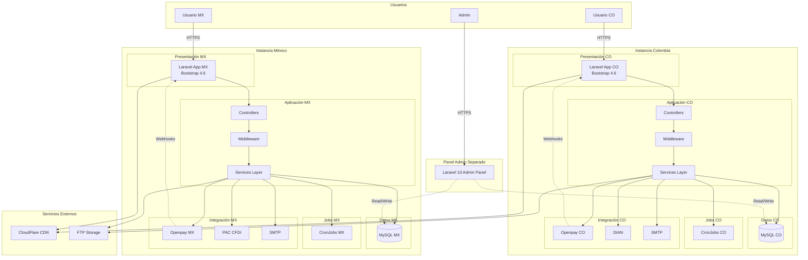
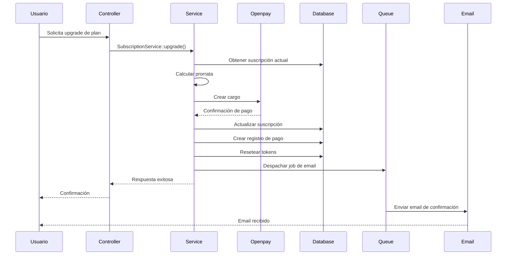

# 🏗️ Arquitectura del Sistema
## Sistema de Planes y Suscripciones

---

## 📑 Tabla de Contenidos

1. [Visión General](#visión-general)
2. [Diagrama de Arquitectura General](#diagrama-de-arquitectura-general)
3. [Componentes Principales](#componentes-principales)
4. [Módulos del Sistema](#módulos-del-sistema)
5. [Patrones de Diseño](#patrones-de-diseño)
6. [Jobs y Queues](#jobs-y-queues)
7. [Eventos del Sistema](#eventos-del-sistema)
8. [Seguridad](#seguridad)
9. [Escalabilidad](#escalabilidad)
10. [Integraciones Externas](#integraciones-externas)

---

## Visión General

El Sistema de Planes y Suscripciones está construido sobre una arquitectura Laravel modular y escalable, diseñada para operar de forma independiente en dos países (México y Colombia) con sus respectivas regulaciones y proveedores de servicios.

### Características Clave de la Arquitectura

- **Multi-instancia:** 2 instancias completamente independientes (MX/CO)
- **Multi-tenancy:** Separación de datos por país
- **Event-Driven:** Uso extensivo de eventos Laravel para desacoplamiento
- **Asíncrono:** Jobs en cola para operaciones pesadas
- **Modular:** Separación clara de responsabilidades por módulos

---

## Diagrama de Arquitectura General



---

## Componentes Principales

### Capa de Presentación

#### Frontend - Bootstrap 4.6
```
/resources/views/
├── layouts/
│   ├── app.blade.php
│   └── admin.blade.php
├── auth/
│   ├── login.blade.php
│   └── register.blade.php
├── subscriptions/
│   ├── plans.blade.php
│   ├── checkout.blade.php
│   └── manage.blade.php
├── billing/
│   ├── payment-methods.blade.php
│   ├── invoices.blade.php
│   └── fiscal-data.blade.php
├── tokens/
│   └── dashboard.blade.php
└── emails/
    ├── welcome.blade.php
    ├── payment-success.blade.php
    └── ...
```

**Características:**
- Templates Blade con componentes reutilizables
- Diseño responsive con Bootstrap 4.6
- Validación client-side con JavaScript
- AJAX para operaciones asíncronas
- CSRF protection en todos los forms

---

### Capa de Aplicación

#### Controllers
```php
/app/Http/Controllers/
├── Auth/
│   ├── LoginController.php
│   ├── RegisterController.php
│   └── ForgotPasswordController.php
├── SubscriptionController.php
├── PaymentController.php
├── TokenController.php
├── CouponController.php
├── ReferralController.php
├── InvoiceController.php
└── WebhookController.php
```

**Responsabilidades:**
- Recibir peticiones HTTP
- Validar input con Form Requests
- Delegar lógica de negocio a Services
- Retornar vistas o JSON responses
- Manejar autenticación y autorización

#### Middleware
```php
/app/Http/Middleware/
├── Authenticate.php
├── CheckSubscriptionStatus.php
├── CheckTokensAvailable.php
├── ValidateCountry.php
├── LogAdminActions.php
└── VerifyWebhookSignature.php
```

**Middleware Personalizados:**
- `CheckSubscriptionStatus`: Verifica suscripción activa
- `CheckTokensAvailable`: Verifica tokens disponibles
- `ValidateCountry`: Asegura usuario en instancia correcta
- `VerifyWebhookSignature`: Valida webhooks de Openpay

---

### Capa de Negocio

#### Services Layer
```php
/app/Services/
├── SubscriptionService.php
├── PaymentService.php
├── TokenService.php
├── CouponService.php
├── ReferralService.php
├── NotificationService.php
├── BillingService.php
├── OpenpayService.php
└── ReportingService.php
```

**SubscriptionService.php**
```php
<?php

namespace App\Services;

class SubscriptionService
{
    /**
     * Crear nueva suscripción con trial
     */
    public function createWithTrial(User $user, Plan $plan, string $cardToken): Subscription
    {
        // Lógica de creación
    }
    
    /**
     * Procesar renovación de suscripción
     */
    public function renew(Subscription $subscription): bool
    {
        // Lógica de renovación
    }
    
    /**
     * Upgrade inmediato con prorrata
     */
    public function upgrade(Subscription $subscription, Plan $newPlan): void
    {
        // Cálculo de prorrata y upgrade
    }
    
    /**
     * Downgrade programado
     */
    public function scheduleDowngrade(Subscription $subscription, Plan $newPlan): void
    {
        // Programar downgrade
    }
    
    /**
     * Cancelar suscripción
     */
    public function cancel(Subscription $subscription): void
    {
        // Lógica de cancelación
    }
}
```

**PaymentService.php**
```php
<?php

namespace App\Services;

class PaymentService
{
    protected $openpayService;
    
    /**
     * Procesar pago con tarjeta
     */
    public function chargeCard(Subscription $subscription, float $amount): Payment
    {
        // Procesar pago vía Openpay
    }
    
    /**
     * Manejar fallo de pago
     */
    public function handleFailure(Payment $payment): void
    {
        // Registrar fallo, programar reintento
    }
    
    /**
     * Procesar reintento de pago
     */
    public function retry(Payment $payment): bool
    {
        // Lógica de reintento
    }
    
    /**
     * Procesar reembolso
     */
    public function refund(Payment $payment, float $amount): void
    {
        // Procesar reembolso
    }
    
    /**
     * Generar orden de pago manual
     */
    public function createManualPaymentOrder(Subscription $subscription): array
    {
        // Generar orden y datos bancarios
    }
}
```

**TokenService.php**
```php
<?php

namespace App\Services;

class TokenService
{
    /**
     * Resetear tokens mensuales
     */
    public function resetMonthlyTokens(Subscription $subscription): void
    {
        // Resetear tokens al inicio del período
    }
    
    /**
     * Consumir tokens
     */
    public function consume(User $user, int $amount): bool
    {
        // Validar y consumir tokens
    }
    
    /**
     * Verificar alertas de consumo
     */
    public function checkAlerts(User $user): void
    {
        // 50%, 75%, 90%, 100%
    }
    
    /**
     * Agregar tokens manualmente (admin)
     */
    public function addTokens(User $user, int $amount, string $reason): void
    {
        // Agregar tokens y loguear
    }
}
```

---

### Capa de Datos

#### Eloquent Models
```php
/app/Models/
├── User.php
├── Plan.php
├── Subscription.php
├── Payment.php
├── TokenUsage.php
├── Coupon.php
├── UserCoupon.php
├── Referral.php
├── BillingData.php
├── Invoice.php
├── PaymentRetry.php
├── GracePeriod.php
├── Notification.php
└── AuditLog.php
```

**Ejemplo: Subscription.php**
```php
<?php

namespace App\Models;

use Illuminate\Database\Eloquent\Model;
use Illuminate\Database\Eloquent\SoftDeletes;

class Subscription extends Model
{
    use SoftDeletes;
    
    protected $fillable = [
        'user_id',
        'plan_id',
        'status',
        'periodicity',
        'starts_at',
        'ends_at',
        'next_billing_date',
        'card_token',
        'manual_payment_reference',
    ];
    
    protected $casts = [
        'starts_at' => 'datetime',
        'ends_at' => 'datetime',
        'next_billing_date' => 'datetime',
    ];
    
    // Relationships
    public function user()
    {
        return $this->belongsTo(User::class);
    }
    
    public function plan()
    {
        return $this->belongsTo(Plan::class);
    }
    
    public function payments()
    {
        return $this->hasMany(Payment::class);
    }
    
    public function tokenUsage()
    {
        return $this->hasMany(TokenUsage::class);
    }
    
    public function gracePeriod()
    {
        return $this->hasOne(GracePeriod::class);
    }
    
    // Scopes
    public function scopeActive($query)
    {
        return $query->where('status', 'active');
    }
    
    public function scopeInTrial($query)
    {
        return $query->where('status', 'trialing');
    }
    
    // Helpers
    public function isActive(): bool
    {
        return $this->status === 'active';
    }
    
    public function isInGracePeriod(): bool
    {
        return $this->gracePeriod && 
               $this->gracePeriod->ends_at->isFuture();
    }
}
```

#### Repository Pattern (Opcional)
```php
/app/Repositories/
├── SubscriptionRepository.php
├── PaymentRepository.php
└── UserRepository.php
```

**Beneficios:**
- Abstracción de lógica de acceso a datos
- Facilita testing con mocks
- Reutilización de queries complejas

---

### Capa de Integración

#### Openpay SDK Integration
```php
/app/Services/OpenpayService.php

<?php

namespace App\Services;

use Openpay\Openpay;

class OpenpayService
{
    protected $openpay;
    protected $merchantId;
    protected $country;
    
    public function __construct()
    {
        $this->country = config('app.country');
        $this->merchantId = config("services.openpay.{$this->country}.merchant_id");
        $apiKey = config("services.openpay.{$this->country}.private_key");
        
        $this->openpay = Openpay::getInstance(
            $this->merchantId,
            $apiKey,
            $this->country
        );
        
        $this->openpay->setProductionMode(
            config('services.openpay.production')
        );
    }
    
    /**
     * Crear cargo recurrente
     */
    public function createCharge(array $data): array
    {
        try {
            $customer = $this->openpay->customers->get($data['customer_id']);
            $charge = $customer->charges->create($data);
            
            return [
                'success' => true,
                'transaction_id' => $charge->id,
                'authorization' => $charge->authorization,
                'data' => $charge,
            ];
        } catch (\Exception $e) {
            return [
                'success' => false,
                'error' => $e->getMessage(),
                'error_code' => $e->getErrorCode(),
            ];
        }
    }
    
    /**
     * Crear cliente en Openpay
     */
    public function createCustomer(User $user): string
    {
        $customer = $this->openpay->customers->add([
            'name' => $user->name,
            'email' => $user->email,
            'requires_account' => false,
        ]);
        
        return $customer->id;
    }
    
    /**
     * Agregar tarjeta a cliente
     */
    public function addCard(string $customerId, string $tokenId): string
    {
        $customer = $this->openpay->customers->get($customerId);
        $card = $customer->cards->add(['token_id' => $tokenId]);
        
        return $card->id;
    }
    
    /**
     * Procesar reembolso
     */
    public function refund(string $transactionId, string $description): bool
    {
        $charge = $this->openpay->charges->get($transactionId);
        $charge->refund(['description' => $description]);
        
        return true;
    }
}
```

---

## Módulos del Sistema

### Módulo 1: Auth & Users

**Responsabilidad:** Autenticación, registro, gestión de perfiles

**Componentes:**
- Controllers: `LoginController`, `RegisterController`
- Models: `User`, `BillingData`
- Views: Login, registro, perfil
- Middleware: `Authenticate`, `ValidateCountry`

**Funcionalidades:**
- Login/Logout
- Registro de usuarios
- Recuperación de contraseña
- Gestión de datos fiscales
- Gestión de perfil

---

### Módulo 2: Plans & Subscriptions

**Responsabilidad:** Gestión del ciclo de vida de suscripciones

**Componentes:**
- Controllers: `SubscriptionController`
- Services: `SubscriptionService`
- Models: `Plan`, `Subscription`
- Jobs: `ProcessSubscriptionRenewal`
- Events: `SubscriptionCreated`, `SubscriptionRenewed`

**Funcionalidades:**
- CRUD de planes (admin)
- Visualización de planes
- Selección y contratación
- Trial management
- Renovaciones automáticas
- Upgrade/Downgrade
- Cancelación

---

### Módulo 3: Payments

**Responsabilidad:** Procesamiento de pagos y transacciones

**Componentes:**
- Controllers: `PaymentController`, `WebhookController`
- Services: `PaymentService`, `OpenpayService`
- Models: `Payment`, `PaymentRetry`, `GracePeriod`
- Jobs: `RetryFailedPayment`, `SendGracePeriodReminder`
- Events: `PaymentSuccessful`, `PaymentFailed`

**Funcionalidades:**
- Cobros con tarjeta
- Pagos manuales (transferencia)
- Reintentos automáticos
- Período de gracia
- Reembolsos
- Procesamiento de webhooks

---

### Módulo 4: Tokens

**Responsabilidad:** Gestión de consumo de tokens

**Componentes:**
- Controllers: `TokenController`
- Services: `TokenService`
- Models: `TokenUsage`
- Jobs: `ResetMonthlyTokens`, `CheckTokenAlerts`
- Events: `TokensAlmostDepleted`

**Funcionalidades:**
- Tracking de consumo
- Reseteo mensual
- Alertas de consumo (50%, 75%, 90%, 100%)
- Dashboard de visualización
- Gestión manual (admin)

---

### Módulo 5: Coupons

**Responsabilidad:** Sistema de cupones y descuentos

**Componentes:**
- Controllers: `CouponController`
- Services: `CouponService`
- Models: `Coupon`, `UserCoupon`

**Funcionalidades:**
- CRUD de cupones (admin)
- Validación de cupones
- Aplicación de descuentos
- Tracking de uso
- Reportes

---

### Módulo 6: Referrals

**Responsabilidad:** Programa de referidos

**Componentes:**
- Controllers: `ReferralController`
- Services: `ReferralService`
- Models: `Referral`
- Events: `ReferralCompleted`

**Funcionalidades:**
- Generación de códigos únicos
- Tracking de referidos
- Otorgamiento de beneficios
- Dashboard de referidos
- Configuración de beneficios (admin)

---

### Módulo 7: Billing

**Responsabilidad:** Facturación electrónica

**Componentes:**
- Controllers: `InvoiceController`
- Services: `BillingService`
- Models: `Invoice`, `BillingData`

**Funcionalidades:**
- Formulario de datos fiscales
- Solicitud de facturas
- Validación de límites de tiempo
- Gestión admin (subir PDFs)
- Envío de facturas por email
- Historial de facturas

---

### Módulo 8: Notifications

**Responsabilidad:** Sistema de notificaciones por email

**Componentes:**
- Services: `NotificationService`
- Models: `Notification`
- Jobs: `SendNotificationEmail`
- Mailables: 17+ clases de emails

**Funcionalidades:**
- 17 tipos de emails transaccionales
- Templates responsive
- Queue para envío asíncrono
- Tracking de envíos
- Rate limiting

---

### Módulo 9: Admin Panel

**Responsabilidad:** Gestión administrativa

**Componentes:**
- Controllers: Admin namespace completo
- Services: `ReportingService`
- Views: Admin dashboard y gestión

**Funcionalidades:**
- Dashboard con métricas (MRR, ARR, churn)
- Gestión de usuarios
- Gestión de planes
- Gestión de cupones
- Gestión de pagos
- Gestión de facturas
- Reportes y exportaciones
- Configuración global

---

## Patrones de Diseño

### 1. Repository Pattern

**Propósito:** Abstraer lógica de acceso a datos

```php
interface SubscriptionRepositoryInterface
{
    public function findByUser(User $user): ?Subscription;
    public function findActiveByPlan(Plan $plan): Collection;
    public function findExpiringTrials(Carbon $date): Collection;
}

class SubscriptionRepository implements SubscriptionRepositoryInterface
{
    public function findByUser(User $user): ?Subscription
    {
        return Subscription::where('user_id', $user->id)
            ->active()
            ->first();
    }
}
```

---

### 2. Service Layer Pattern

**Propósito:** Encapsular lógica de negocio

```php
class SubscriptionService
{
    protected $repository;
    protected $paymentService;
    protected $tokenService;
    
    public function __construct(
        SubscriptionRepository $repository,
        PaymentService $paymentService,
        TokenService $tokenService
    ) {
        $this->repository = $repository;
        $this->paymentService = $paymentService;
        $this->tokenService = $tokenService;
    }
    
    public function renew(Subscription $subscription): bool
    {
        DB::beginTransaction();
        
        try {
            // Procesar pago
            $payment = $this->paymentService->chargeCard(
                $subscription,
                $subscription->plan->price
            );
            
            if (!$payment->successful) {
                throw new PaymentFailedException();
            }
            
            // Actualizar suscripción
            $subscription->update([
                'next_billing_date' => $this->calculateNextBillingDate($subscription),
            ]);
            
            // Resetear tokens
            $this->tokenService->resetMonthlyTokens($subscription);
            
            // Disparar evento
            event(new SubscriptionRenewed($subscription, $payment));
            
            DB::commit();
            return true;
            
        } catch (\Exception $e) {
            DB::rollBack();
            throw $e;
        }
    }
}
```

---

### 3. Observer Pattern (Laravel Events)

**Propósito:** Desacoplar acciones de eventos del sistema

```php
// Event
class PaymentSuccessful
{
    public $payment;
    public $subscription;
    
    public function __construct(Payment $payment, Subscription $subscription)
    {
        $this->payment = $payment;
        $this->subscription = $subscription;
    }
}

// Listener
class SendPaymentConfirmationEmail
{
    public function handle(PaymentSuccessful $event)
    {
        Mail::to($event->subscription->user->email)
            ->send(new PaymentConfirmationMail($event->payment));
    }
}

// EventServiceProvider
protected $listen = [
    PaymentSuccessful::class => [
        SendPaymentConfirmationEmail::class,
        UpdateSubscriptionStatus::class,
        CreateInvoiceRequest::class,
    ],
];
```

---

### 4. Strategy Pattern

**Propósito:** Diferentes estrategias de cálculo (prorrata, descuentos)

```php
interface ProrataCalculatorInterface
{
    public function calculate(Subscription $subscription, Plan $newPlan): float;
}

class MonthlyProrataCalculator implements ProrataCalculatorInterface
{
    public function calculate(Subscription $subscription, Plan $newPlan): float
    {
        $daysRemaining = $subscription->next_billing_date->diffInDays(now());
        $totalDays = 30;
        $currentPlanCredit = ($daysRemaining / $totalDays) * $subscription->plan->price;
        
        return $newPlan->price - $currentPlanCredit;
    }
}

class AnnualProrataCalculator implements ProrataCalculatorInterface
{
    public function calculate(Subscription $subscription, Plan $newPlan): float
    {
        $daysRemaining = $subscription->next_billing_date->diffInDays(now());
        $totalDays = 365;
        $currentPlanCredit = ($daysRemaining / $totalDays) * $subscription->plan->price;
        
        return $newPlan->price - $currentPlanCredit;
    }
}
```

---

### 5. Factory Pattern

**Propósito:** Crear instancias de notificaciones

```php
class NotificationFactory
{
    public static function create(string $type, array $data): Mailable
    {
        return match($type) {
            'payment_success' => new PaymentSuccessNotification($data),
            'payment_failed' => new PaymentFailedNotification($data),
            'trial_ending' => new TrialEndingNotification($data),
            'tokens_alert' => new TokensAlertNotification($data),
            default => throw new InvalidArgumentException("Unknown notification type: {$type}"),
        };
    }
}
```

---

## Jobs y Queues

### CronJobs Configurados

```php
// app/Console/Kernel.php

protected function schedule(Schedule $schedule)
{
    // Renovaciones diarias (ejecutar a las 2 AM)
    $schedule->command('subscriptions:renew')
        ->dailyAt('02:00')
        ->onOneServer();
    
    // Reintentos de pagos fallidos (cada 6 horas)
    $schedule->command('payments:retry')
        ->everySixHours()
        ->onOneServer();
    
    // Recordatorios de período de gracia (diario a las 9 AM)
    $schedule->command('grace-period:remind')
        ->dailyAt('09:00')
        ->onOneServer();
    
    // Reseteo de tokens mensuales (1ro de cada mes a las 00:00)
    $schedule->command('tokens:reset')
        ->monthlyOn(1, '00:00')
        ->onOneServer();
    
    // Verificar trials próximos a vencer (diario a las 8 AM)
    $schedule->command('trials:check-expiring')
        ->dailyAt('08:00')
        ->onOneServer();
    
    // Procesar webhooks pendientes (cada 5 minutos)
    $schedule->command('webhooks:process')
        ->everyFiveMinutes()
        ->onOneServer();
    
    // Generar reportes mensuales (1ro de mes a las 3 AM)
    $schedule->command('reports:generate monthly')
        ->monthlyOn(1, '03:00')
        ->onOneServer();
    
    // Limpiar logs antiguos (semanal, domingos a las 4 AM)
    $schedule->command('logs:cleanup')
        ->weekly()
        ->sundays()
        ->at('04:00')
        ->onOneServer();
}
```

### Jobs Asíncronos

```php
/app/Jobs/
├── ProcessSubscriptionRenewal.php
├── RetryFailedPayment.php
├── SendGracePeriodReminder.php
├── ProcessWebhookEvent.php
├── SendNotificationEmail.php
├── ResetMonthlyTokens.php
├── CheckTrialExpirations.php
└── GenerateMonthlyReport.php
```

**Ejemplo: ProcessSubscriptionRenewal.php**
```php
<?php

namespace App\Jobs;

use App\Models\Subscription;
use App\Services\SubscriptionService;
use Illuminate\Bus\Queueable;
use Illuminate\Contracts\Queue\ShouldQueue;
use Illuminate\Foundation\Bus\Dispatchable;
use Illuminate\Queue\InteractsWithQueue;
use Illuminate\Queue\SerializesModels;

class ProcessSubscriptionRenewal implements ShouldQueue
{
    use Dispatchable, InteractsWithQueue, Queueable, SerializesModels;
    
    public $tries = 3;
    public $timeout = 120;
    
    protected $subscription;
    
    public function __construct(Subscription $subscription)
    {
        $this->subscription = $subscription;
    }
    
    public function handle(SubscriptionService $subscriptionService)
    {
        try {
            $subscriptionService->renew($this->subscription);
        } catch (\Exception $e) {
            report($e);
            $this->fail($e);
        }
    }
    
    public function failed(\Throwable $exception)
    {
        // Notificar admin de fallo crítico
        \Log::error('Subscription renewal failed', [
            'subscription_id' => $this->subscription->id,
            'error' => $exception->getMessage(),
        ]);
    }
}
```

---

## Eventos del Sistema

### Eventos de Pagos

```php
// app/Events/PaymentSuccessful.php
class PaymentSuccessful
{
    public Payment $payment;
    public Subscription $subscription;
}

// app/Events/PaymentFailed.php
class PaymentFailed
{
    public Payment $payment;
    public Subscription $subscription;
    public string $errorMessage;
}
```

### Eventos de Suscripciones

```php
// app/Events/SubscriptionCreated.php
class SubscriptionCreated
{
    public Subscription $subscription;
}

// app/Events/SubscriptionUpgraded.php
class SubscriptionUpgraded
{
    public Subscription $subscription;
    public Plan $oldPlan;
    public Plan $newPlan;
    public float $prorataAmount;
}

// app/Events/SubscriptionDowngraded.php
class SubscriptionDowngraded
{
    public Subscription $subscription;
    public Plan $oldPlan;
    public Plan $newPlan;
}

// app/Events/SubscriptionCancelled.php
class SubscriptionCancelled
{
    public Subscription $subscription;
    public string $reason;
}
```

### Eventos de Tokens

```php
// app/Events/TokensAlmostDepleted.php
class TokensAlmostDepleted
{
    public User $user;
    public int $percentage; // 50, 75, 90, 100
    public int $tokensRemaining;
}
```

### Eventos de Trial

```php
// app/Events/TrialAboutToExpire.php
class TrialAboutToExpire
{
    public Subscription $subscription;
    public int $daysRemaining;
}
```

### Eventos de Referidos

```php
// app/Events/ReferralCompleted.php
class ReferralCompleted
{
    public Referral $referral;
    public User $referrer;
    public User $referred;
}
```

---

## Seguridad

### Protección de Datos Sensibles

```php
// Encriptación en modelo
class BillingData extends Model
{
    protected $casts = [
        'tax_id' => 'encrypted',
        'legal_name' => 'encrypted',
    ];
}
```

### Validación de Webhooks

```php
// app/Http/Middleware/VerifyWebhookSignature.php

class VerifyWebhookSignature
{
    public function handle($request, Closure $next)
    {
        $signature = $request->header('X-Openpay-Signature');
        $payload = $request->getContent();
        $secret = config('services.openpay.webhook_secret');
        
        $expected = hash_hmac('sha256', $payload, $secret);
        
        if (!hash_equals($expected, $signature)) {
            abort(401, 'Invalid webhook signature');
        }
        
        return $next($request);
    }
}
```

### Rate Limiting

```php
// app/Http/Kernel.php

protected $middlewareGroups = [
    'api' => [
        'throttle:60,1', // 60 requests per minute
    ],
];

// Rutas específicas con límites más estrictos
Route::middleware('throttle:10,1')->group(function () {
    Route::post('/payment', [PaymentController::class, 'process']);
});
```

### Validación de Input

```php
// app/Http/Requests/StoreSubscriptionRequest.php

class StoreSubscriptionRequest extends FormRequest
{
    public function rules()
    {
        return [
            'plan_id' => 'required|exists:plans,id',
            'card_token' => 'required|string',
            'billing_data.tax_id' => 'required|string|max:20',
            'billing_data.legal_name' => 'required|string|max:255',
        ];
    }
    
    protected function prepareForValidation()
    {
        $this->merge([
            'plan_id' => strip_tags($this->plan_id),
            'card_token' => strip_tags($this->card_token),
        ]);
    }
}
```

### Cumplimiento Normativo

**México - Ley Federal de Protección de Datos Personales:**
- Aviso de privacidad claro y accesible
- Consentimiento explícito para uso de datos
- Derecho de acceso, rectificación, cancelación y oposición (ARCO)
- Encriptación de datos sensibles

**Colombia - Ley 1581 de 2012 (Habeas Data):**
- Política de tratamiento de datos personales
- Autorización previa del titular
- Derecho de acceso, actualización y rectificación
- Registro en RNBD (Registro Nacional de Bases de Datos)

### Audit Logs

```php
// app/Observers/SubscriptionObserver.php

class SubscriptionObserver
{
    public function updated(Subscription $subscription)
    {
        AuditLog::create([
            'user_id' => auth()->id(),
            'action' => 'subscription.updated',
            'entity' => 'Subscription',
            'entity_id' => $subscription->id,
            'before' => $subscription->getOriginal(),
            'after' => $subscription->getAttributes(),
            'ip' => request()->ip(),
        ]);
    }
}
```

---

## Escalabilidad

### Optimización de Base de Datos

**Índices Estratégicos:**
```sql
-- Índices para queries frecuentes
CREATE INDEX idx_subscriptions_user_status ON subscriptions(user_id, status);
CREATE INDEX idx_subscriptions_next_billing ON subscriptions(next_billing_date, status);
CREATE INDEX idx_payments_subscription_status ON payments(subscription_id, status);
CREATE INDEX idx_tokens_user_period ON tokens_usage(user_id, period_start, period_end);
```

**Eager Loading:**
```php
// Evitar N+1 queries
$subscriptions = Subscription::with(['user', 'plan', 'payments'])
    ->active()
    ->get();
```

### Caché (Redis Recomendado)

```php
// Cachear planes disponibles
$plans = Cache::remember('plans.active', 3600, function () {
    return Plan::where('active', true)->get();
});

// Cachear estadísticas de usuario
$stats = Cache::remember("user.{$userId}.stats", 600, function () use ($userId) {
    return [
        'tokens_remaining' => TokenService::getRemaining($userId),
        'next_billing' => SubscriptionService::getNextBilling($userId),
    ];
});
```

### Queue Workers

```bash
# Configurar múltiples workers para diferentes queues
php artisan queue:work --queue=high,default,low --tries=3

# Supervisor configuration
[program:laravel-worker]
process_name=%(program_name)s_%(process_num)02d
command=php /path/to/artisan queue:work --sleep=3 --tries=3
autostart=true
autorestart=true
numprocs=8
```

### CDN para Assets

```php
// config/filesystems.php
'cdn' => [
    'driver' => 'cloudflare',
    'url' => env('CDN_URL'),
],
```

### Monitoreo y Observabilidad

**Laravel Telescope (Desarrollo):**
```bash
composer require laravel/telescope --dev
php artisan telescope:install
```

**Laravel Horizon (Producción - Queues):**
```bash
composer require laravel/horizon
php artisan horizon:install
```

**Sentry (Error Tracking):**
```bash
composer require sentry/sentry-laravel
```

### Migración a VPS Recomendada

**Configuración sugerida para 10,000+ usuarios:**
- **CPU:** 4 cores
- **RAM:** 8 GB
- **Storage:** 100 GB SSD
- **Servicios:**
  - Nginx
  - PHP 8.1+ con PHP-FPM
  - MySQL 8.0
  - Redis
  - Supervisor (queue workers)

---

## Integraciones Externas

### Openpay

**Configuración:**
```php
// config/services.php
return [
    'openpay' => [
        'production' => env('OPENPAY_PRODUCTION', false),
        'MX' => [
            'merchant_id' => env('OPENPAY_MX_MERCHANT_ID'),
            'public_key' => env('OPENPAY_MX_PUBLIC_KEY'),
            'private_key' => env('OPENPAY_MX_PRIVATE_KEY'),
        ],
        'CO' => [
            'merchant_id' => env('OPENPAY_CO_MERCHANT_ID'),
            'public_key' => env('OPENPAY_CO_PUBLIC_KEY'),
            'private_key' => env('OPENPAY_CO_PRIVATE_KEY'),
        ],
        'webhook_secret' => env('OPENPAY_WEBHOOK_SECRET'),
    ],
];
```

**Endpoints de Webhooks:**
- `POST /webhooks/openpay` - Recibir eventos de Openpay
- Eventos: `charge.succeeded`, `charge.failed`, `charge.refunded`

### SMTP

```php
// config/mail.php
return [
    'default' => env('MAIL_MAILER', 'smtp'),
    'mailers' => [
        'smtp' => [
            'transport' => 'smtp',
            'host' => env('MAIL_HOST'),
            'port' => env('MAIL_PORT', 587),
            'encryption' => env('MAIL_ENCRYPTION', 'tls'),
            'username' => env('MAIL_USERNAME'),
            'password' => env('MAIL_PASSWORD'),
        ],
    ],
];
```

### Facturación Externa

**México - PAC:**
- Integración manual: Admin genera CFDI en portal PAC
- Admin sube XML y PDF a plataforma
- Sistema envía por email

**Colombia - DIAN:**
- Integración manual: Admin genera factura en sistema DIAN
- Admin sube PDF a plataforma
- Sistema envía por email

---

## Diagrama de Flujo de Datos



---

**Documento:** ARCHITECTURE v1.0  
**Fecha:** Enero 2026  
**Próxima Revisión:** Al completar MVP

