# Esquema de Base de Datos
## Sistema de Suscripciones - Agenda Médica SaaS

**Versión:** 1.1  
**Fecha:** Enero 2026  
**Actualización:** Campos 3D Secure (3DS)

---

## 📑 Tabla de Contenidos

1. [Diagrama ERD](#diagrama-erd)
2. [Descripción de Tablas](#descripción-de-tablas)
3. [Relaciones](#relaciones)
4. [Índices Recomendados](#índices-recomendados)
5. [Políticas de Eliminación](#políticas-de-eliminación)

---

## Diagrama ERD

```mermaid
erDiagram
    users ||--o{ subscriptions : "has"
    users ||--o{ billing_data : "has"
    users ||--o{ referrals_as_referrer : "refers"
    users ||--o{ referrals_as_referred :  "referred_by"
    users ||--o{ user_coupons : "applies"
    users ||--o{ notifications : "receives"
    
    plans ||--o{ subscriptions : "offered_in"
    
    subscriptions ||--o{ payments : "generates"
    subscriptions ||--o{ tokens_usage : "tracks"
    subscriptions ||--o{ grace_periods : "enters"
    
    payments ||--o{ payment_retries : "has_retries"
    payments ||--o{ invoices : "requires_invoice"
    
    coupons ||--o{ user_coupons : "used_by"
    
    users {
        bigint id PK
        string name
        string email UK
        timestamp email_verified_at
        string password
        enum role "profesional, consultorio, asistente, paciente"
        enum country "MX, CO"
        string remember_token
        timestamps created_at_updated_at
        timestamp deleted_at
    }
    
    plans {
        bigint id PK
        string name
        text description
        int tokens_monthly
        enum periodicity "monthly, annual, annual_monthly_billing"
        decimal price_mxn "10,2"
        decimal price_cop "10,2"
        int trial_days
        boolean active
        timestamps created_at_updated_at
    }
    
    subscriptions {
        bigint id PK
        bigint user_id FK
        bigint plan_id FK
        enum status "trial, active, past_due, grace_period, cancelled, blocked"
        enum periodicity "monthly, annual, annual_monthly_billing"
        date starts_at
        date ends_at
        date next_billing_date
        string card_token
        string manual_payment_reference
        boolean mit_enabled "MIT enabled for recurring"
        boolean first_payment_3ds_completed "First payment with 3DS OK"
        bigint pending_plan_id FK "For scheduled downgrades"
        date pending_plan_change_date
        timestamps created_at_updated_at
        timestamp deleted_at
    }
    
    tokens_usage {
        bigint id PK
        bigint user_id FK
        bigint subscription_id FK
        date period_start
        date period_end
        int used
        int total
        timestamps created_at_updated_at
    }
    
    payments {
        bigint id PK
        bigint subscription_id FK
        decimal amount "10,2"
        string currency "MXN, COP"
        enum method "card, bank_transfer"
        enum status "pending, processing, requires_3ds, authenticating, authenticated, completed, failed, refunded, cancelled"
        string openpay_transaction_id
        int attempt "1, 2, 3"
        timestamp paid_at
        string error_code
        text error_message
        boolean requires_3ds "Payment requires 3DS auth"
        enum three_ds_status "not_required, pending, authenticated, failed, timeout"
        string three_ds_redirect_url "500 chars"
        string three_ds_version "1.0, 2.0"
        timestamp authentication_required_notified_at
        timestamps created_at_updated_at
    }
    
    coupons {
        bigint id PK
        string code UK
        enum type "percentage, fixed"
        decimal value "10,2"
        int duration_months "NULL=permanent"
        json applicable_plans "NULL=all plans"
        int usage_limit "NULL=unlimited"
        int current_usage
        date expires_at
        boolean active
        timestamps created_at_updated_at
    }
    
    user_coupons {
        bigint id PK
        bigint user_id FK
        bigint coupon_id FK
        timestamp applied_at
        timestamps created_at_updated_at
    }
    
    referrals {
        bigint id PK
        bigint referrer_id FK
        bigint referred_id FK
        string code UK
        json referrer_benefit "discount, tokens, credit"
        json referred_benefit "discount"
        enum status "pending, completed, expired"
        timestamp completed_at
        timestamps created_at_updated_at
    }
    
    billing_data {
        bigint id PK
        bigint user_id FK
        enum country "MX, CO"
        string tax_id "RFC or NIT"
        string legal_name
        string tax_regime "MX only"
        string postal_code "MX only"
        string cfdi_use "MX only"
        enum person_type "natural, legal - CO only"
        text address "CO only"
        string city "CO only"
        string state "CO only"
        timestamps created_at_updated_at
    }
    
    invoices {
        bigint id PK
        bigint user_id FK
        bigint payment_id FK
        string file_url
        timestamp requested_at
        timestamp sent_at
        enum status "requested, processing, completed, failed"
        timestamps created_at_updated_at
    }
    
    payment_retries {
        bigint id PK
        bigint payment_id FK
        int attempt
        timestamp tried_at
        text result
        timestamps created_at_updated_at
    }
    
    grace_periods {
        bigint id PK
        bigint subscription_id FK
        date started_at
        date ends_at
        int months_owed
        decimal amount_owed "10,2"
        int notifications_sent
        timestamps created_at_updated_at
    }
    
    notifications {
        bigint id PK
        bigint user_id FK
        string type "20 types"
        timestamp sent_at
        enum status "pending, sent, failed, bounced"
        json metadata
        timestamps created_at_updated_at
    }
    
    audit_logs {
        bigint id PK
        bigint user_id FK
        string action
        string entity
        bigint entity_id
        json before
        json after
        string ip
        timestamps created_at_updated_at
    }
```



---

## Descripción de Tablas

### 1. users

**Descripción:** Almacena todos los usuarios del sistema con sus 4 roles posibles.

| Campo | Tipo | Null | Descripción |
|-------|------|------|-------------|
| `id` | BIGINT UNSIGNED | NO | PK, Auto-increment |
| `name` | VARCHAR(255) | NO | Nombre completo del usuario |
| `email` | VARCHAR(255) | NO | Email único (login) |
| `email_verified_at` | TIMESTAMP | YES | Fecha de verificación de email |
| `password` | VARCHAR(255) | NO | Hash de contraseña (bcrypt) |
| `role` | ENUM | NO | profesional, consultorio, asistente, paciente |
| `country` | ENUM | NO | MX (México), CO (Colombia) |
| `remember_token` | VARCHAR(100) | YES | Token de "recordarme" |
| `created_at` | TIMESTAMP | YES | Fecha de creación |
| `updated_at` | TIMESTAMP | YES | Fecha de última actualización |
| `deleted_at` | TIMESTAMP | YES | Soft delete |

**Índices:**
- PRIMARY KEY:  `id`
- UNIQUE: `email`
- INDEX: `role`, `country`, `deleted_at`

**Relaciones:**
- `users` → `subscriptions` (1:N)
- `users` → `billing_data` (1:1)
- `users` → `referrals` (1:N como referrer y referred)
- `users` → `user_coupons` (1:N)
- `users` → `notifications` (1:N)

**Políticas:**
- Soft delete habilitado
- Email debe ser válido y único
- País detectado automáticamente en registro

---

### 2. plans

**Descripción:** Catálogo de planes de suscripción disponibles.

| Campo | Tipo | Null | Descripción |
|-------|------|------|-------------|
| `id` | BIGINT UNSIGNED | NO | PK, Auto-increment |
| `name` | VARCHAR(255) | NO | Nombre del plan (ej: "Google Tech + IA 50") |
| `description` | TEXT | YES | Descripción detallada del plan |
| `tokens_monthly` | INT | NO | Cantidad de tokens mensuales |
| `periodicity` | ENUM | NO | monthly, annual, annual_monthly_billing |
| `price_mxn` | DECIMAL(10,2) | NO | Precio en pesos mexicanos |
| `price_cop` | DECIMAL(10,2) | NO | Precio en pesos colombianos |
| `trial_days` | INT | NO | Días de trial (personalizable por plan) |
| `active` | BOOLEAN | NO | Si el plan está disponible para nuevas suscripciones |
| `created_at` | TIMESTAMP | YES | Fecha de creación |
| `updated_at` | TIMESTAMP | YES | Fecha de última actualización |

**Índices:**
- PRIMARY KEY: `id`
- INDEX: `active`

**Relaciones:**
- `plans` → `subscriptions` (1:N)

**Políticas:**
- No tiene soft delete (planes históricos permanecen)
- Precios son fijos por moneda (no conversión automática)
- Un plan desactivado no aparece en selección, pero suscripciones existentes continúan

---

### 3. subscriptions 🔒 **[ACTUALIZADO - 3DS]**

**Descripción:** Suscripciones activas, canceladas o en período de gracia de usuarios.

| Campo | Tipo | Null | Descripción |
|-------|------|------|-------------|
| `id` | BIGINT UNSIGNED | NO | PK, Auto-increment |
| `user_id` | BIGINT UNSIGNED | NO | FK → users.id |
| `plan_id` | BIGINT UNSIGNED | NO | FK → plans. id (plan actual) |
| `status` | ENUM | NO | trial, active, past_due, grace_period, cancelled, blocked |
| `periodicity` | ENUM | NO | monthly, annual, annual_monthly_billing |
| `starts_at` | DATE | NO | Fecha de inicio de suscripción |
| `ends_at` | DATE | YES | Fecha de fin (NULL si activa) |
| `next_billing_date` | DATE | NO | Próxima fecha de cobro |
| `card_token` | VARCHAR(255) | YES | Token de tarjeta en Openpay (para pagos recurrentes) |
| `manual_payment_reference` | VARCHAR(255) | YES | Referencia si paga con transferencia |
| **`mit_enabled`** 🆕 | **BOOLEAN** | **NO** | **MIT habilitado para pagos recurrentes** |
| **`first_payment_3ds_completed`** 🆕 | **BOOLEAN** | **NO** | **Primer pago con 3DS exitoso** |
| `pending_plan_id` | BIGINT UNSIGNED | YES | FK → plans.id (para downgrades programados) |
| `pending_plan_change_date` | DATE | YES | Fecha programada de cambio de plan |
| `created_at` | TIMESTAMP | YES | Fecha de creación |
| `updated_at` | TIMESTAMP | YES | Fecha de última actualización |
| `deleted_at` | TIMESTAMP | YES | Soft delete |

**Índices:**
- PRIMARY KEY: `id`
- FOREIGN KEY: `user_id` → `users.id`
- FOREIGN KEY: `plan_id` → `plans.id`
- FOREIGN KEY: `pending_plan_id` → `plans.id`
- INDEX: `status`, `next_billing_date`, `user_id`, `deleted_at`
- INDEX: **`mit_enabled`** 🆕
- INDEX: **`first_payment_3ds_completed`** 🆕

**Relaciones:**
- `users` → `subscriptions` (1:N)
- `plans` → `subscriptions` (1:N)
- `subscriptions` → `payments` (1:N)
- `subscriptions` → `tokens_usage` (1:N)
- `subscriptions` → `grace_periods` (1:N)

**Políticas:**
- Soft delete habilitado
- Un usuario puede tener múltiples suscripciones (historial)
- Solo una suscripción activa por usuario a la vez

**Estados:**
- `trial`: En período de prueba
- `active`: Suscripción activa y al día
- `past_due`: Pago vencido (en reintentos)
- `grace_period`: En período de gracia (2 meses)
- `cancelled`: Cancelada por usuario
- `blocked`: Bloqueada por falta de pago

**Campos 3DS agregados:**
- `mit_enabled`: Se activa en `true` cuando el primer pago con 3DS es exitoso
- `first_payment_3ds_completed`: Rastrea si ya se completó autenticación inicial

---

### 4. tokens_usage

**Descripción:** Tracking de consumo de tokens por período de facturación.

| Campo | Tipo | Null | Descripción |
|-------|------|------|-------------|
| `id` | BIGINT UNSIGNED | NO | PK, Auto-increment |
| `user_id` | BIGINT UNSIGNED | NO | FK → users.id |
| `subscription_id` | BIGINT UNSIGNED | NO | FK → subscriptions.id |
| `period_start` | DATE | NO | Inicio del período de facturación |
| `period_end` | DATE | NO | Fin del período de facturación |
| `used` | INT | NO | Tokens usados en el período |
| `total` | INT | NO | Tokens totales asignados |
| `created_at` | TIMESTAMP | YES | Fecha de creación |
| `updated_at` | TIMESTAMP | YES | Fecha de última actualización |

**Índices:**
- PRIMARY KEY: `id`
- FOREIGN KEY: `user_id` → `users.id`
- FOREIGN KEY: `subscription_id` → `subscriptions.id`
- INDEX: `user_id`, `subscription_id`, `period_start`

**Relaciones:**
- `users` → `tokens_usage` (1:N)
- `subscriptions` → `tokens_usage` (1:N)

**Políticas:**
- Se crea un registro nuevo cada período de facturación
- Tokens no usados NO se acumulan (campo `used` se resetea)
- Permite ver histórico de consumo

---

### 5. payments 🔒 **[ACTUALIZADO - 3DS]**

**Descripción:** Registro completo de todos los intentos de pago.

| Campo | Tipo | Null | Descripción |
|-------|------|------|-------------|
| `id` | BIGINT UNSIGNED | NO | PK, Auto-increment |
| `subscription_id` | BIGINT UNSIGNED | NO | FK → subscriptions.id |
| `amount` | DECIMAL(10,2) | NO | Monto del pago |
| `currency` | VARCHAR(3) | NO | MXN o COP |
| `method` | ENUM | NO | card, bank_transfer |
| `status` | ENUM | NO | pending, processing, **requires_3ds**, **authenticating**, **authenticated**, completed, failed, refunded, cancelled |
| `openpay_transaction_id` | VARCHAR(255) | YES | ID de transacción en Openpay |
| `attempt` | INT | NO | Número de intento (1, 2, 3) |
| `paid_at` | TIMESTAMP | YES | Fecha en que se completó el pago |
| `error_code` | VARCHAR(50) | YES | Código de error si falló |
| `error_message` | TEXT | YES | Mensaje de error si falló |
| **`requires_3ds`** 🆕 | **BOOLEAN** | **NO** | **¿El pago requiere autenticación 3DS?** |
| **`three_ds_status`** 🆕 | **ENUM** | **NO** | **not_required, pending, authenticated, failed, timeout** |
| **`three_ds_redirect_url`** 🆕 | **VARCHAR(500)** | **YES** | **URL del banco para autenticación** |
| **`three_ds_version`** 🆕 | **VARCHAR(10)** | **YES** | **Versión de 3DS (1.0 o 2.0)** |
| **`authentication_required_notified_at`** 🆕 | **TIMESTAMP** | **YES** | **Cuándo se notificó al usuario** |
| `created_at` | TIMESTAMP | YES | Fecha de creación |
| `updated_at` | TIMESTAMP | YES | Fecha de última actualización |

**Índices:**
- PRIMARY KEY: `id`
- FOREIGN KEY: `subscription_id` → `subscriptions.id`
- INDEX: `status`, `openpay_transaction_id`, `subscription_id`
- INDEX: **`requires_3ds`** 🆕
- INDEX: **`three_ds_status`** 🆕
- INDEX: **`authentication_required_notified_at`** 🆕

**Relaciones:**
- `subscriptions` → `payments` (1:N)
- `payments` → `payment_retries` (1:N)
- `payments` → `invoices` (1:1)

**Políticas:**
- NO soft delete (auditoría completa)
- Cada intento de cobro crea un registro
- Estados reflejan ciclo de vida del pago

**Estados agregados por 3DS:**
- `requires_3ds`: Openpay solicita autenticación del usuario
- `authenticating`: Usuario está en modal del banco
- `authenticated`: Autenticación exitosa, procesando cargo

**Campos 3DS:**
- `requires_3ds`: Flag booleano para filtros rápidos
- `three_ds_status`: Estado detallado del proceso 3DS
- `three_ds_redirect_url`: URL para modal/iframe del banco
- `three_ds_version`: Rastrea qué versión de 3DS se usó
- `authentication_required_notified_at`: Timestamp de cuando se envió email #20

---

### 6. coupons

**Descripción:** Catálogo de cupones de descuento disponibles.

| Campo | Tipo | Null | Descripción |
|-------|------|------|-------------|
| `id` | BIGINT UNSIGNED | NO | PK, Auto-increment |
| `code` | VARCHAR(50) | NO | Código único del cupón (ej:  PROMO2026) |
| `type` | ENUM | NO | percentage, fixed |
| `value` | DECIMAL(10,2) | NO | Valor del descuento (% o monto fijo) |
| `duration_months` | INT | YES | Duración en meses (NULL = permanente) |
| `applicable_plans` | JSON | YES | IDs de planes aplicables (NULL = todos) |
| `usage_limit` | INT | YES | Límite de usos totales (NULL = ilimitado) |
| `current_usage` | INT | NO | Usos actuales (incrementa con cada aplicación) |
| `expires_at` | DATE | YES | Fecha de expiración (NULL = no expira) |
| `active` | BOOLEAN | NO | Si el cupón está activo |
| `created_at` | TIMESTAMP | YES | Fecha de creación |
| `updated_at` | TIMESTAMP | YES | Fecha de última actualización |

**Índices:**
- PRIMARY KEY: `id`
- UNIQUE: `code`
- INDEX: `active`, `expires_at`

**Relaciones:**
- `coupons` → `user_coupons` (1:N)

**Políticas:**
- No soft delete
- Códigos son case-insensitive al validar
- Un cupón desactivado no se puede aplicar

**Validaciones:**
- `code`: Alfanumérico, 5-50 caracteres
- `value`: Siempre positivo
- `current_usage`: No puede exceder `usage_limit`

---

### 7. user_coupons

**Descripción:** Registro de cupones aplicados por usuarios (evita reuso).

| Campo | Tipo | Null | Descripción |
|-------|------|------|-------------|
| `id` | BIGINT UNSIGNED | NO | PK, Auto-increment |
| `user_id` | BIGINT UNSIGNED | NO | FK → users.id |
| `coupon_id` | BIGINT UNSIGNED | NO | FK → coupons.id |
| `applied_at` | TIMESTAMP | NO | Fecha en que se aplicó el cupón |
| `created_at` | TIMESTAMP | YES | Fecha de creación |
| `updated_at` | TIMESTAMP | YES | Fecha de última actualización |

**Índices:**
- PRIMARY KEY: `id`
- FOREIGN KEY: `user_id` → `users.id`
- FOREIGN KEY: `coupon_id` → `coupons.id`
- UNIQUE:  Combinación `user_id` + `coupon_id` (un usuario no puede usar el mismo cupón dos veces)
- INDEX: `user_id`, `coupon_id`

**Relaciones:**
- `users` → `user_coupons` (1:N)
- `coupons` → `user_coupons` (1:N)

**Políticas:**
- NO soft delete (auditoría)
- Un usuario puede tener múltiples cupones (distintos)
- Un usuario NO puede reusar el mismo cupón

---

### 8. referrals

**Descripción:** Sistema de referidos con tracking de beneficios.

| Campo | Tipo | Null | Descripción |
|-------|------|------|-------------|
| `id` | BIGINT UNSIGNED | NO | PK, Auto-increment |
| `referrer_id` | BIGINT UNSIGNED | NO | FK → users.id (quien refiere) |
| `referred_id` | BIGINT UNSIGNED | NO | FK → users.id (quien fue referido) |
| `code` | VARCHAR(50) | NO | Código único del referido |
| `referrer_benefit` | JSON | NO | Beneficios para referidor (discount, tokens, credit) |
| `referred_benefit` | JSON | NO | Beneficios para referido (discount) |
| `status` | ENUM | NO | pending, completed, expired |
| `completed_at` | TIMESTAMP | YES | Fecha en que se completó (primer pago del referido) |
| `created_at` | TIMESTAMP | YES | Fecha de creación |
| `updated_at` | TIMESTAMP | YES | Fecha de última actualización |

**Índices:**
- PRIMARY KEY: `id`
- FOREIGN KEY: `referrer_id` → `users.id`
- FOREIGN KEY: `referred_id` → `users.id`
- UNIQUE: `code`
- INDEX: `status`, `referrer_id`, `referred_id`

**Relaciones:**
- `users` (como referrer) → `referrals` (1:N)
- `users` (como referred) → `referrals` (1:N)

**Políticas:**
- NO soft delete (auditoría)
- Un usuario puede referir a múltiples personas
- Un usuario puede ser referido solo una vez

**Ejemplo JSON `referrer_benefit`:**
```json
{
  "discount":  {"type": "percentage", "value": 20, "duration_months": 1},
  "tokens": 1000,
  "credit": {"amount": 100, "currency": "MXN"}
}
```

**Estados:**
- `pending`: Referido se registró pero no ha pagado
- `completed`: Referido hizo primer pago, beneficios otorgados
- `expired`: Referido canceló trial sin pagar

---

### 9. billing_data

**Descripción:** Datos fiscales de usuarios para facturación electrónica.

| Campo | Tipo | Null | Descripción |
|-------|------|------|-------------|
| `id` | BIGINT UNSIGNED | NO | PK, Auto-increment |
| `user_id` | BIGINT UNSIGNED | NO | FK → users.id (relación 1:1) |
| `country` | ENUM | NO | MX, CO |
| `tax_id` | VARCHAR(50) | NO | RFC (MX) o NIT (CO) |
| `legal_name` | VARCHAR(255) | NO | Razón social |
| `tax_regime` | VARCHAR(100) | YES | Régimen fiscal (solo MX) |
| `postal_code` | VARCHAR(10) | YES | Código postal (solo MX) |
| `cfdi_use` | VARCHAR(10) | YES | Uso de CFDI (solo MX) |
| `person_type` | ENUM | YES | natural, legal (solo CO) |
| `address` | TEXT | YES | Dirección completa (solo CO) |
| `city` | VARCHAR(100) | YES | Ciudad/Municipio (solo CO) |
| `state` | VARCHAR(100) | YES | Departamento (solo CO) |
| `created_at` | TIMESTAMP | YES | Fecha de creación |
| `updated_at` | TIMESTAMP | YES | Fecha de última actualización |

**Índices:**
- PRIMARY KEY: `id`
- FOREIGN KEY: `user_id` → `users.id`
- UNIQUE: `user_id` (relación 1:1)
- INDEX: `country`

**Relaciones:**
- `users` → `billing_data` (1:1)

**Políticas:**
- NO soft delete
- Validación de RFC/NIT según formato de cada país
- Campos de MX son NULL para usuarios CO y viceversa

**Validaciones:**
- **RFC (MX):** Formato 12-13 caracteres alfanuméricos
- **NIT (CO):** Formato 9 dígitos + dígito verificador
- `tax_regime`: Catálogo SAT (MX)
- `cfdi_use`: Catálogo SAT (MX)

---

### 10. invoices

**Descripción:** Solicitudes y registro de facturas electrónicas.

| Campo | Tipo | Null | Descripción |
|-------|------|------|-------------|
| `id` | BIGINT UNSIGNED | NO | PK, Auto-increment |
| `user_id` | BIGINT UNSIGNED | NO | FK → users.id |
| `payment_id` | BIGINT UNSIGNED | NO | FK → payments. id |
| `file_url` | VARCHAR(500) | YES | Ruta del PDF de la factura |
| `requested_at` | TIMESTAMP | NO | Fecha de solicitud por el usuario |
| `sent_at` | TIMESTAMP | YES | Fecha de envío al usuario |
| `status` | ENUM | NO | requested, processing, completed, failed |
| `created_at` | TIMESTAMP | YES | Fecha de creación |
| `updated_at` | TIMESTAMP | YES | Fecha de última actualización |

**Índices:**
- PRIMARY KEY: `id`
- FOREIGN KEY: `user_id` → `users.id`
- FOREIGN KEY: `payment_id` → `payments.id`
- INDEX: `status`, `user_id`, `payment_id`

**Relaciones:**
- `users` → `invoices` (1:N)
- `payments` → `invoices` (1:1)

**Políticas:**
- NO soft delete (auditoría fiscal)
- Un pago puede tener solo una factura
- Usuario puede re-descargar factura indefinidamente

**Estados:**
- `requested`: Usuario solicitó, pendiente de generación
- `processing`: Admin está generando en sistema externo
- `completed`: Factura generada, PDF subido y enviado
- `failed`: Error en generación (debe reintentar admin)

---

### 11. payment_retries

**Descripción:** Registro de reintentos de pagos fallidos.

| Campo | Tipo | Null | Descripción |
|-------|------|------|-------------|
| `id` | BIGINT UNSIGNED | NO | PK, Auto-increment |
| `payment_id` | BIGINT UNSIGNED | NO | FK → payments. id |
| `attempt` | INT | NO | Número de reintento (1, 2, 3) |
| `tried_at` | TIMESTAMP | NO | Fecha y hora del reintento |
| `result` | TEXT | YES | Resultado del reintento (éxito o razón de fallo) |
| `created_at` | TIMESTAMP | YES | Fecha de creación |
| `updated_at` | TIMESTAMP | YES | Fecha de última actualización |

**Índices:**
- PRIMARY KEY: `id`
- FOREIGN KEY: `payment_id` → `payments.id`
- INDEX: `payment_id`, `tried_at`

**Relaciones:**
- `payments` → `payment_retries` (1:N)

**Políticas:**
- NO soft delete (auditoría)
- Máximo 3 intentos por pago
- Cada reintento se programa según días configurados

---

### 12. grace_periods

**Descripción:** Períodos de gracia otorgados por fallos de pago.

| Campo | Tipo | Null | Descripción |
|-------|------|------|-------------|
| `id` | BIGINT UNSIGNED | NO | PK, Auto-increment |
| `subscription_id` | BIGINT UNSIGNED | NO | FK → subscriptions.id |
| `started_at` | DATE | NO | Fecha de inicio del período de gracia |
| `ends_at` | DATE | NO | Fecha de fin del período (2 meses después) |
| `months_owed` | INT | NO | Meses adeudados |
| `amount_owed` | DECIMAL(10,2) | NO | Monto total adeudado |
| `notifications_sent` | INT | NO | Cantidad de notificaciones enviadas |
| `created_at` | TIMESTAMP | YES | Fecha de creación |
| `updated_at` | TIMESTAMP | YES | Fecha de última actualización |

**Índices:**
- PRIMARY KEY: `id`
- FOREIGN KEY: `subscription_id` → `subscriptions.id`
- INDEX: `subscription_id`, `ends_at`

**Relaciones:**
- `subscriptions` → `grace_periods` (1:N, pero idealmente 1:1 activo)

**Políticas:**
- NO soft delete (auditoría)
- Duración fija:  2 meses
- Recordatorios cada 15 días (configurable)
- Usuario mantiene acceso completo durante gracia

---

### 13. notifications

**Descripción:** Log de todas las notificaciones enviadas.

| Campo | Tipo | Null | Descripción |
|-------|------|------|-------------|
| `id` | BIGINT UNSIGNED | NO | PK, Auto-increment |
| `user_id` | BIGINT UNSIGNED | NO | FK → users.id |
| `type` | VARCHAR(100) | NO | Tipo de notificación (20 tipos) |
| `sent_at` | TIMESTAMP | YES | Fecha y hora de envío |
| `status` | ENUM | NO | pending, sent, failed, bounced |
| `metadata` | JSON | YES | Datos adicionales de la notificación |
| `created_at` | TIMESTAMP | YES | Fecha de creación |
| `updated_at` | TIMESTAMP | YES | Fecha de última actualización |

**Índices:**
- PRIMARY KEY: `id`
- FOREIGN KEY: `user_id` → `users.id`
- INDEX: `user_id`, `type`, `status`, `sent_at`

**Relaciones:**
- `users` → `notifications` (1:N)

**Políticas:**
- NO soft delete (auditoría)
- Permite reenvío manual si falló
- Tracking completo para métricas

**Tipos de notificación (20):**
1. `welcome`
2. `payment_success`
3. `payment_reminder`
4. `payment_failed`
5. `manual_payment_order`
6. `grace_period_start`
7. `grace_period_reminder`
8. `subscription_cancelled`
9. `plan_changed`
10. `referral_successful`
11. `referral_discount_code`
12. `invoice_available`
13. `tokens_50`
14. `tokens_75`
15. `tokens_90`
16. `tokens_100`
17. `trial_expiring`
18. `trial_expired`
19. `subscription_reactivated`
20. **`payment_authentication_required`** 🆕

---

### 14. audit_logs

**Descripción:** Registro de auditoría de todas las acciones críticas.

| Campo | Tipo | Null | Descripción |
|-------|------|------|-------------|
| `id` | BIGINT UNSIGNED | NO | PK, Auto-increment |
| `user_id` | BIGINT UNSIGNED | YES | FK → users.id (NULL si es acción del sistema) |
| `action` | VARCHAR(100) | NO | Acción realizada (create, update, delete, etc.) |
| `entity` | VARCHAR(100) | NO | Entidad afectada (subscription, payment, etc.) |
| `entity_id` | BIGINT UNSIGNED | NO | ID del registro afectado |
| `before` | JSON | YES | Estado antes del cambio |
| `after` | JSON | YES | Estado después del cambio |
| `ip` | VARCHAR(45) | YES | IP desde donde se realizó la acción |
| `created_at` | TIMESTAMP | YES | Fecha de creación |
| `updated_at` | TIMESTAMP | YES | Fecha de última actualización |

**Índices:**
- PRIMARY KEY: `id`
- FOREIGN KEY: `user_id` → `users.id`
- INDEX: `user_id`, `entity`, `entity_id`, `created_at`

**Relaciones:**
- `users` → `audit_logs` (1:N)

**Políticas:**
- NO soft delete (auditoría permanente)
- Inmutable (INSERT only)
- Retención:  indefinida o según políticas de compliance

---

## Relaciones

### Diagrama de Relaciones Simplificado

```
users (1) ──────── (N) subscriptions
plans (1) ──────── (N) subscriptions
subscriptions (1) ─ (N) payments
subscriptions (1) ─ (N) tokens_usage
subscriptions (1) ─ (N) grace_periods
payments (1) ────── (N) payment_retries
payments (1) ────── (1) invoices
users (1) ────────  (1) billing_data
users (1) ──────── (N) user_coupons
coupons (1) ─────── (N) user_coupons
users (1) ──────── (N) referrals (as referrer)
users (1) ──────── (N) referrals (as referred)
users (1) ──────── (N) notifications
users (1) ──────── (N) audit_logs
```

---

## Índices Recomendados

### Índices de Performance Críticos

**Consultas frecuentes:**

```sql
-- Obtener suscripciones a renovar hoy
SELECT * FROM subscriptions 
WHERE next_billing_date <= CURDATE() 
AND status = 'active';
-- ÍNDICE:   (next_billing_date, status)

-- Obtener pagos que requieren 3DS sin notificar
SELECT * FROM payments 
WHERE requires_3ds = true 
AND authentication_required_notified_at IS NULL;
-- ÍNDICE:  (requires_3ds, authentication_required_notified_at)

-- Obtener tokens de usuario actual
SELECT * FROM tokens_usage 
WHERE user_id = ?  
ORDER BY period_start DESC 
LIMIT 1;
-- ÍNDICE:  (user_id, period_start)

-- Validar cupón
SELECT * FROM coupons 
WHERE code = ?  
AND active = true 
AND (expires_at IS NULL OR expires_at >= CURDATE());
-- ÍNDICE:  (code, active, expires_at)
```

### Índices Compuestos Adicionales

```sql
CREATE INDEX idx_subscriptions_renewal 
ON subscriptions(next_billing_date, status);

CREATE INDEX idx_payments_3ds_pending 
ON payments(requires_3ds, three_ds_status, authentication_required_notified_at);

CREATE INDEX idx_tokens_user_period 
ON tokens_usage(user_id, period_start DESC);

CREATE INDEX idx_grace_periods_active 
ON grace_periods(subscription_id, ends_at);

CREATE INDEX idx_notifications_pending 
ON notifications(status, created_at) 
WHERE status = 'pending';
```

---

## Políticas de Eliminación

### Soft Delete Habilitado

Las siguientes tablas usan soft delete (`deleted_at`):
- ✅ `users`
- ✅ `subscriptions`

**Razón:** Permite recuperación y mantiene integridad referencial.

### Sin Soft Delete (Auditoría)

Las siguientes tablas NO usan soft delete:
- ❌ `payments` - Auditoría fiscal
- ❌ `invoices` - Obligación legal
- ❌ `payment_retries` - Trazabilidad
- ❌ `grace_periods` - Auditoría
- ❌ `user_coupons` - Evitar reuso
- ❌ `referrals` - Tracking completo
- ❌ `audit_logs` - Inmutable
- ❌ `notifications` - Trazabilidad

### Cascadas de Eliminación

```sql
-- Ejemplo de configuración: 
ALTER TABLE subscriptions
ADD CONSTRAINT fk_subscriptions_user
FOREIGN KEY (user_id) REFERENCES users(id)
ON DELETE CASCADE; -- Si se elimina usuario, se eliminan suscripciones

ALTER TABLE payments
ADD CONSTRAINT fk_payments_subscription
FOREIGN KEY (subscription_id) REFERENCES subscriptions(id)
ON DELETE RESTRICT; -- No se puede eliminar suscripción con pagos
```

**Política recomendada:**
- `users` → `subscriptions`: CASCADE
- `subscriptions` → `payments`: RESTRICT (no permitir eliminación si hay pagos)
- `payments` → `invoices`: CASCADE
- Todo lo demás:  RESTRICT (eliminación manual explícita)

---

## Resumen de Cambios por 3DS

### Tablas Modificadas

**1. subscriptions:**
- ✅ `mit_enabled` (BOOLEAN)
- ✅ `first_payment_3ds_completed` (BOOLEAN)

**2. payments:**
- ✅ `requires_3ds` (BOOLEAN)
- ✅ `three_ds_status` (ENUM)
- ✅ `three_ds_redirect_url` (VARCHAR 500)
- ✅ `three_ds_version` (VARCHAR 10)
- ✅ `authentication_required_notified_at` (TIMESTAMP)
- ✅ Estados ENUM actualizados:  `requires_3ds`, `authenticating`, `authenticated`

**3. notifications:**
- ✅ Tipo nuevo: `payment_authentication_required`

### Índices Nuevos

```sql
CREATE INDEX idx_subscriptions_mit ON subscriptions(mit_enabled);
CREATE INDEX idx_payments_3ds ON payments(requires_3ds, three_ds_status);
CREATE INDEX idx_payments_auth_notified ON payments(authentication_required_notified_at);
```

---

## 📚 Referencias

- [DATABASE_DDL.sql](./DATABASE_DDL.sql) - Scripts SQL completos
- [3DS Integration](./3DS_INTEGRATION.md) - Detalles de integración 3DS
- [API Webhooks](./API_WEBHOOKS.md) - Webhooks que afectan estas tablas

---

**Versión:** 1.1  
**Cambios:**
- ✅ Agregados campos 3DS en `payments`
- ✅ Agregados campos MIT en `subscriptions`
- ✅ Agregado tipo de notificación `payment_authentication_required`
- ✅ Agregados índices para queries de 3DS
- ✅ Documentación completa de cada tabla

---

**Fin del Documento**