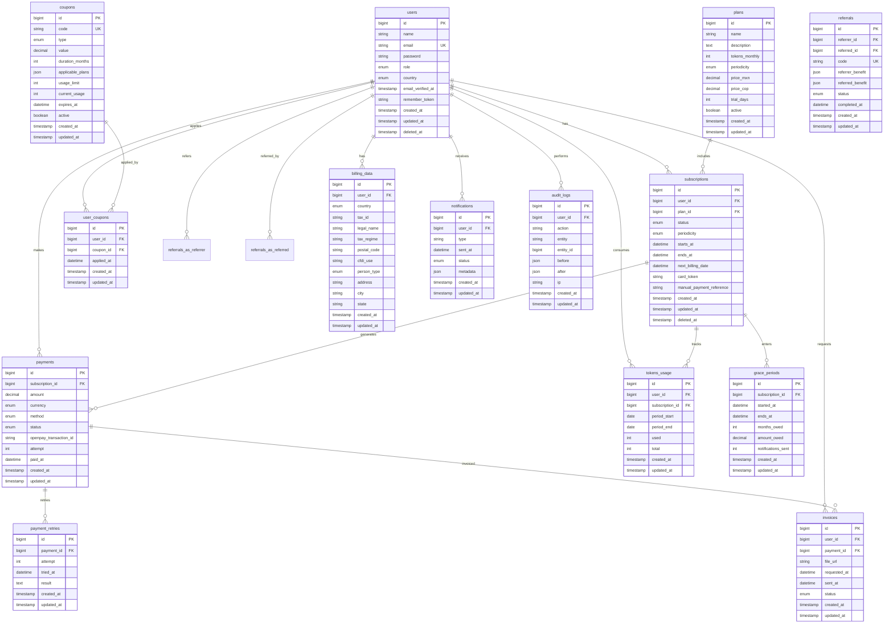

# 🗄️ Esquema de Base de Datos
## Sistema de Planes y Suscripciones

---

## 📑 Tabla de Contenidos

1. [Visión General](#visión-general)
2. [Diagrama ERD](#diagrama-erd)
3. [Tablas Principales](#tablas-principales)
4. [Relaciones](#relaciones)
5. [Índices y Optimización](#índices-y-optimización)
6. [Políticas de Datos](#políticas-de-datos)

---

## Visión General

La base de datos del sistema de suscripciones está diseñada para soportar operaciones de alta disponibilidad y garantizar la integridad de datos transaccionales. Se utilizan índices estratégicos para optimizar las consultas más frecuentes y soft deletes para mantener integridad referencial e histórica.

**Características Clave:**
- **Motor:** MySQL 8.0+
- **Charset:** utf8mb4 (soporte completo Unicode)
- **Collation:** utf8mb4_unicode_ci
- **Engine:** InnoDB (transacciones ACID)
- **Soft Deletes:** Implementado en tablas críticas
- **Timestamps:** created_at y updated_at en todas las tablas

---

## Diagrama ERD



---

## Tablas Principales

### 1. users

**Descripción:** Almacena información de todos los usuarios del sistema.

| Campo | Tipo | Nullable | Descripción |
|-------|------|----------|-------------|
| `id` | BIGINT UNSIGNED | NO | Identificador único (PK) |
| `name` | VARCHAR(255) | NO | Nombre completo del usuario |
| `email` | VARCHAR(255) | NO | Email (único) |
| `email_verified_at` | TIMESTAMP | YES | Fecha de verificación de email |
| `password` | VARCHAR(255) | NO | Hash de contraseña (bcrypt) |
| `role` | ENUM | NO | Rol: 'profesional', 'consultorio', 'asistente', 'paciente' |
| `country` | ENUM | NO | País: 'MX', 'CO' |
| `remember_token` | VARCHAR(100) | YES | Token de "recordarme" |
| `created_at` | TIMESTAMP | YES | Fecha de creación |
| `updated_at` | TIMESTAMP | YES | Fecha de última actualización |
| `deleted_at` | TIMESTAMP | YES | Fecha de eliminación lógica (soft delete) |

**Índices:**
- PRIMARY KEY (`id`)
- UNIQUE KEY (`email`)
- INDEX `idx_role` (`role`)
- INDEX `idx_country` (`country`)
- INDEX `idx_deleted_at` (`deleted_at`)

**Relaciones:**
- Has many: `subscriptions`, `user_coupons`, `billing_data`, `invoices`, `tokens_usage`, `notifications`, `audit_logs`
- Has many (referrals): `referrals` as referrer and referred

---

### 2. plans

**Descripción:** Define los planes de suscripción disponibles.

| Campo | Tipo | Nullable | Descripción |
|-------|------|----------|-------------|
| `id` | BIGINT UNSIGNED | NO | Identificador único (PK) |
| `name` | VARCHAR(255) | NO | Nombre del plan ("Google Tech + IA 50") |
| `description` | TEXT | YES | Descripción detallada del plan |
| `tokens_monthly` | INT UNSIGNED | NO | Tokens mensuales incluidos |
| `periodicity` | ENUM | NO | Periodicidad: 'monthly', 'annual', 'annual_monthly_billing' |
| `price_mxn` | DECIMAL(10,2) | NO | Precio en pesos mexicanos |
| `price_cop` | DECIMAL(10,2) | NO | Precio en pesos colombianos |
| `trial_days` | INT UNSIGNED | NO | Días de trial (0 si no aplica) |
| `active` | BOOLEAN | NO | Si el plan está activo (default: true) |
| `created_at` | TIMESTAMP | YES | Fecha de creación |
| `updated_at` | TIMESTAMP | YES | Fecha de última actualización |

**Índices:**
- PRIMARY KEY (`id`)
- INDEX `idx_active` (`active`)
- INDEX `idx_periodicity` (`periodicity`)

**Relaciones:**
- Has many: `subscriptions`

**Notas:**
- Los cambios de precio solo afectan a nuevas suscripciones
- `periodicity` define el ciclo de facturación

---

### 3. subscriptions

**Descripción:** Gestiona las suscripciones activas de los usuarios.

| Campo | Tipo | Nullable | Descripción |
|-------|------|----------|-------------|
| `id` | BIGINT UNSIGNED | NO | Identificador único (PK) |
| `user_id` | BIGINT UNSIGNED | NO | FK a users |
| `plan_id` | BIGINT UNSIGNED | NO | FK a plans |
| `status` | ENUM | NO | Estado: 'trialing', 'active', 'past_due', 'cancelled', 'blocked' |
| `periodicity` | ENUM | NO | Periodicidad contratada |
| `starts_at` | DATETIME | NO | Fecha de inicio de la suscripción |
| `ends_at` | DATETIME | YES | Fecha de finalización (si está cancelada) |
| `next_billing_date` | DATETIME | NO | Próxima fecha de cobro |
| `card_token` | VARCHAR(255) | YES | Token de tarjeta en Openpay (encriptado) |
| `manual_payment_reference` | VARCHAR(255) | YES | Referencia de pago manual |
| `created_at` | TIMESTAMP | YES | Fecha de creación |
| `updated_at` | TIMESTAMP | YES | Fecha de última actualización |
| `deleted_at` | TIMESTAMP | YES | Fecha de eliminación lógica |

**Índices:**
- PRIMARY KEY (`id`)
- FOREIGN KEY (`user_id`) REFERENCES `users(id)` ON DELETE CASCADE
- FOREIGN KEY (`plan_id`) REFERENCES `plans(id)` ON DELETE RESTRICT
- INDEX `idx_user_status` (`user_id`, `status`)
- INDEX `idx_next_billing` (`next_billing_date`, `status`)
- INDEX `idx_status` (`status`)
- INDEX `idx_deleted_at` (`deleted_at`)

**Relaciones:**
- Belongs to: `user`, `plan`
- Has many: `payments`, `tokens_usage`
- Has one: `grace_period`

**Estados posibles:**
- `trialing`: En período de prueba
- `active`: Suscripción activa y al día
- `past_due`: Con pagos fallidos, en reintentos
- `cancelled`: Cancelada por el usuario
- `blocked`: Bloqueada por falta de pago

---

### 4. tokens_usage

**Descripción:** Registra el consumo mensual de tokens por usuario.

| Campo | Tipo | Nullable | Descripción |
|-------|------|----------|-------------|
| `id` | BIGINT UNSIGNED | NO | Identificador único (PK) |
| `user_id` | BIGINT UNSIGNED | NO | FK a users |
| `subscription_id` | BIGINT UNSIGNED | NO | FK a subscriptions |
| `period_start` | DATE | NO | Inicio del período |
| `period_end` | DATE | NO | Fin del período |
| `used` | INT UNSIGNED | NO | Tokens consumidos (default: 0) |
| `total` | INT UNSIGNED | NO | Total de tokens del período |
| `created_at` | TIMESTAMP | YES | Fecha de creación |
| `updated_at` | TIMESTAMP | YES | Fecha de última actualización |

**Índices:**
- PRIMARY KEY (`id`)
- FOREIGN KEY (`user_id`) REFERENCES `users(id)` ON DELETE CASCADE
- FOREIGN KEY (`subscription_id`) REFERENCES `subscriptions(id)` ON DELETE CASCADE
- INDEX `idx_user_period` (`user_id`, `period_start`, `period_end`)
- INDEX `idx_subscription_period` (`subscription_id`, `period_start`)
- UNIQUE KEY `idx_user_period_unique` (`user_id`, `period_start`)

**Relaciones:**
- Belongs to: `user`, `subscription`

**Notas:**
- Se crea un nuevo registro cada período de facturación
- `used` se incrementa con cada consumo de token
- Alertas se disparan al alcanzar 50%, 75%, 90%, 100% de `used/total`

---

### 5. payments

**Descripción:** Registra todas las transacciones de pago.

| Campo | Tipo | Nullable | Descripción |
|-------|------|----------|-------------|
| `id` | BIGINT UNSIGNED | NO | Identificador único (PK) |
| `subscription_id` | BIGINT UNSIGNED | NO | FK a subscriptions |
| `amount` | DECIMAL(10,2) | NO | Monto del pago |
| `currency` | ENUM | NO | Moneda: 'MXN', 'COP' |
| `method` | ENUM | NO | Método: 'card', 'transfer' |
| `status` | ENUM | NO | Estado: 'pending', 'successful', 'failed', 'refunded' |
| `openpay_transaction_id` | VARCHAR(255) | YES | ID de transacción en Openpay |
| `attempt` | INT UNSIGNED | NO | Número de intento (default: 1) |
| `paid_at` | DATETIME | YES | Fecha de pago exitoso |
| `created_at` | TIMESTAMP | YES | Fecha de creación |
| `updated_at` | TIMESTAMP | YES | Fecha de última actualización |

**Índices:**
- PRIMARY KEY (`id`)
- FOREIGN KEY (`subscription_id`) REFERENCES `subscriptions(id)` ON DELETE CASCADE
- INDEX `idx_subscription_status` (`subscription_id`, `status`)
- INDEX `idx_openpay_transaction` (`openpay_transaction_id`)
- INDEX `idx_status_created` (`status`, `created_at`)
- INDEX `idx_paid_at` (`paid_at`)

**Relaciones:**
- Belongs to: `subscription`
- Has many: `payment_retries`
- Has many: `invoices`

**Estados posibles:**
- `pending`: Pendiente de procesamiento
- `successful`: Pago exitoso
- `failed`: Pago fallido
- `refunded`: Reembolsado

---

### 6. coupons

**Descripción:** Define cupones de descuento disponibles.

| Campo | Tipo | Nullable | Descripción |
|-------|------|----------|-------------|
| `id` | BIGINT UNSIGNED | NO | Identificador único (PK) |
| `code` | VARCHAR(50) | NO | Código del cupón (único, case-insensitive) |
| `type` | ENUM | NO | Tipo: 'percentage', 'fixed_amount' |
| `value` | DECIMAL(10,2) | NO | Valor del descuento (porcentaje o monto fijo) |
| `duration_months` | INT UNSIGNED | YES | Duración en meses (NULL = permanente) |
| `applicable_plans` | JSON | YES | IDs de planes aplicables (NULL = todos) |
| `usage_limit` | INT UNSIGNED | YES | Límite total de usos (NULL = ilimitado) |
| `current_usage` | INT UNSIGNED | NO | Usos actuales (default: 0) |
| `expires_at` | DATETIME | YES | Fecha de expiración |
| `active` | BOOLEAN | NO | Si el cupón está activo (default: true) |
| `created_at` | TIMESTAMP | YES | Fecha de creación |
| `updated_at` | TIMESTAMP | YES | Fecha de última actualización |

**Índices:**
- PRIMARY KEY (`id`)
- UNIQUE KEY (`code`)
- INDEX `idx_active_expires` (`active`, `expires_at`)
- INDEX `idx_code_active` (`code`, `active`)

**Relaciones:**
- Has many: `user_coupons`

**Notas:**
- `applicable_plans` es un array JSON de IDs de planes
- `duration_months` NULL significa descuento permanente
- Un cupón puede ser usado por cada usuario solo una vez

---

### 7. user_coupons

**Descripción:** Registra qué usuarios han aplicado qué cupones.

| Campo | Tipo | Nullable | Descripción |
|-------|------|----------|-------------|
| `id` | BIGINT UNSIGNED | NO | Identificador único (PK) |
| `user_id` | BIGINT UNSIGNED | NO | FK a users |
| `coupon_id` | BIGINT UNSIGNED | NO | FK a coupons |
| `applied_at` | DATETIME | NO | Fecha de aplicación |
| `created_at` | TIMESTAMP | YES | Fecha de creación |
| `updated_at` | TIMESTAMP | YES | Fecha de última actualización |

**Índices:**
- PRIMARY KEY (`id`)
- FOREIGN KEY (`user_id`) REFERENCES `users(id)` ON DELETE CASCADE
- FOREIGN KEY (`coupon_id`) REFERENCES `coupons(id)` ON DELETE CASCADE
- UNIQUE KEY `idx_user_coupon_unique` (`user_id`, `coupon_id`)
- INDEX `idx_coupon_applied` (`coupon_id`, `applied_at`)

**Relaciones:**
- Belongs to: `user`, `coupon`

**Notas:**
- La combinación `user_id` + `coupon_id` debe ser única
- Garantiza que un usuario no pueda reusar el mismo cupón

---

### 8. referrals

**Descripción:** Gestiona el sistema de referidos.

| Campo | Tipo | Nullable | Descripción |
|-------|------|----------|-------------|
| `id` | BIGINT UNSIGNED | NO | Identificador único (PK) |
| `referrer_id` | BIGINT UNSIGNED | NO | FK a users (quien refiere) |
| `referred_id` | BIGINT UNSIGNED | NO | FK a users (quien es referido) |
| `code` | VARCHAR(50) | NO | Código único de referido |
| `referrer_benefit` | JSON | NO | Beneficios otorgados al referidor |
| `referred_benefit` | JSON | NO | Beneficios otorgados al referido |
| `status` | ENUM | NO | Estado: 'pending', 'completed', 'expired' |
| `completed_at` | DATETIME | YES | Fecha en que se completó el referido |
| `created_at` | TIMESTAMP | YES | Fecha de creación |
| `updated_at` | TIMESTAMP | YES | Fecha de última actualización |

**Índices:**
- PRIMARY KEY (`id`)
- FOREIGN KEY (`referrer_id`) REFERENCES `users(id)` ON DELETE CASCADE
- FOREIGN KEY (`referred_id`) REFERENCES `users(id)` ON DELETE CASCADE
- UNIQUE KEY (`code`)
- INDEX `idx_referrer_status` (`referrer_id`, `status`)
- INDEX `idx_referred` (`referred_id`)

**Relaciones:**
- Belongs to: `referrer` (users), `referred` (users)

**Beneficios (JSON):**
```json
{
  "type": "discount|tokens|credit",
  "value": 100,
  "applied": true
}
```

**Estados posibles:**
- `pending`: Referido registrado pero no ha pagado
- `completed`: Referido realizó primer pago, beneficios otorgados
- `expired`: Referido no completó en tiempo límite

---

### 9. billing_data

**Descripción:** Almacena datos fiscales de los usuarios.

| Campo | Tipo | Nullable | Descripción |
|-------|------|----------|-------------|
| `id` | BIGINT UNSIGNED | NO | Identificador único (PK) |
| `user_id` | BIGINT UNSIGNED | NO | FK a users |
| `country` | ENUM | NO | País: 'MX', 'CO' |
| `tax_id` | VARCHAR(50) | NO | RFC (MX) o NIT (CO) - encriptado |
| `legal_name` | VARCHAR(255) | NO | Razón social - encriptado |
| `tax_regime` | VARCHAR(100) | YES | Régimen fiscal (solo MX) |
| `postal_code` | VARCHAR(10) | YES | Código postal (solo MX) |
| `cfdi_use` | VARCHAR(100) | YES | Uso de CFDI (solo MX) |
| `person_type` | ENUM | YES | Tipo: 'natural', 'juridica' (solo CO) |
| `address` | VARCHAR(255) | YES | Dirección (solo CO) |
| `city` | VARCHAR(100) | YES | Ciudad (solo CO) |
| `state` | VARCHAR(100) | YES | Departamento (solo CO) |
| `created_at` | TIMESTAMP | YES | Fecha de creación |
| `updated_at` | TIMESTAMP | YES | Fecha de última actualización |

**Índices:**
- PRIMARY KEY (`id`)
- FOREIGN KEY (`user_id`) REFERENCES `users(id)` ON DELETE CASCADE
- UNIQUE KEY (`user_id`)
- INDEX `idx_country` (`country`)

**Relaciones:**
- Belongs to: `user`

**Notas:**
- Campos encriptados para proteger datos fiscales
- Campos específicos por país (validados en aplicación)
- Obligatorio para generar facturas

---

### 10. invoices

**Descripción:** Registra solicitudes y facturas generadas.

| Campo | Tipo | Nullable | Descripción |
|-------|------|----------|-------------|
| `id` | BIGINT UNSIGNED | NO | Identificador único (PK) |
| `user_id` | BIGINT UNSIGNED | NO | FK a users |
| `payment_id` | BIGINT UNSIGNED | NO | FK a payments |
| `file_url` | VARCHAR(500) | YES | URL del PDF de factura |
| `requested_at` | DATETIME | NO | Fecha de solicitud |
| `sent_at` | DATETIME | YES | Fecha de envío al usuario |
| `status` | ENUM | NO | Estado: 'pending', 'generated', 'sent' |
| `created_at` | TIMESTAMP | YES | Fecha de creación |
| `updated_at` | TIMESTAMP | YES | Fecha de última actualización |

**Índices:**
- PRIMARY KEY (`id`)
- FOREIGN KEY (`user_id`) REFERENCES `users(id)` ON DELETE CASCADE
- FOREIGN KEY (`payment_id`) REFERENCES `payments(id)` ON DELETE CASCADE
- INDEX `idx_user_status` (`user_id`, `status`)
- INDEX `idx_payment` (`payment_id`)
- INDEX `idx_status_requested` (`status`, `requested_at`)

**Relaciones:**
- Belongs to: `user`, `payment`

**Estados posibles:**
- `pending`: Solicitada, pendiente de generar
- `generated`: PDF generado y subido
- `sent`: Enviada al usuario por email

---

### 11. payment_retries

**Descripción:** Registra reintentos de pagos fallidos.

| Campo | Tipo | Nullable | Descripción |
|-------|------|----------|-------------|
| `id` | BIGINT UNSIGNED | NO | Identificador único (PK) |
| `payment_id` | BIGINT UNSIGNED | NO | FK a payments |
| `attempt` | INT UNSIGNED | NO | Número de intento (1, 2, 3) |
| `tried_at` | DATETIME | NO | Fecha del reintento |
| `result` | TEXT | NO | Resultado/mensaje del reintento |
| `created_at` | TIMESTAMP | YES | Fecha de creación |
| `updated_at` | TIMESTAMP | YES | Fecha de última actualización |

**Índices:**
- PRIMARY KEY (`id`)
- FOREIGN KEY (`payment_id`) REFERENCES `payments(id)` ON DELETE CASCADE
- INDEX `idx_payment_attempt` (`payment_id`, `attempt`)
- INDEX `idx_tried_at` (`tried_at`)

**Relaciones:**
- Belongs to: `payment`

**Notas:**
- Máximo 3 reintentos por pago
- Después del tercer fallo, inicia período de gracia

---

### 12. grace_periods

**Descripción:** Gestiona períodos de gracia por fallos de pago.

| Campo | Tipo | Nullable | Descripción |
|-------|------|----------|-------------|
| `id` | BIGINT UNSIGNED | NO | Identificador único (PK) |
| `subscription_id` | BIGINT UNSIGNED | NO | FK a subscriptions |
| `started_at` | DATETIME | NO | Fecha de inicio del período de gracia |
| `ends_at` | DATETIME | NO | Fecha de finalización (2 meses después) |
| `months_owed` | INT UNSIGNED | NO | Meses de deuda acumulada |
| `amount_owed` | DECIMAL(10,2) | NO | Monto total de deuda |
| `notifications_sent` | INT UNSIGNED | NO | Número de recordatorios enviados (default: 0) |
| `created_at` | TIMESTAMP | YES | Fecha de creación |
| `updated_at` | TIMESTAMP | YES | Fecha de última actualización |

**Índices:**
- PRIMARY KEY (`id`)
- FOREIGN KEY (`subscription_id`) REFERENCES `subscriptions(id)` ON DELETE CASCADE
- UNIQUE KEY (`subscription_id`)
- INDEX `idx_ends_at` (`ends_at`)
- INDEX `idx_started_at` (`started_at`)

**Relaciones:**
- Belongs to: `subscription`

**Notas:**
- Solo puede existir un período de gracia activo por suscripción
- Duración fija de 2 meses
- Se envían recordatorios cada 15 días (configurable)

---

### 13. notifications

**Descripción:** Registra todas las notificaciones enviadas a usuarios.

| Campo | Tipo | Nullable | Descripción |
|-------|------|----------|-------------|
| `id` | BIGINT UNSIGNED | NO | Identificador único (PK) |
| `user_id` | BIGINT UNSIGNED | NO | FK a users |
| `type` | VARCHAR(100) | NO | Tipo de notificación |
| `sent_at` | DATETIME | YES | Fecha de envío |
| `status` | ENUM | NO | Estado: 'pending', 'sent', 'failed' |
| `metadata` | JSON | YES | Datos adicionales de la notificación |
| `created_at` | TIMESTAMP | YES | Fecha de creación |
| `updated_at` | TIMESTAMP | YES | Fecha de última actualización |

**Índices:**
- PRIMARY KEY (`id`)
- FOREIGN KEY (`user_id`) REFERENCES `users(id)` ON DELETE CASCADE
- INDEX `idx_user_type` (`user_id`, `type`)
- INDEX `idx_status_sent` (`status`, `sent_at`)
- INDEX `idx_type` (`type`)

**Relaciones:**
- Belongs to: `user`

**Tipos de notificación:**
- `welcome`, `payment_success`, `payment_reminder`, `payment_failed`, `manual_payment_order`, `grace_period_start`, `grace_period_reminder`, `subscription_cancelled`, `plan_changed`, `referral_success`, `discount_code`, `invoice_available`, `tokens_50`, `tokens_75`, `tokens_90`, `tokens_100`, `trial_ending`, `trial_expired`, `reactivation`

---

### 14. audit_logs

**Descripción:** Registro de auditoría de todas las acciones críticas.

| Campo | Tipo | Nullable | Descripción |
|-------|------|----------|-------------|
| `id` | BIGINT UNSIGNED | NO | Identificador único (PK) |
| `user_id` | BIGINT UNSIGNED | YES | FK a users (quien ejecuta la acción) |
| `action` | VARCHAR(100) | NO | Tipo de acción realizada |
| `entity` | VARCHAR(100) | NO | Entidad afectada (Subscription, Payment, etc.) |
| `entity_id` | BIGINT UNSIGNED | NO | ID de la entidad afectada |
| `before` | JSON | YES | Estado anterior (JSON) |
| `after` | JSON | YES | Estado nuevo (JSON) |
| `ip` | VARCHAR(45) | YES | Dirección IP de origen |
| `created_at` | TIMESTAMP | YES | Fecha de creación |
| `updated_at` | TIMESTAMP | YES | Fecha de última actualización |

**Índices:**
- PRIMARY KEY (`id`)
- FOREIGN KEY (`user_id`) REFERENCES `users(id)` ON DELETE SET NULL
- INDEX `idx_entity` (`entity`, `entity_id`)
- INDEX `idx_user_action` (`user_id`, `action`)
- INDEX `idx_created_at` (`created_at`)
- INDEX `idx_action` (`action`)

**Relaciones:**
- Belongs to: `user`

**Notas:**
- Retención mínima: 1 año
- Retención recomendada: 5 años (cumplimiento fiscal)
- `user_id` puede ser NULL para acciones del sistema
- `before` y `after` contienen snapshots completos en JSON

---

## Relaciones

### Resumen de Relaciones

```
users (1) ──── (N) subscriptions
users (1) ──── (N) user_coupons
users (1) ──── (N) referrals (as referrer)
users (1) ──── (N) referrals (as referred)
users (1) ──── (1) billing_data
users (1) ──── (N) invoices
users (1) ──── (N) tokens_usage
users (1) ──── (N) notifications
users (1) ──── (N) audit_logs

plans (1) ──── (N) subscriptions

subscriptions (1) ──── (N) payments
subscriptions (1) ──── (N) tokens_usage
subscriptions (1) ──── (1) grace_periods

payments (1) ──── (N) payment_retries
payments (1) ──── (N) invoices

coupons (1) ──── (N) user_coupons
```

### Foreign Keys

**Cascada en DELETE:**
- `subscriptions.user_id` → CASCADE (eliminar suscripciones si se elimina usuario)
- `payments.subscription_id` → CASCADE
- `tokens_usage.user_id` → CASCADE
- `user_coupons.user_id` → CASCADE
- `referrals.referrer_id` → CASCADE
- `invoices.user_id` → CASCADE
- `notifications.user_id` → CASCADE

**Restrict en DELETE:**
- `subscriptions.plan_id` → RESTRICT (no permitir eliminar plan con suscripciones activas)

**Set NULL en DELETE:**
- `audit_logs.user_id` → SET NULL (mantener log aunque se elimine usuario)

---

## Índices y Optimización

### Índices Compuestos Estratégicos

```sql
-- Consultas frecuentes de suscripciones activas por usuario
CREATE INDEX idx_subscriptions_user_status ON subscriptions(user_id, status);

-- Renovaciones diarias (buscar suscripciones para renovar)
CREATE INDEX idx_subscriptions_next_billing ON subscriptions(next_billing_date, status);

-- Historial de pagos por suscripción
CREATE INDEX idx_payments_subscription_status ON payments(subscription_id, status);

-- Consumo de tokens en período actual
CREATE INDEX idx_tokens_user_period ON tokens_usage(user_id, period_start, period_end);

-- Búsqueda de cupones válidos
CREATE INDEX idx_coupons_code_active ON coupons(code, active);

-- Facturas pendientes de generar
CREATE INDEX idx_invoices_status_requested ON invoices(status, requested_at);

-- Auditoría por entidad
CREATE INDEX idx_audit_entity ON audit_logs(entity, entity_id);
```

### Optimización de Queries

**Uso de Eager Loading (Laravel):**
```php
// Evitar N+1 queries
$subscriptions = Subscription::with(['user', 'plan', 'payments'])
    ->where('status', 'active')
    ->get();
```

**Paginación para grandes datasets:**
```php
$payments = Payment::orderBy('created_at', 'desc')
    ->paginate(50);
```

**Uso de select para reducir memoria:**
```php
$users = User::select('id', 'name', 'email')
    ->where('role', 'profesional')
    ->get();
```

---

## Políticas de Datos

### Soft Deletes

Las siguientes tablas implementan soft deletes para mantener integridad histórica:
- `users`
- `subscriptions`

**Beneficios:**
- Mantener historial de transacciones
- Recuperación de datos eliminados accidentalmente
- Auditoría completa
- Cumplimiento normativo

### Encriptación

Campos encriptados en base de datos:
- `billing_data.tax_id`
- `billing_data.legal_name`
- `subscriptions.card_token`

**Implementación en Laravel:**
```php
protected $casts = [
    'tax_id' => 'encrypted',
    'legal_name' => 'encrypted',
];
```

### Retención de Datos

| Tabla | Período de Retención | Razón |
|-------|---------------------|-------|
| `users` | Indefinido (soft delete) | Relaciones históricas |
| `subscriptions` | Indefinido (soft delete) | Historial de suscripciones |
| `payments` | 5 años | Cumplimiento fiscal |
| `invoices` | 5 años | Cumplimiento fiscal |
| `audit_logs` | 5 años | Auditoría y cumplimiento |
| `notifications` | 1 año | Análisis y soporte |
| `tokens_usage` | 1 año | Análisis de consumo |

### Backup y Recuperación

**Estrategia de Backup:**
- Backup completo diario (3 AM)
- Backups incrementales cada 6 horas
- Retención de backups: 30 días
- Backups mensuales archivados: 1 año
- Almacenamiento en ubicación separada

**Procedimiento de Recuperación:**
1. Identificar punto de recuperación
2. Detener aplicación
3. Restaurar backup
4. Verificar integridad
5. Reiniciar aplicación
6. Validar funcionalidad

---

## Consideraciones de Escalabilidad

### Particionamiento (Futuro)

Para escalar a millones de registros, considerar particionamiento:

```sql
-- Particionar payments por fecha
ALTER TABLE payments 
PARTITION BY RANGE (YEAR(created_at)) (
    PARTITION p2024 VALUES LESS THAN (2025),
    PARTITION p2025 VALUES LESS THAN (2026),
    PARTITION p2026 VALUES LESS THAN (2027),
    PARTITION pmax VALUES LESS THAN MAXVALUE
);
```

### Read Replicas

Para alta carga de lectura:
- Master para escrituras
- Replicas para lecturas (reportes, dashboards)
- Lag máximo aceptable: 5 segundos

### Archivado de Datos Históricos

Mover datos antiguos a tablas de archivo:
- `payments_archive` para pagos > 2 años
- `audit_logs_archive` para logs > 1 año
- Mantener acceso mediante vistas UNION

---

**Documento:** DATABASE_SCHEMA v1.0  
**Fecha:** Enero 2026  
**Próxima Revisión:** Trimestral

