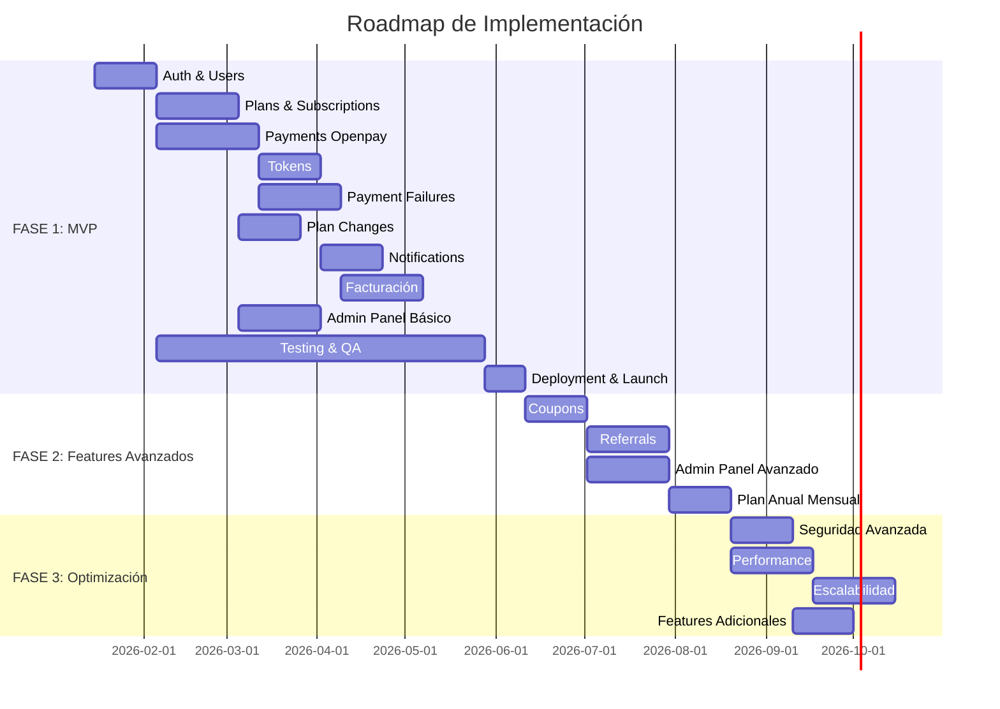

# 📅 Roadmap por Fases
## Sistema de Planes y Suscripciones

---

## 📑 Tabla de Contenidos

1. [Visión General](#visión-general)
2. [FASE 1: MVP (3-4 meses)](#fase-1-mvp-3-4-meses)
3. [FASE 2: Features Avanzados (2-3 meses)](#fase-2-features-avanzados-2-3-meses)
4. [FASE 3: Optimización y Escalabilidad (2-3 meses)](#fase-3-optimización-y-escalabilidad-2-3-meses)
5. [Resumen de Timeline](#resumen-de-timeline)

---

## Visión General

El roadmap está dividido en 3 fases principales enfocadas en entregar valor incremental mientras se construye un sistema robusto y escalable.

**Filosofía del Roadmap:**
- **Fase 1 (MVP):** Funcionalidades críticas para lanzar
- **Fase 2:** Features que mejoran la experiencia y retención
- **Fase 3:** Optimización para escalar a 10,000+ usuarios

**Estimación Total:** 7-10 meses  
**Metodología:** Agile/Scrum con sprints de 2 semanas  
**Equipo Estimado:** 2-3 desarrolladores backend, 1 frontend, 1 QA

---

## FASE 1: MVP (3-4 meses)

**Objetivo:** Lanzar sistema funcional con características esenciales para monetización.

**Entregables Clave:**
- Registro y autenticación
- Selección y contratación de planes
- Procesamiento de pagos recurrentes
- Sistema básico de tokens
- Notificaciones esenciales por email
- Panel admin básico

---

### Módulo 1: Auth & Users (2-3 semanas)

- [ ] Sistema de registro de usuarios
  - [ ] Formulario de registro con validación
  - [ ] Validación de email
  - [ ] Hash de contraseñas (bcrypt)
  - [ ] Roles de usuario (profesional, consultorio, asistente, paciente)
- [ ] Sistema de login/logout
  - [ ] Autenticación con Laravel Auth
  - [ ] "Recordarme" funcional
  - [ ] Recuperación de contraseña
- [ ] Gestión de perfil
  - [ ] Editar datos personales
  - [ ] Cambiar contraseña
  - [ ] Vista de perfil
- [ ] Formulario de datos fiscales
  - [ ] Campos específicos por país (MX/CO)
  - [ ] Validación según normativas locales
  - [ ] Encriptación de datos sensibles
- [ ] Middleware de autenticación
  - [ ] Protección de rutas
  - [ ] Validación de país (MX/CO)

**Criterios de Aceptación:**
- Usuario puede registrarse y loguearse exitosamente
- Datos fiscales completos y validados
- Contraseñas seguras y recuperables

---

### Módulo 2: Plans & Subscriptions (3-4 semanas)

- [ ] CRUD de Planes (Admin)
  - [ ] Crear planes desde admin panel
  - [ ] Editar características de planes
  - [ ] Activar/desactivar planes
  - [ ] Configurar precios por país (MXN/COP)
  - [ ] Configurar tokens mensuales
  - [ ] Configurar días de trial
- [ ] Visualización de Planes (Frontend)
  - [ ] Página de planes con comparación
  - [ ] Destacar características de cada plan
  - [ ] Mostrar precios según país del usuario
  - [ ] Indicar período de trial
- [ ] Selección y Checkout
  - [ ] Seleccionar plan y periodicidad
  - [ ] Formulario de pago (tarjeta)
  - [ ] Validación de datos
  - [ ] Confirmación pre-compra
- [ ] Gestión de Trial
  - [ ] Crear suscripción con status "trialing"
  - [ ] Asignar tokens de trial
  - [ ] Calcular fecha de vencimiento de trial
  - [ ] Conversión automática a pago
- [ ] Gestión de Suscripciones
  - [ ] Dashboard de suscripción del usuario
  - [ ] Ver plan actual y características
  - [ ] Ver próxima fecha de cobro
  - [ ] Ver historial de suscripción
- [ ] Cancelación de Suscripción
  - [ ] Flujo de cancelación con confirmación
  - [ ] Mantener acceso hasta fin de período
  - [ ] Email de confirmación
  - [ ] Opción de feedback/razón

**Criterios de Aceptación:**
- Admin puede gestionar planes completamente
- Usuario puede ver y seleccionar planes
- Trial funciona correctamente con conversión automática
- Usuario puede cancelar en cualquier momento

---

### Módulo 3: Payments con Openpay (4-5 semanas)

- [ ] Integración Openpay SDK
  - [ ] Configuración para México (MXN)
  - [ ] Configuración para Colombia (COP)
  - [ ] Ambiente sandbox para testing
  - [ ] Ambiente producción con credenciales reales
- [ ] Tokenización de Tarjetas
  - [ ] Integrar Openpay.js en frontend
  - [ ] Tokenizar tarjeta sin enviar al servidor
  - [ ] Almacenar token en backend
  - [ ] No almacenar datos completos de tarjeta
- [ ] Cobros con Tarjeta
  - [ ] Crear cargo en Openpay
  - [ ] Manejar respuestas exitosas
  - [ ] Manejar respuestas fallidas
  - [ ] Registrar transacciones en BD
- [ ] Renovación Automática
  - [ ] Job diario para identificar renovaciones
  - [ ] Procesar cobro automático
  - [ ] Actualizar suscripción en éxito
  - [ ] Iniciar reintentos en fallo
- [ ] Webhooks de Openpay
  - [ ] Endpoint para recibir webhooks
  - [ ] Validar firma HMAC
  - [ ] Procesar evento charge.succeeded
  - [ ] Procesar evento charge.failed
  - [ ] Procesar evento charge.refunded
  - [ ] Logging de todos los webhooks
- [ ] Transferencia Bancaria (Manual)
  - [ ] Generar orden de pago manual
  - [ ] Enviar email con instrucciones
  - [ ] Subir comprobante de pago
  - [ ] Admin confirma pago manual
  - [ ] Activar suscripción post-confirmación

**Criterios de Aceptación:**
- Openpay integrado en ambos países
- Cobros automáticos funcionan correctamente
- Webhooks procesados de forma confiable
- Pago manual disponible como alternativa

---

### Módulo 4: Tokens (2-3 semanas)

- [ ] Sistema de Tracking de Consumo
  - [ ] Tabla tokens_usage
  - [ ] Crear registro por período
  - [ ] Incrementar used en cada consumo
  - [ ] Calcular disponibles (total - used)
- [ ] Reseteo Mensual Automático
  - [ ] Job mensual (día 1 a las 00:00)
  - [ ] Crear nuevo registro por período
  - [ ] Asignar total según plan
  - [ ] Mantener historial de períodos anteriores
- [ ] Alertas de Consumo
  - [ ] Calcular porcentaje consumido
  - [ ] Enviar alerta al 50% (email)
  - [ ] Enviar alerta al 75% (email)
  - [ ] Enviar alerta al 90% (email)
  - [ ] Enviar alerta al 100% (email)
  - [ ] No duplicar alertas en mismo período
- [ ] Panel de Tokens (Dashboard)
  - [ ] Indicador visual de tokens restantes
  - [ ] Barra de progreso
  - [ ] Número de tokens: X de Y
  - [ ] Fecha de reseteo
  - [ ] Historial de consumo mensual
- [ ] Gestión Manual de Tokens (Admin)
  - [ ] Agregar tokens extra a usuario
  - [ ] Quitar tokens a usuario
  - [ ] Registrar razón del ajuste
  - [ ] Audit log de ajustes

**Criterios de Aceptación:**
- Consumo de tokens tracked en tiempo real
- Alertas enviadas en umbrales correctos
- Reseteo automático mensual funciona
- Admin puede ajustar tokens manualmente

---

### Módulo 5: Payment Failures & Grace Period (3-4 semanas)

- [ ] Sistema de Reintentos
  - [ ] Registrar fallo inicial
  - [ ] Programar reintento #1 (3 días)
  - [ ] Programar reintento #2 (7 días después)
  - [ ] Programar reintento #3 (10 días después)
  - [ ] Job para ejecutar reintentos
  - [ ] Actualizar subscription status a "past_due"
- [ ] Período de Gracia (2 meses)
  - [ ] Crear registro en grace_periods
  - [ ] Mantener acceso completo
  - [ ] Acumular deuda mensual
  - [ ] Tracking de meses adeudados
- [ ] Notificaciones de Período de Gracia
  - [ ] Email entrada a período de gracia
  - [ ] Email recordatorio cada 15 días
  - [ ] Mostrar deuda en dashboard
  - [ ] Contador de días restantes
- [ ] Bloqueo por Falta de Pago
  - [ ] Detectar fin de período de gracia
  - [ ] Actualizar status a "blocked"
  - [ ] Limitar acceso (solo lectura)
  - [ ] Mostrar mensaje de deuda
  - [ ] Opción de pago para reactivar
- [ ] Reactivación Post-Pago
  - [ ] Procesar pago de deuda
  - [ ] Limpiar grace_period
  - [ ] Actualizar status a "active"
  - [ ] Establecer nuevo next_billing_date
  - [ ] Email de reactivación exitosa

**Criterios de Aceptación:**
- 3 reintentos automáticos funcionan
- Período de gracia otorga 2 meses de acceso
- Usuario puede pagar y reactivar en cualquier momento
- Bloqueo efectivo después de gracia vencida

---

### Módulo 6: Plan Changes (2-3 semanas)

- [ ] Upgrade Inmediato
  - [ ] Calcular prorrata correctamente
  - [ ] Cobrar diferencia inmediata
  - [ ] Actualizar plan inmediatamente
  - [ ] Resetear tokens al nuevo plan
  - [ ] Recalcular next_billing_date
  - [ ] Email de confirmación
- [ ] Downgrade Programado
  - [ ] Guardar cambio pendiente
  - [ ] Mantener plan actual hasta renovación
  - [ ] Aplicar cambio en renovación
  - [ ] Resetear tokens en aplicación
  - [ ] Email de confirmación de programación
  - [ ] Opción de cancelar downgrade programado
- [ ] Cálculos de Prorrata
  - [ ] Prorrata mensual (30 días)
  - [ ] Prorrata anual (365 días)
  - [ ] Pruebas unitarias de cálculos
  - [ ] Edge cases (mismo día, último día)

**Criterios de Aceptación:**
- Upgrade se aplica inmediatamente con prorrata correcta
- Downgrade se programa y aplica en renovación
- Cálculos de prorrata son precisos
- Usuario puede cancelar downgrade antes de ejecución

---

### Módulo 7: Notifications (2-3 semanas)

**17 Emails MVP:**

- [ ] 1. Bienvenida (al registrarse)
- [ ] 2. Confirmación de Pago Exitoso
- [ ] 3. Recordatorio de Cobro (X días antes)
- [ ] 4. Fallo de Pago
- [ ] 5. Orden de Pago Manual
- [ ] 6. Entrada a Período de Gracia
- [ ] 7-N. Recordatorios de Gracia (cada 15 días)
- [ ] 8. Cancelación de Suscripción
- [ ] 9. Cambio de Plan (upgrade/downgrade)
- [ ] 10. Referido Exitoso (al referidor) - Placeholder MVP
- [ ] 11. Código Descuento (al referido) - Placeholder MVP
- [ ] 12. Factura Disponible
- [ ] 13. Tokens 50%
- [ ] 14. Tokens 75%
- [ ] 15. Tokens 90%
- [ ] 16. Tokens 100%
- [ ] 17. Trial Próximo a Vencer (3 días)
- [ ] 18. Trial Vencido
- [ ] 19. Reactivación Post-Pago

**Implementación:**
- [ ] Templates Blade responsive
- [ ] Personalización con datos del usuario
- [ ] Links a acciones relevantes
- [ ] Testing de cada template
- [ ] Queue para envío asíncrono
- [ ] Rate limiting (evitar spam)
- [ ] Logs de emails enviados

**Criterios de Aceptación:**
- Los 17 emails diseñados y funcionales
- Templates responsive y con branding
- Envío asíncrono mediante queues
- Logs de envíos para auditoría

---

### Módulo 8: Facturación (3-4 semanas)

- [ ] Formulario de Datos Fiscales
  - [ ] Campos México (RFC, Razón Social, etc.)
  - [ ] Campos Colombia (NIT, Razón Social, etc.)
  - [ ] Validación específica por país
  - [ ] Encriptación de datos sensibles
- [ ] Solicitud de Factura
  - [ ] Botón en historial de pagos
  - [ ] Validar datos fiscales completos
  - [ ] Validar límite de tiempo (mismo mes MX, 5 días CO)
  - [ ] Crear solicitud en BD
  - [ ] Notificar admin
  - [ ] Email confirmación a usuario
- [ ] Admin Sube Factura
  - [ ] Panel de solicitudes pendientes
  - [ ] Revisar datos fiscales
  - [ ] Subir PDF de factura
  - [ ] (Opcional) Subir XML en México
  - [ ] Marcar como "generada"
- [ ] Envío de Factura
  - [ ] Email con PDF adjunto
  - [ ] Marcar como "enviada"
  - [ ] Actualizar timestamp sent_at
- [ ] Historial de Facturas
  - [ ] Listar todas las facturas del usuario
  - [ ] Descargar PDF
  - [ ] Ver estado (pending, generated, sent)
- [ ] Validaciones de Límites
  - [ ] México: mismo mes del pago
  - [ ] Colombia: máximo 5 días post-pago
  - [ ] Mostrar errores claros si fuera de límite

**Criterios de Aceptación:**
- Usuario puede solicitar factura dentro del límite
- Admin puede generar y enviar facturas
- Facturas almacenadas y descargables
- Cumplimiento con normativas MX/CO

---

### Módulo 9: Admin Panel Básico (3-4 semanas)

- [ ] Dashboard Principal
  - [ ] Métrica: MRR (Monthly Recurring Revenue)
  - [ ] Métrica: ARR (Annual Recurring Revenue)
  - [ ] Total usuarios activos
  - [ ] Total suscripciones por plan
  - [ ] Tasa de conversión trial → pago
  - [ ] Gráfico de evolución de ingresos
  - [ ] Distribución de usuarios por plan
- [ ] Gestión de Usuarios
  - [ ] Listar todos los usuarios
  - [ ] Filtros (rol, país, status suscripción)
  - [ ] Búsqueda por email/nombre
  - [ ] Ver detalle de usuario
  - [ ] Ver suscripción del usuario
- [ ] Gestión de Planes
  - [ ] CRUD completo de planes
  - [ ] Activar/desactivar planes
  - [ ] Configurar precios
  - [ ] Configurar tokens
  - [ ] Configurar trial
- [ ] Acciones sobre Usuarios
  - [ ] Cancelar suscripción
  - [ ] Reactivar suscripción
  - [ ] Cambiar plan manualmente
- [ ] Gestión de Pagos
  - [ ] Listar todos los pagos
  - [ ] Filtros (status, fecha, método)
  - [ ] Ver detalle de pago
  - [ ] Confirmar pagos manuales
- [ ] Gestión de Facturas
  - [ ] Listar solicitudes pendientes
  - [ ] Subir PDF de factura
  - [ ] Enviar factura a usuario
  - [ ] Ver historial completo

**Criterios de Aceptación:**
- Dashboard con métricas clave funcional
- Admin puede gestionar usuarios y suscripciones
- Admin puede gestionar planes
- Admin puede confirmar pagos manuales
- Admin puede procesar facturas

---

### Testing & QA (Continuo durante FASE 1)

- [ ] Tests Unitarios
  - [ ] Cálculos de prorrata
  - [ ] Validaciones de datos fiscales
  - [ ] Cálculos de descuentos (preparación FASE 2)
  - [ ] Lógica de consumo de tokens
- [ ] Tests de Integración
  - [ ] Flujo completo de registro
  - [ ] Flujo completo de pago
  - [ ] Flujo de renovación automática
  - [ ] Flujo de webhooks
- [ ] Tests de Navegador (Dusk)
  - [ ] Proceso de checkout
  - [ ] Gestión de suscripción
  - [ ] Dashboard de usuario
- [ ] Testing Manual
  - [ ] Ambos países (MX/CO)
  - [ ] Todos los planes
  - [ ] Casos edge
  - [ ] Sandbox Openpay

**Criterios de Aceptación:**
- Cobertura de tests > 70%
- Todos los flujos críticos testeados
- Testing en ambos países exitoso
- Sandbox Openpay validado

---

### Deployment & Launch (2 semanas)

- [ ] Configuración de Producción
  - [ ] Configurar .env producción
  - [ ] Credenciales Openpay producción
  - [ ] Configurar SMTP
  - [ ] Configurar storage
- [ ] Migración de Base de Datos
  - [ ] Ejecutar migraciones en producción
  - [ ] Seeders de planes iniciales
  - [ ] Validar integridad
- [ ] Configuración de CronJobs
  - [ ] Renovaciones diarias
  - [ ] Reintentos de pago
  - [ ] Reseteo de tokens
  - [ ] Recordatorios
- [ ] Monitoreo y Logs
  - [ ] Configurar Laravel Telescope (dev)
  - [ ] Configurar logs estructurados
  - [ ] Alertas de errores críticos
- [ ] Documentación
  - [ ] Guía de usuario
  - [ ] Runbooks para operaciones
  - [ ] Procedimientos de soporte
- [ ] Lanzamiento Beta
  - [ ] Grupo reducido de usuarios
  - [ ] Recolectar feedback
  - [ ] Ajustes menores
- [ ] Lanzamiento Público
  - [ ] Comunicación a todos los usuarios
  - [ ] Soporte activo
  - [ ] Monitoreo intensivo primeras 72 horas

**Criterios de Aceptación:**
- Sistema en producción estable
- CronJobs ejecutándose correctamente
- Monitoreo activo
- Documentación completa

---

## FASE 2: Features Avanzados (2-3 meses)

**Objetivo:** Agregar características que mejoran retención y generan crecimiento orgánico.

---

### Módulo 10: Coupons (2-3 semanas)

- [ ] CRUD de Cupones (Admin)
  - [ ] Crear cupones
  - [ ] Configurar tipo (porcentaje/monto fijo)
  - [ ] Configurar valor
  - [ ] Configurar duración (meses o permanente)
  - [ ] Seleccionar planes aplicables
  - [ ] Límite de usos totales
  - [ ] Fecha de expiración
  - [ ] Activar/desactivar
- [ ] Validación de Cupones
  - [ ] Verificar código existe
  - [ ] Verificar activo
  - [ ] Verificar no expirado
  - [ ] Verificar límite no alcanzado
  - [ ] Verificar aplica al plan
  - [ ] Verificar usuario no lo ha usado
  - [ ] Verificar no tiene cupón activo
- [ ] Aplicación de Cupones
  - [ ] Input en checkout
  - [ ] Validación en tiempo real
  - [ ] Mostrar descuento aplicado
  - [ ] Calcular precio final
  - [ ] Guardar asociación user_coupons
  - [ ] Incrementar usage
- [ ] Gestión de Cupones Activos
  - [ ] Aplicar en renovaciones según duración
  - [ ] Remover al vencer duración
  - [ ] Notificar cuando descuento venza
- [ ] Reportes de Cupones (Admin)
  - [ ] Estadísticas de uso por cupón
  - [ ] Lista de usuarios que usaron cupón
  - [ ] Exportar datos
  - [ ] Análisis de efectividad

**Criterios de Aceptación:**
- Admin puede crear y gestionar cupones
- Validación completa funciona
- Descuentos se aplican correctamente
- Reportes disponibles

---

### Módulo 11: Referrals (3-4 semanas)

- [ ] Sistema de Códigos de Referido
  - [ ] Generar código único por usuario
  - [ ] Generar link único
  - [ ] Dashboard de referidos
  - [ ] Opciones para compartir (email, social, link)
- [ ] Tracking de Referidos
  - [ ] Capturar código en registro
  - [ ] Crear registro en referrals
  - [ ] Status: pending
  - [ ] Asociar referidor y referido
- [ ] Conversión de Referidos
  - [ ] Detectar primer pago del referido
  - [ ] Actualizar status a "completed"
  - [ ] Otorgar beneficios
- [ ] Beneficios del Referidor (Configurables)
  - [ ] Descuento en próxima renovación
  - [ ] Tokens extra inmediatos
  - [ ] Crédito en plataforma
  - [ ] Configuración admin de tipo y monto
- [ ] Beneficios del Referido
  - [ ] Descuento en primer pago
  - [ ] Aplicación automática
- [ ] Dashboard de Referidos
  - [ ] Lista de referidos y su status
  - [ ] Beneficios ganados
  - [ ] Estadísticas (conversión, etc.)
- [ ] Notificaciones
  - [ ] Email a referidor: amigo se registró
  - [ ] Email a referidor: amigo convirtió + beneficio
  - [ ] Email a referido: código de descuento
- [ ] Admin - Gestión de Referidos
  - [ ] Ver todos los referidos
  - [ ] Estadísticas por referidor
  - [ ] Configurar beneficios del programa
  - [ ] Límites configurables

**Criterios de Aceptación:**
- Usuario puede referir amigos fácilmente
- Tracking completo funciona
- Beneficios se otorgan correctamente
- Admin puede configurar programa

---

### Módulo 12: Admin Panel Avanzado (3-4 semanas)

- [ ] Descuentos Manuales
  - [ ] Aplicar descuento custom a usuario
  - [ ] Duración configurable
  - [ ] Razón obligatoria
  - [ ] Audit log
- [ ] Cambiar Plan de Usuario
  - [ ] Interfaz para cambio de plan
  - [ ] Opción inmediata o programada
  - [ ] Override de prorrata (admin decision)
  - [ ] Confirmación y logging
- [ ] Procesar Reembolsos
  - [ ] Listar pagos reembolsables
  - [ ] Procesar reembolso en Openpay
  - [ ] Actualizar registros
  - [ ] Ajustar suscripción si necesario
  - [ ] Notificar usuario
- [ ] Gestión de Tokens Manual
  - [ ] Agregar tokens a usuario
  - [ ] Quitar tokens
  - [ ] Razón obligatoria
  - [ ] Historial de ajustes
- [ ] Logs y Auditoría
  - [ ] Ver audit log completo
  - [ ] Filtrar por usuario, entidad, acción
  - [ ] Exportar logs
  - [ ] Ver before/after de cambios
- [ ] Reportes Avanzados
  - [ ] Reporte de ARR con proyección
  - [ ] Análisis de churn con gráficos
  - [ ] Cohortes de usuarios
  - [ ] Métricas por plan
  - [ ] Exportar todos los reportes
- [ ] Gestión de Período de Gracia
  - [ ] Listar usuarios en gracia
  - [ ] Ver deuda acumulada
  - [ ] Extender/reducir período
  - [ ] Forzar pago o bloqueo
  - [ ] Condonar deuda (con razón)
- [ ] Configuración Global
  - [ ] Días de recordatorio de cobro
  - [ ] Frecuencia recordatorios gracia
  - [ ] Configurar beneficios de referidos
  - [ ] Configurar umbrales de alertas tokens
  - [ ] Templates de emails

**Criterios de Aceptación:**
- Admin tiene control total sobre usuarios
- Reembolsos procesados correctamente
- Reportes avanzados útiles para decisiones
- Audit log completo y accesible

---

### Módulo 13: Plan Anual con Cobros Mensuales (2-3 semanas)

- [ ] Configuración de Plan
  - [ ] Periodicidad "annual_monthly_billing"
  - [ ] Contrato de 12 meses
  - [ ] Cobro mensual del total/12
- [ ] Lógica de Contrato
  - [ ] Crear contrato al suscribirse
  - [ ] Tracking de meses restantes
  - [ ] Impedir cancelación sin penalización
- [ ] Gestión de Deuda Acumulada
  - [ ] Acumular deuda si cancela antes de 12 meses
  - [ ] Calcular penalización
  - [ ] Opción de pago de deuda o continuar
- [ ] Renovaciones Mensuales
  - [ ] Cobrar mensualmente
  - [ ] Resetear tokens cada mes
  - [ ] Mantener contrato hasta completar 12 meses
- [ ] Finalización de Contrato
  - [ ] Al completar 12 meses, opción de renovar
  - [ ] Convertir a plan mensual o renovar anual
  - [ ] Notificación 30 días antes de fin

**Criterios de Aceptación:**
- Plan anual con cobros mensuales funciona
- Contrato de 12 meses se respeta
- Penalizaciones calculadas correctamente
- Usuario puede completar contrato sin problemas

---

## FASE 3: Optimización y Escalabilidad (2-3 meses)

**Objetivo:** Preparar sistema para escalar a 10,000+ usuarios con alta performance y seguridad.

---

### Módulo 14: Seguridad Avanzada (2-3 semanas)

- [ ] Autenticación de Dos Factores (2FA)
  - [ ] Integrar librería 2FA (Google Authenticator)
  - [ ] Habilitar 2FA opcional para usuarios
  - [ ] QR code para configuración
  - [ ] Códigos de backup
  - [ ] Forzar 2FA para admin
- [ ] Auditoría de Seguridad
  - [ ] Penetration testing
  - [ ] Análisis de vulnerabilidades
  - [ ] Revisión de OWASP Top 10
  - [ ] Corregir vulnerabilidades encontradas
- [ ] Cumplimiento Normativo Completo
  - [ ] Política de privacidad actualizada
  - [ ] Términos y condiciones
  - [ ] Consentimiento explícito GDPR-style
  - [ ] Derecho al olvido (exportar/eliminar datos)
  - [ ] Registro en RNBD (Colombia)
- [ ] Rate Limiting Avanzado
  - [ ] Throttling por IP
  - [ ] Throttling por usuario
  - [ ] Protección DDoS
  - [ ] Captcha en formularios críticos
- [ ] Encriptación Mejorada
  - [ ] Revisar campos encriptados
  - [ ] Encriptación en tránsito (HTTPS strict)
  - [ ] Key rotation para tokens

**Criterios de Aceptación:**
- 2FA disponible y funcional
- Penetration test aprobado
- Cumplimiento normativo completo
- Sistema resistente a ataques comunes

---

### Módulo 15: Optimización de Performance (3-4 semanas)

- [ ] Migración a Laravel 10/11
  - [ ] Actualizar dependencias
  - [ ] Migrar código deprecated
  - [ ] Testing completo post-migración
  - [ ] Aprovechar mejoras de performance
- [ ] Implementación de Redis
  - [ ] Instalar y configurar Redis
  - [ ] Cache de queries frecuentes
  - [ ] Cache de planes activos
  - [ ] Cache de configuración global
  - [ ] Session storage en Redis
  - [ ] Queue driver en Redis
- [ ] Optimización de Queries
  - [ ] Identificar N+1 queries
  - [ ] Implementar eager loading
  - [ ] Optimizar queries lentas
  - [ ] Índices adicionales en BD
  - [ ] Paginación eficiente
- [ ] CDN para Assets
  - [ ] Configurar CloudFlare CDN
  - [ ] Mover assets estáticos a CDN
  - [ ] Optimizar imágenes
  - [ ] Minificación CSS/JS
  - [ ] Gzip compression
- [ ] Lazy Loading
  - [ ] Implementar lazy loading en listas largas
  - [ ] Paginación en frontend
  - [ ] Infinite scroll donde aplique
- [ ] Query Optimization
  - [ ] Añadir índices estratégicos
  - [ ] Analizar slow queries
  - [ ] Optimizar joins complejos

**Criterios de Aceptación:**
- Tiempos de respuesta < 500ms (p95)
- Queries optimizados sin N+1
- Redis implementado correctamente
- CDN reduce carga del servidor

---

### Módulo 16: Escalabilidad (3-4 semanas)

- [ ] Migración a VPS/Cloud
  - [ ] Provisionar servidor (DigitalOcean/AWS)
  - [ ] 4 cores CPU, 8GB RAM, 100GB SSD
  - [ ] Configurar Nginx
  - [ ] Configurar PHP 8.1+ con PHP-FPM
  - [ ] Instalar MySQL 8.0
  - [ ] Instalar Redis
  - [ ] Configurar Supervisor para queues
- [ ] Load Balancing (Preparación)
  - [ ] Arquitectura para múltiples app servers
  - [ ] Sesiones en Redis (stateless)
  - [ ] Assets en CDN
  - [ ] BD centralizada
- [ ] Database Optimization
  - [ ] Índices adicionales
  - [ ] Particionamiento de tablas grandes
  - [ ] Read replicas (preparación)
  - [ ] Conexión pool
- [ ] Queue Workers
  - [ ] Múltiples workers con Supervisor
  - [ ] Queues prioritarias (high, default, low)
  - [ ] Horizon para monitoreo
  - [ ] Auto-scaling de workers (básico)
- [ ] Monitoreo y Alertas
  - [ ] Laravel Horizon (producción)
  - [ ] Sentry para error tracking
  - [ ] Uptime monitoring (UptimeRobot/Pingdom)
  - [ ] Alertas de CPU/RAM/Disk
  - [ ] Logs estructurados con análisis
- [ ] Backups Automatizados
  - [ ] Backup diario de BD
  - [ ] Backup de archivos
  - [ ] Retención 30 días
  - [ ] Backup offsite
  - [ ] Procedimiento de restauración testeado

**Criterios de Aceptación:**
- VPS configurado y en producción
- Capacidad para 10,000+ usuarios
- Monitoreo completo activo
- Backups automatizados funcionando
- Plan de escalado documentado

---

### Módulo 17: Features Adicionales (2-3 semanas)

- [ ] Dashboard de Usuario Mejorado
  - [ ] Gráficos de consumo de tokens
  - [ ] Proyección de consumo
  - [ ] Comparación mes a mes
  - [ ] Sugerencias de upgrade
- [ ] Exportaciones
  - [ ] Exportar historial de pagos (PDF/Excel)
  - [ ] Exportar consumo de tokens
  - [ ] Exportar datos personales (GDPR)
- [ ] API Pública (Básica)
  - [ ] Endpoints para consultar suscripción
  - [ ] Endpoints para consumo de tokens
  - [ ] Autenticación API con tokens
  - [ ] Documentación API (Swagger/Postman)
- [ ] Webhooks Salientes
  - [ ] Configurar webhooks por usuario
  - [ ] Eventos: pago exitoso, tokens agotados, etc.
  - [ ] Firma HMAC para seguridad
  - [ ] Logs de webhooks enviados
- [ ] Multi-lenguaje (i18n)
  - [ ] Español (por defecto)
  - [ ] Inglés
  - [ ] Traducciones de interfaz
  - [ ] Emails en idioma del usuario

**Criterios de Aceptación:**
- Dashboard mejorado con analytics útiles
- Exportaciones funcionan correctamente
- API documentada y funcional
- Webhooks salientes configurables

---

## Resumen de Timeline

---

## Métricas de Éxito por Fase

### FASE 1 (MVP)
- [ ] Sistema en producción
- [ ] > 100 usuarios activos
- [ ] Tasa de conversión trial > 40%
- [ ] Tasa de éxito de pagos > 95%
- [ ] MRR creciendo mensualmente

### FASE 2
- [ ] > 500 usuarios activos
- [ ] Cupones usados por > 20% nuevos usuarios
- [ ] Referidos contribuyen > 10% nuevos usuarios
- [ ] Churn rate < 5%

### FASE 3
- [ ] > 10,000 usuarios activos
- [ ] Uptime > 99.5%
- [ ] Tiempo respuesta < 500ms (p95)
- [ ] 0 vulnerabilidades críticas
- [ ] Escalabilidad probada

---

**Estimación Total:** 7-10 meses  
**Sprint Duration:** 2 semanas  
**Total Sprints:** ~14-20 sprints

**Documento:** ROADMAP v1.0  
**Fecha:** Enero 2026  
**Próxima Revisión:** Mensual durante desarrollo

