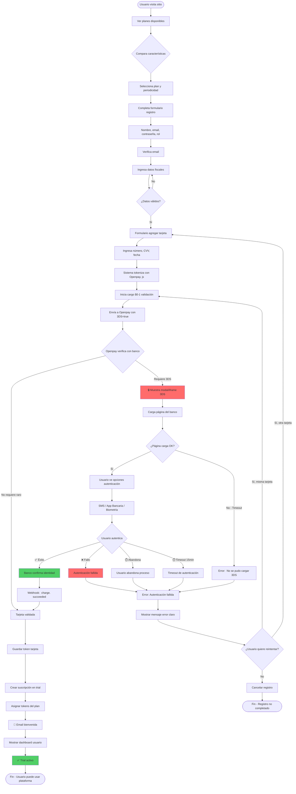
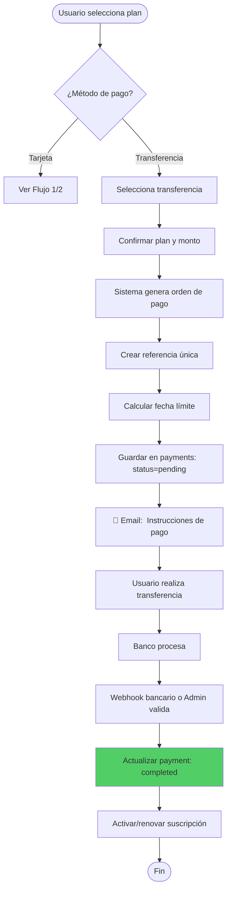
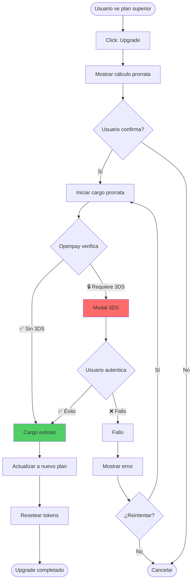
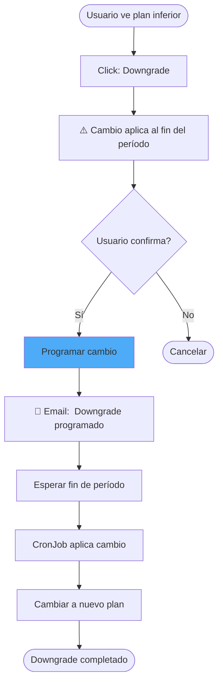
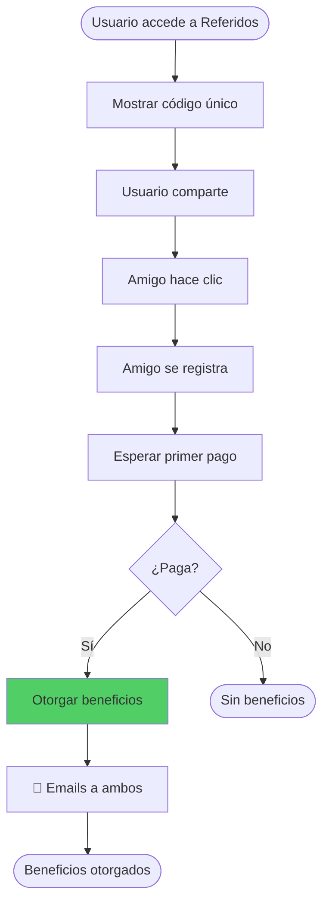
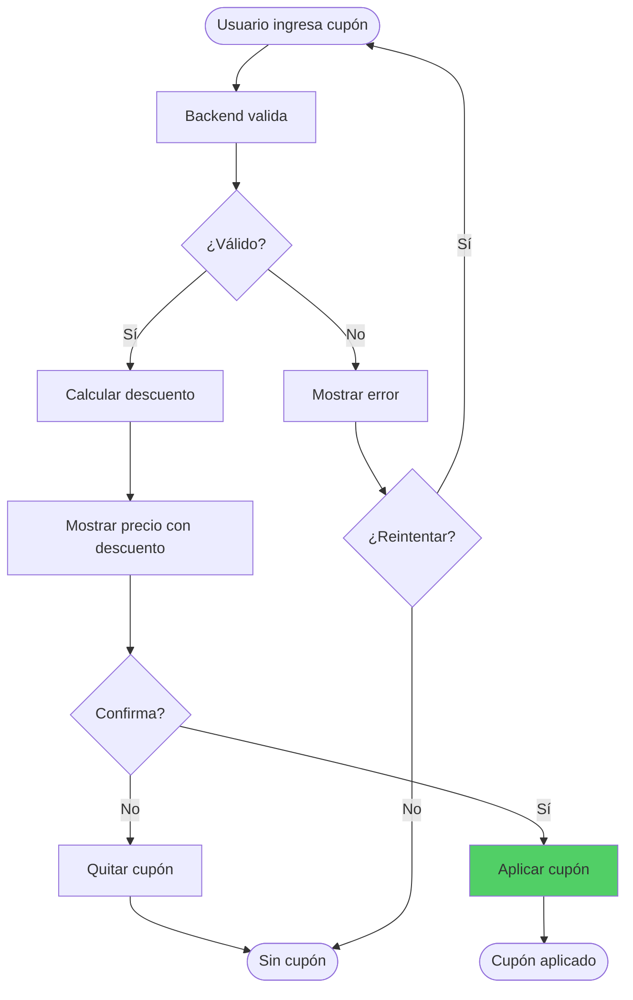
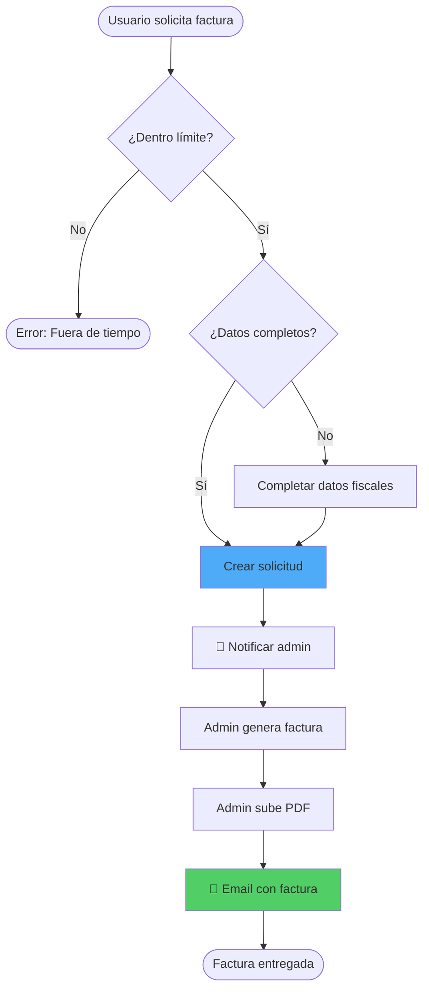
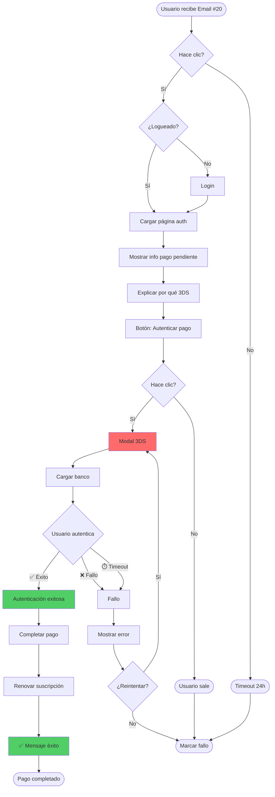

# Diagramas de Flujo de Usuario
## Sistema de Suscripciones - Agenda Médica SaaS

**Versión:** 1.1  
**Fecha:** Enero 2026  
**Actualización:** Integración 3D Secure (3DS)

---

## 📑 Tabla de Contenidos

1. [Flujo 1: Registro y Trial con 3DS](#flujo-1-registro-y-trial-con-3ds)
2. [Flujo 2: Renovación Automática con MIT/3DS](#flujo-2-renovación-automática-con-mit3ds)
3. [Flujo 3: Pagos Manuales (Transferencia)](#flujo-3-pagos-manuales-transferencia)
4. [Flujo 4: Upgrade de Plan con 3DS](#flujo-4-upgrade-de-plan-con-3ds)
5. [Flujo 5: Downgrade de Plan](#flujo-5-downgrade-de-plan)
6. [Flujo 6: Sistema de Referidos](#flujo-6-sistema-de-referidos)
7. [Flujo 7: Aplicación de Cupón](#flujo-7-aplicación-de-cupón)
8. [Flujo 8: Solicitud de Factura](#flujo-8-solicitud-de-factura)
9. [🆕 Flujo 9: Autenticación de Pago Pendiente (3DS)](#flujo-9-autenticación-de-pago-pendiente-3ds)

---

## Flujo 1: Registro y Trial con 3DS

**Objetivo:** Usuario nuevo se registra, agrega tarjeta con autenticación 3DS y activa su trial.

**Actores:** Usuario nuevo, Sistema, Openpay, Banco Emisor

**⚠️ Cambios vs versión anterior:** Agregado proceso completo de autenticación 3D Secure obligatorio.

**Puntos clave:**
- ✅ **3DS es obligatorio** en el primer pago
- ✅ Usuario ve **modal/iframe** (no redirect completo - mejor UX)
- ✅ Múltiples métodos de autenticación (SMS, app, biometría)
- ✅ Timeout de **15 minutos**
- ✅ Opciones de reintento claras
- ✅ Mensajes tranquilizadores ("Es por tu seguridad")

**Estados del pago durante el flujo:**
1. `pending` → Pago creado
2. `processing` → Enviado a Openpay
3. `requires_3ds` → Esperando autenticación usuario
4. `authenticating` → Usuario en modal del banco
5. `authenticated` → Autenticación exitosa
6. `completed` → Pago completado, trial activo

**Tiempo estimado:**
- Sin problemas: **3-5 minutos**
- Con reintento: **5-8 minutos**

---

## Flujo 2: Renovación Automática con MIT/3DS

**Objetivo:** Renovar suscripción automáticamente, usando MIT cuando sea posible, o solicitando autenticación 3DS si el banco lo requiere.

**Actores:** CronJob, Sistema, Openpay, Banco Emisor, Usuario

**⚠️ Cambios vs versión anterior:** Agregado manejo de MIT (exención 3DS) y flujo alternativo si se requiere autenticación.

```mermaid
flowchart TD
    Start([CronJob diario:  Procesar renovaciones]) --> GetSubs[Obtener suscripciones a renovar hoy]
    
    GetSubs --> ForEach{Por cada suscripción}
    ForEach -->|Siguiente| CheckActive{¿Suscripción activa?}
    ForEach -->|Fin| EndCron([Fin CronJob])
    
    CheckActive -->|No| ForEach
    CheckActive -->|Sí| CheckCard{¿Tiene tarjeta guardada?}
    
    CheckCard -->|No| ManualPayment[Generar orden pago manual]
    CheckCard -->|Sí| CreatePayment[Crear registro Payment]
    
    ManualPayment --> EmailManual[📧 Email:  Orden de pago]
    EmailManual --> ForEach
    
    CreatePayment --> InitCharge[Iniciar cargo recurrente]
    InitCharge --> OpenpayMIT[Solicitar a Openpay con MIT=true]
    
    OpenpayMIT --> OpenpayResponse{Respuesta Openpay}
    
    OpenpayResponse -->|✅ Éxito - MIT aceptado| ChargeSuccess[Pago completado sin 3DS]
    OpenpayResponse -->|🔒 Requiere 3DS| BankRequires3DS[Banco solicita autenticación]
    OpenpayResponse -->|❌ Fallo - Fondos| ChargeFailed[Fallo:  Fondos insuficientes]
    OpenpayResponse -->|❌ Fallo - Tarjeta| ChargeFailedCard[Fallo: Tarjeta expirada/inválida]
    OpenpayResponse -->|❌ Fallo - Técnico| ChargeFailedTech[Fallo técnico]
    
    ChargeSuccess --> UpdatePayment[Actualizar payment:  completed]
    UpdatePayment --> RenewSub[Renovar suscripción]
    RenewSub --> ResetTokens[Resetear tokens al plan]
    ResetTokens --> EmailSuccess[📧 Email: Pago exitoso]
    EmailSuccess --> MarkInvoice[Marcar para facturación]
    MarkInvoice --> ForEach
    
    BankRequires3DS --> MarkRequires3DS[Marcar payment:  requires_3ds]
    MarkRequires3DS --> SaveRedirectURL[Guardar URL autenticación]
    SaveRedirectURL --> EmailAuthRequired[📧 Email #20:  Acción requerida - Autentica tu pago]
    
    EmailAuthRequired --> WaitUser{Usuario actúa en 24h? }
    
    WaitUser -->|Sí - Hace clic| UserLogin[Usuario ingresa a plataforma]
    WaitUser -->|No| Timeout24h[Timeout 24h sin acción]
    
    UserLogin --> ShowAuthPage[Mostrar página autenticación]
    ShowAuthPage --> ExplainWhy[Explicar por qué necesita autenticar]
    ExplainWhy --> ButtonAuth[Botón: Autenticar mi pago]
    
    ButtonAuth --> Open3DSModal[Abrir modal 3DS]
    Open3DSModal --> BankAuth[Usuario autentica con banco]
    
    BankAuth -->|✅ Éxito| Webhook3DSSuccess[Webhook: charge.succeeded]
    BankAuth -->|❌ Fallo| Auth3DSFailed[Autenticación fallida]
    BankAuth -->|⏱️ Timeout| Auth3DSTimeout[Timeout 15 min]
    
    Webhook3DSSuccess --> ChargeSuccess
    
    Auth3DSFailed --> Timeout24h
    Auth3DSTimeout --> Timeout24h
    
    Timeout24h --> CountAttempt[Contar como fallo intento 1]
    CountAttempt --> ChargeFailed
    
    ChargeFailed --> SaveRetry[Guardar en payment_retries]
    ChargeFailedCard --> SaveRetry
    ChargeFailedTech --> SaveRetry
    
    SaveRetry --> CheckAttempts{¿Intentos < 3?}
    
    CheckAttempts -->|Sí| ScheduleRetry[Programar reintento]
    CheckAttempts -->|No| EnterGrace[Entrar período de gracia]
    
    ScheduleRetry --> CalcRetryDate[Calcular fecha reintento]
    CalcRetryDate --> Retry1{¿Intento? }
    
    Retry1 -->|1| Schedule3Days[+3 días]
    Retry1 -->|2| Schedule5Days[+5 días]
    
    Schedule3Days --> EmailRetry[📧 Email:  Reintento programado]
    Schedule5Days --> EmailRetry
    EmailRetry --> ForEach
    
    EnterGrace --> CreateGracePeriod[Crear grace_period:  2 meses]
    CreateGracePeriod --> EmailGrace[📧 Email:  Período de gracia]
    EmailGrace --> ScheduleReminders[Programar recordatorios cada 15 días]
    ScheduleReminders --> ForEach
    
    style OpenpayMIT fill:#4dabf7
    style ChargeSuccess fill:#51cf66
    style BankRequires3DS fill:#ff6b6b
    style EmailAuthRequired fill:#ffd43b
    style Webhook3DSSuccess fill:#51cf66
    style EnterGrace fill:#ff8787
```

**Métricas a monitorear:**
- % de renovaciones con MIT exitoso (objetivo:  >70%)
- % de renovaciones que requieren 3DS (baseline para detectar cambios)
- Tasa de respuesta a email #20 en 24h (objetivo: >60%)
- % de usuarios que completan autenticación solicitada (objetivo: >80%)

---

## Flujo 3: Pagos Manuales (Transferencia)

**Objetivo:** Usuario sin tarjeta puede pagar con transferencia bancaria.

**✅ Sin cambios:** Este flujo NO requiere 3DS porque no usa tarjeta.

---

## Flujo 4: Upgrade de Plan con 3DS

**Objetivo:** Usuario sube de plan inmediatamente. 

**⚠️ Cambios:** Puede requerir 3DS si el banco lo solicita.

---

## Flujo 5: Downgrade de Plan

**Objetivo:** Usuario baja de plan al fin del período. 

**✅ Sin cambios:** No requiere pago inmediato.

---

## Flujo 6: Sistema de Referidos

**✅ Sin cambios:** 3DS no afecta este flujo.

---

## Flujo 7: Aplicación de Cupón

**✅ Sin cambios:** Solo reduce monto a cobrar.

---

## Flujo 8: Solicitud de Factura

**✅ Sin cambios:** Post-pago, no requiere 3DS. 

---

## 🆕 Flujo 9: Autenticación de Pago Pendiente (3DS)

**✨ NUEVO:** Cuando renovación requiere 3DS. 

**Métricas:**
- Tasa apertura email #20: >60%
- Tasa clic botón: >80%
- Tasa autenticación exitosa: >85%
- Tiempo promedio: <3 min

---

## 📊 Resumen de Cambios por 3DS

| Flujo | Cambio | Impacto |
|-------|--------|---------|
| **Flujo 1: Registro + Trial** | 🔴 Alto | 3DS obligatorio |
| **Flujo 2: Renovación** | 🔴 Alto | MIT + 3DS requerido |
| **Flujo 3: Transferencia** | 🟢 Ninguno | No usa tarjeta |
| **Flujo 4: Upgrade** | 🟡 Medio | Puede requerir 3DS |
| **Flujo 5: Downgrade** | 🟢 Ninguno | No cobra inmediato |
| **Flujo 6: Referidos** | 🟢 Ninguno | No afecta lógica |
| **Flujo 7: Cupones** | 🟢 Ninguno | Solo reduce monto |
| **Flujo 8: Factura** | 🟢 Ninguno | Post-pago |
| **🆕 Flujo 9: Auth 3DS** | 🔴 Nuevo | Completamente nuevo |

---

## 📚 Referencias

- [Documento 3DS Integration](./3DS_INTEGRATION.md)
- [PRD - Requerimientos](./PRD.md)
- [Casos de Uso Detallados](./USE_CASES.md)

---

**Versión:** 1.1  
**Cambios:**
- ✅ Agregado Flujo 1 con 3DS completo
- ✅ Agregado Flujo 2 con MIT y manejo 3DS
- ✅ Agregado Flujo 4 con posible 3DS
- ✅ Agregado Flujo 9 (nuevo) autenticación pendiente
- ✅ Simplificados flujos 3, 5, 6, 7, 8 (sin cambios 3DS)

---

**Fin del Documento**