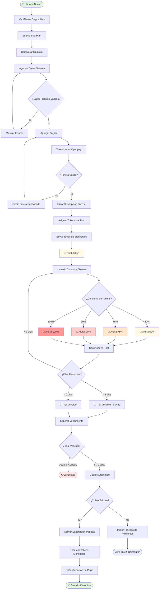
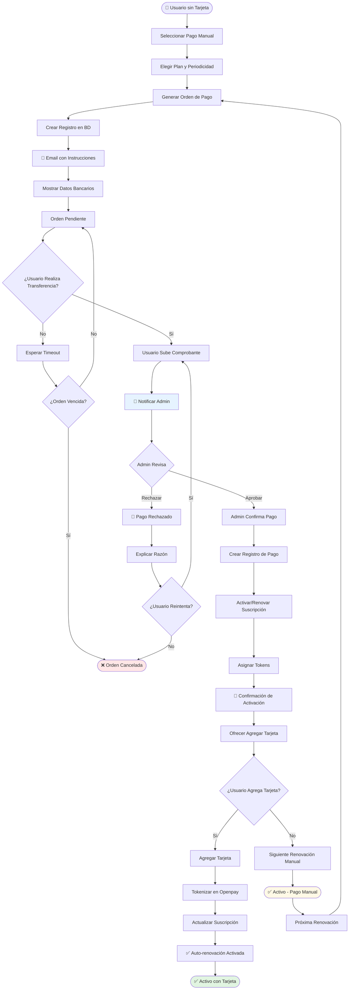
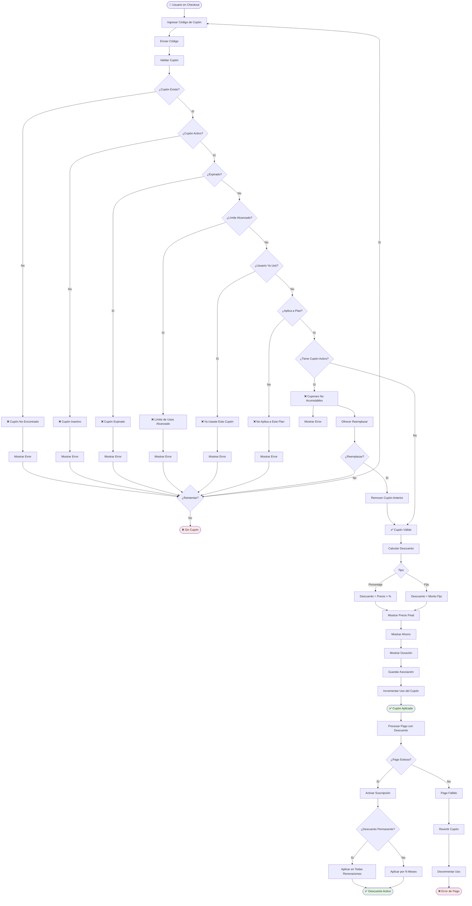

# 🔄 Diagramas de Flujo de Usuario
## Sistema de Planes y Suscripciones

---

## 📑 Tabla de Contenidos

1. [Introducción](#introducción)
2. [Flujo 1: Registro y Trial](#flujo-1-registro-y-trial)
3. [Flujo 2: Pagos Recurrentes con Tarjeta](#flujo-2-pagos-recurrentes-con-tarjeta)
4. [Flujo 3: Pagos Manuales con Transferencia](#flujo-3-pagos-manuales-con-transferencia)
5. [Flujo 4: Upgrade de Plan](#flujo-4-upgrade-de-plan)
6. [Flujo 5: Downgrade de Plan](#flujo-5-downgrade-de-plan)
7. [Flujo 6: Sistema de Referidos](#flujo-6-sistema-de-referidos)
8. [Flujo 7: Aplicación de Cupón](#flujo-7-aplicación-de-cupón)
9. [Flujo 8: Solicitud de Factura](#flujo-8-solicitud-de-factura)

---

## Introducción

Este documento presenta los flujos de usuario principales del sistema de suscripciones. Cada diagrama ilustra el recorrido completo del usuario a través de procesos clave, incluyendo decisiones, validaciones y resultados.

**Convenciones:**
- 🟢 **Verde:** Flujos exitosos
- 🔴 **Rojo:** Flujos de error o rechazo
- 🟡 **Amarillo:** Procesos en espera o validación
- 💎 **Rombo:** Puntos de decisión
- 📦 **Rectángulo:** Procesos o acciones
- ⭕ **Círculo:** Inicio/Fin

---

## Flujo 1: Registro y Trial

**Descripción:** Proceso completo desde que un nuevo usuario se registra hasta la conversión del trial en suscripción de pago.



---

## Flujo 2: Pagos Recurrentes con Tarjeta

**Descripción:** Proceso de renovación automática de suscripción, manejo de fallos y período de gracia.

```mermaid
flowchart TD
    Start([⏰ Fecha de Renovación]) --> AttemptCharge[Intentar Cobro Automático]
    
    AttemptCharge --> ChargeResult{¿Resultado?}
    
    ChargeResult -->|✅ Exitoso| RenewSubscription[Renovar Suscripción]
    RenewSubscription --> ResetTokens[Resetear Tokens Mensuales]
    ResetTokens --> SendConfirmation[📧 Email Confirmación]
    SendConfirmation --> CreateInvoiceReq[Crear Solicitud de Factura]
    CreateInvoiceReq --> UpdateBilling[Actualizar Next Billing Date]
    UpdateBilling --> Success([✅ Renovación Exitosa])
    
    ChargeResult -->|❌ Fallido| RecordFailure[Registrar Fallo]
    RecordFailure --> SendFailureEmail[📧 Email Fallo de Pago]
    SendFailureEmail --> Retry1{¿Reintento 1?}
    
    Retry1 -->|Sí| Wait3Days[Esperar 3 Días]
    Wait3Days --> AttemptRetry1[Reintento Automático #1]
    AttemptRetry1 --> Retry1Result{¿Resultado?}
    
    Retry1Result -->|✅ Exitoso| RenewSubscription
    Retry1Result -->|❌ Fallido| LogRetry1[Registrar Reintento #1]
    LogRetry1 --> SendRetry1Fail[📧 Fallo Reintento #1]
    SendRetry1Fail --> Wait7Days[Esperar 7 Días]
    
    Wait7Days --> AttemptRetry2[Reintento Automático #2]
    AttemptRetry2 --> Retry2Result{¿Resultado?}
    
    Retry2Result -->|✅ Exitoso| RenewSubscription
    Retry2Result -->|❌ Fallido| LogRetry2[Registrar Reintento #2]
    LogRetry2 --> SendRetry2Fail[📧 Fallo Reintento #2]
    SendRetry2Fail --> Wait10Days[Esperar 10 Días]
    
    Wait10Days --> AttemptRetry3[Reintento Automático #3]
    AttemptRetry3 --> Retry3Result{¿Resultado?}
    
    Retry3Result -->|✅ Exitoso| RenewSubscription
    Retry3Result -->|❌ Fallido| LogRetry3[Registrar Reintento #3]
    LogRetry3 --> AllRetriesFailed[3 Reintentos Fallidos]
    
    AllRetriesFailed --> StartGracePeriod[Iniciar Período de Gracia]
    StartGracePeriod --> SetGraceEnd[Establecer Fin: +2 Meses]
    SetGraceEnd --> SendGraceStart[📧 Entrada a Período de Gracia]
    SendGraceStart --> FullAccessGrace[✅ Acceso Completo Mantenido]
    
    FullAccessGrace --> GraceLoop{¿En Período Gracia?}
    GraceLoop -->|Cada 15 días| SendReminder[📧 Recordatorio de Pago]
    SendReminder --> AccumulateDebt[Acumular Deuda]
    AccumulateDebt --> CheckPayment{¿Usuario Pagó?}
    
    CheckPayment -->|Sí| ProcessPayment[Procesar Pago]
    ProcessPayment --> ClearDebt[Limpiar Deuda]
    ClearDebt --> ExitGrace[Salir de Período Gracia]
    ExitGrace --> ReactivateNormal[Reactivar Normal]
    ReactivateNormal --> SendReactivation[📧 Reactivación Exitosa]
    SendReactivation --> Reactivated([✅ Reactivado])
    
    CheckPayment -->|No| ContinueGrace[Continuar en Gracia]
    ContinueGrace --> GraceExpired{¿Gracia Vencida?}
    
    GraceExpired -->|No| GraceLoop
    GraceExpired -->|Sí, 2 Meses| BlockAccount[Bloquear Cuenta]
    BlockAccount --> FinalDebt[Deuda Acumulada Final]
    FinalDebt --> SendBlockNotice[📧 Cuenta Bloqueada]
    SendBlockNotice --> LimitedAccess[Acceso Limitado - Solo Lectura]
    LimitedAccess --> ShowDebt[Mostrar Deuda y Opción Pago]
    ShowDebt --> Blocked([🚫 Bloqueado con Deuda])
    
    Blocked --> UserPaysDebt{¿Paga Deuda?}
    UserPaysDebt -->|Sí| ProcessPayment
    UserPaysDebt -->|No| StayBlocked[Permanece Bloqueado]
    StayBlocked --> Blocked
    
    style Success fill:#e1f5e1
    style Reactivated fill:#e1f5e1
    style Blocked fill:#ffe6e6
    style FullAccessGrace fill:#fff9e6
    style SendReminder fill:#ffe6cc
```



---

## Flujo 3: Pagos Manuales con Transferencia

**Descripción:** Proceso para usuarios que prefieren pagar mediante transferencia bancaria.



---

## Flujo 4: Upgrade de Plan

**Descripción:** Cambio inmediato a un plan superior con cálculo de prorrata.

```mermaid
flowchart TD
    Start([👤 Usuario Activo]) --> ViewUpgrade[Ver Planes Superiores]
    ViewUpgrade --> SelectNewPlan[Seleccionar Nuevo Plan]
    SelectNewPlan --> CalculateProrata[Calcular Prorrata]
    
    CalculateProrata --> GetCurrentPlan[Obtener Plan Actual]
    GetCurrentPlan --> GetDaysRemaining[Calcular Días Restantes]
    GetDaysRemaining --> CalculateCredit[Crédito = Días/Total × Precio]
    CalculateCredit --> GetNewPlanPrice[Obtener Precio Nuevo Plan]
    GetNewPlanPrice --> CalculateCharge[Cargo = Nuevo Precio - Crédito]
    
    CalculateCharge --> ShowSummary[Mostrar Resumen]
    ShowSummary --> DisplayCredit[Crédito por Días Restantes]
    DisplayCredit --> DisplayCharge[Cargo Inmediato]
    DisplayCharge --> DisplayNextCharge[Próximo Cargo Completo]
    DisplayNextCharge --> DisplayTokens[Tokens del Nuevo Plan]
    
    DisplayTokens --> UserConfirms{¿Usuario Confirma?}
    
    UserConfirms -->|No| UpgradeCancelled([❌ Upgrade Cancelado])
    
    UserConfirms -->|Sí| ProcessCharge[Procesar Cargo Prorrateado]
    ProcessCharge --> ChargeResult{¿Cargo Exitoso?}
    
    ChargeResult -->|No| PaymentFailed[Error de Pago]
    PaymentFailed --> ShowError[Mostrar Error]
    ShowError --> RetryPayment{¿Reintentar?}
    RetryPayment -->|Sí| ProcessCharge
    RetryPayment -->|No| UpgradeCancelled
    
    ChargeResult -->|Sí| UpdateSubscription[Actualizar Suscripción]
    UpdateSubscription --> ChangePlan[Cambiar a Nuevo Plan]
    ChangePlan --> ResetTokensImmediate[Resetear Tokens INMEDIATAMENTE]
    ResetTokensImmediate --> AssignNewTokens[Asignar Tokens Nuevo Plan]
    AssignNewTokens --> UpdateBillingDate[Actualizar Next Billing Date]
    UpdateBillingDate --> CreatePaymentRecord[Crear Registro de Pago]
    CreatePaymentRecord --> SendConfirmation[📧 Confirmación Upgrade]
    SendConfirmation --> LogChange[Registrar en Audit Log]
    LogChange --> UpgradeComplete([✅ Upgrade Completado])
    
    UpgradeComplete --> NextBilling[Próxima Renovación]
    NextBilling --> FullPriceCharge[Cobro Precio Completo]
    FullPriceCharge --> NormalRenewal([🔄 Ciclo Normal])
    
    style UpgradeComplete fill:#e1f5e1
    style UpgradeCancelled fill:#ffe6e6
    style ResetTokensImmediate fill:#ffe6cc
```



**Ejemplo de Cálculo de Prorrata:**
```
Plan Actual: $50/mes mensual
Días restantes en período: 15 días (de 30)
Plan Nuevo: $100/mes mensual

Cálculo:
- Crédito = (15/30) × $50 = $25
- Cargo inmediato = $100 - $25 = $75
- Próxima renovación (en 15 días): $100 completo
- Tokens: Resetean INMEDIATAMENTE al pool del plan nuevo
```

---

## Flujo 5: Downgrade de Plan

**Descripción:** Cambio programado a un plan inferior que se aplica al finalizar el período actual.

```mermaid
flowchart TD
    Start([👤 Usuario Activo]) --> ViewDowngrade[Ver Planes Inferiores]
    ViewDowngrade --> SelectLowerPlan[Seleccionar Plan Menor]
    SelectLowerPlan --> ShowImpact[Mostrar Impacto del Cambio]
    
    ShowImpact --> DisplayTokenReduction[Tokens Reducidos]
    DisplayTokenReduction --> DisplayNewPrice[Nuevo Precio Menor]
    DisplayNewPrice --> DisplayEffectiveDate[Efectivo: Próxima Renovación]
    DisplayEffectiveDate --> DisplayCurrentPlan[Plan Actual Continúa Hasta...]
    
    DisplayCurrentPlan --> UserConfirms{¿Usuario Confirma?}
    
    UserConfirms -->|No| DowngradeCancelled([❌ Downgrade Cancelado])
    
    UserConfirms -->|Sí| ScheduleDowngrade[Programar Downgrade]
    ScheduleDowngrade --> SavePendingChange[Guardar Cambio Pendiente]
    SavePendingChange --> SendConfirmation[📧 Downgrade Programado]
    SendConfirmation --> ShowStatus[Mostrar Estado: Pendiente]
    ShowStatus --> DowngradeScheduled([📅 Downgrade Programado])
    
    DowngradeScheduled --> ContinueCurrent[Continuar con Plan Actual]
    ContinueCurrent --> MaintainTokens[Mantener Tokens Actuales]
    MaintainTokens --> WaitRenewal[Esperar Fecha Renovación]
    
    WaitRenewal --> UserCancels{¿Usuario Cancela Downgrade?}
    UserCancels -->|Sí| CancelScheduled[Cancelar Cambio Programado]
    CancelScheduled --> RemovePending[Eliminar Cambio Pendiente]
    RemovePending --> SendCancellation[📧 Downgrade Cancelado]
    SendCancellation --> StayCurrentPlan([✅ Permanece Plan Actual])
    
    UserCancels -->|No| RenewalDate{¿Fecha de Renovación?}
    
    RenewalDate -->|Llega| ExecuteDowngrade[Ejecutar Downgrade]
    ExecuteDowngrade --> UpdatePlan[Cambiar a Nuevo Plan]
    UpdatePlan --> ChargeNewPrice[Cobrar Nuevo Precio]
    ChargeNewPrice --> ChargeResult{¿Cargo Exitoso?}
    
    ChargeResult -->|No| HandleFailure[Manejar Fallo]
    HandleFailure --> RetryFlow([Ver Flujo 2: Reintentos])
    
    ChargeResult -->|Sí| ResetTokensNew[Resetear a Tokens Nuevo Plan]
    ResetTokensNew --> SendChangeConfirm[📧 Cambio Aplicado]
    SendChangeConfirm --> LogChange[Registrar en Audit Log]
    LogChange --> DowngradeComplete([✅ Downgrade Completado])
    
    style DowngradeComplete fill:#e1f5e1
    style DowngradeCancelled fill:#ffe6e6
    style DowngradeScheduled fill:#fff9e6
    style StayCurrentPlan fill:#e1f5e1
```



**Línea de Tiempo del Downgrade:**
```
Día 0: Usuario solicita downgrade
       - Se programa el cambio
       - Usuario continúa con plan actual
       
Días 1-29: 
       - Plan actual sigue activo
       - Tokens del plan actual disponibles
       - Usuario puede cancelar el downgrade programado
       
Día 30: Fecha de renovación
       - Se ejecuta el downgrade
       - Se cobra el nuevo precio menor
       - Tokens resetean al pool del plan nuevo
       - Confirmación enviada
```

---

## Flujo 6: Sistema de Referidos

**Descripción:** Proceso completo del programa de referidos desde la generación del código hasta el otorgamiento de beneficios.

```mermaid
flowchart TD
    Start([👤 Usuario Activo]) --> AccessReferral[Acceder a Programa Referidos]
    AccessReferral --> GenerateCode[Generar Código Único]
    GenerateCode --> CreateLink[Crear Link Único]
    CreateLink --> ShowDashboard[Mostrar Dashboard Referidos]
    
    ShowDashboard --> ShareOptions[Opciones para Compartir]
    ShareOptions --> ShareEmail[📧 Email]
    ShareOptions --> ShareSocial[📱 Redes Sociales]
    ShareOptions --> ShareDirect[🔗 Link Directo]
    
    ShareEmail --> ReferrerShares([Referidor Comparte])
    ShareSocial --> ReferrerShares
    ShareDirect --> ReferrerShares
    
    ReferrerShares --> FriendReceives[Amigo Recibe Invitación]
    FriendReceives --> FriendClicks[Amigo Click en Link]
    FriendClicks --> CaptureCode[Capturar Código de Referido]
    CaptureCode --> ShowPlans[Mostrar Planes]
    
    ShowPlans --> FriendRegisters{¿Amigo se Registra?}
    
    FriendRegisters -->|No| LinkExpires([❌ Link No Usado])
    
    FriendRegisters -->|Sí| CreateReferral[Crear Registro Referral]
    CreateReferral --> AssociateCode[Asociar Código]
    AssociateCode --> SetStatusPending[Status: Pending]
    SetStatusPending --> CompleteRegistration[Completar Registro]
    CompleteRegistration --> StartTrial[Iniciar Trial]
    StartTrial --> NotifyReferrer1[🔔 Notificar Referidor: Registro]
    NotifyReferrer1 --> ReferredInTrial([🎯 Referido en Trial])
    
    ReferredInTrial --> TrialPeriod[Período de Trial]
    TrialPeriod --> TrialEnds{¿Resultado Trial?}
    
    TrialEnds -->|Cancela| MarkExpired[Marcar Referral: Expired]
    MarkExpired --> NoConversion([❌ Sin Conversión])
    
    TrialEnds -->|Convierte| FirstPayment[Primer Pago Exitoso]
    FirstPayment --> ValidatePayment{¿Pago Confirmado?}
    
    ValidatePayment -->|No| WaitConfirm[Esperar Confirmación]
    WaitConfirm --> ValidatePayment
    
    ValidatePayment -->|Sí| MarkCompleted[Marcar Referral: Completed]
    MarkCompleted --> GetBenefitsConfig[Obtener Config Beneficios]
    
    GetBenefitsConfig --> GrantReferrerBenefit[Otorgar Beneficio Referidor]
    GrantReferrerBenefit --> CheckBenefitType{Tipo Beneficio}
    
    CheckBenefitType -->|Descuento| ApplyDiscount[Aplicar Descuento Próxima Renovación]
    CheckBenefitType -->|Tokens| AddTokens[Agregar Tokens Extra]
    CheckBenefitType -->|Crédito| AddCredit[Agregar Crédito Plataforma]
    
    ApplyDiscount --> NotifyReferrer2[📧 Beneficio Otorgado]
    AddTokens --> NotifyReferrer2
    AddCredit --> NotifyReferrer2
    
    NotifyReferrer2 --> GrantReferredBenefit[Otorgar Beneficio Referido]
    GrantReferredBenefit --> ApplyReferredDiscount[Aplicar Descuento]
    ApplyReferredDiscount --> SendReferredCode[📧 Código Descuento]
    SendReferredCode --> UpdateDashboard[Actualizar Dashboard]
    UpdateDashboard --> LogBenefits[Registrar en Audit Log]
    LogBenefits --> ReferralComplete([✅ Referido Completado])
    
    ReferralComplete --> CheckLimit{¿Límite Alcanzado?}
    CheckLimit -->|No| CanReferMore([Puede Referir Más])
    CheckLimit -->|Sí| LimitReached([⚠️ Límite Alcanzado])
    
    style ReferralComplete fill:#e1f5e1
    style NoConversion fill:#ffe6e6
    style LinkExpires fill:#ffe6e6
    style ReferredInTrial fill:#fff9e6
```



**Configuración de Beneficios (Ejemplo):**
```json
{
  "referrer": {
    "type": "discount",
    "value": 20,
    "unit": "percentage",
    "duration_months": 1
  },
  "referred": {
    "type": "discount",
    "value": 10,
    "unit": "percentage",
    "duration_months": 3
  }
}
```

---

## Flujo 7: Aplicación de Cupón

**Descripción:** Validación y aplicación de cupones de descuento.



**Ejemplo de Validación:**
```
Cupón: PROMO20
Tipo: Porcentaje
Valor: 20%
Duración: 3 meses
Plan: Google Tech + IA 100
Precio Original: $100/mes

Validaciones:
✅ Cupón existe
✅ Está activo
✅ No expirado
✅ Límite no alcanzado (50 de 100)
✅ Usuario no lo ha usado
✅ Aplica al plan seleccionado
✅ Usuario no tiene otro cupón activo

Resultado:
- Descuento: $20/mes
- Precio Final: $80/mes
- Duración: 3 meses
- Después del mes 3: vuelve a $100/mes
```

---

## Flujo 8: Solicitud de Factura

**Descripción:** Proceso de solicitud, generación y entrega de facturas electrónicas.

```mermaid
flowchart TD
    Start([👤 Usuario con Pago]) --> AccessInvoices[Acceder a Facturas]
    AccessInvoices --> ViewPayments[Ver Historial de Pagos]
    ViewPayments --> SelectPayment[Seleccionar Pago para Facturar]
    
    SelectPayment --> CheckAlreadyInvoiced{¿Ya Facturado?}
    
    CheckAlreadyInvoiced -->|Sí| ShowExistingInvoice[Mostrar Factura Existente]
    ShowExistingInvoice --> DownloadPDF[Descargar PDF]
    DownloadPDF --> Done([✅ Factura Descargada])
    
    CheckAlreadyInvoiced -->|No| CheckFiscalData{¿Datos Fiscales Completos?}
    
    CheckFiscalData -->|No| RedirectFiscal[Redirigir a Datos Fiscales]
    RedirectFiscal --> FillFiscalData[Completar Formulario]
    FillFiscalData --> ValidateFiscal[Validar Datos]
    ValidateFiscal --> FiscalValid{¿Válidos?}
    
    FiscalValid -->|No| ShowFiscalErrors[Mostrar Errores]
    ShowFiscalErrors --> FillFiscalData
    
    FiscalValid -->|Sí| SaveFiscalData[Guardar Datos Fiscales]
    SaveFiscalData --> ProceedRequest
    
    CheckFiscalData -->|Sí| ProceedRequest[Proceder a Solicitud]
    ProceedRequest --> CheckCountry{País}
    
    CheckCountry -->|México| CheckMXLimit[Verificar Límite: Mismo Mes]
    CheckCountry -->|Colombia| CheckCOLimit[Verificar Límite: 5 Días]
    
    CheckMXLimit --> MXValid{¿Dentro de Plazo?}
    CheckCOLimit --> COValid{¿Dentro de Plazo?}
    
    MXValid -->|No| ErrorMXExpired[❌ Plazo Vencido MX]
    ErrorMXExpired --> ShowMXMessage[Mostrar: Debe ser mismo mes]
    ShowMXMessage --> RequestFailed([❌ Solicitud Rechazada])
    
    COValid -->|No| ErrorCOExpired[❌ Plazo Vencido CO]
    ErrorCOExpired --> ShowCOMessage[Mostrar: Debe ser en 5 días]
    ShowCOMessage --> RequestFailed
    
    MXValid -->|Sí| CreateRequest
    COValid -->|Sí| CreateRequest[Crear Solicitud de Factura]
    
    CreateRequest --> SaveRequest[Guardar en BD]
    SaveRequest --> SetStatusPending[Status: Pending]
    SetStatusPending --> NotifyAdmin[🔔 Notificar Admin]
    NotifyAdmin --> ConfirmUser[📧 Solicitud Recibida]
    ConfirmUser --> RequestCreated([📋 Solicitud Creada])
    
    RequestCreated --> AdminQueue[En Cola Admin]
    AdminQueue --> AdminAccess[Admin Accede a Solicitudes]
    AdminAccess --> ViewRequest[Ver Solicitud]
    ViewRequest --> ReviewData[Revisar Datos Fiscales]
    
    ReviewData --> AdminValidates{¿Datos Correctos?}
    
    AdminValidates -->|No| ContactUser[Contactar Usuario]
    ContactUser --> UserCorrects[Usuario Corrige]
    UserCorrects --> ReviewData
    
    AdminValidates -->|Sí| GenerateExternal[Generar Factura Externa]
    GenerateExternal --> CountrySystem{Sistema}
    
    CountrySystem -->|México| UsePAC[Usar PAC para CFDI]
    CountrySystem -->|Colombia| UseDIAN[Usar Sistema DIAN]
    
    UsePAC --> GetXMLPDF[Obtener XML y PDF]
    UseDIAN --> GetPDF[Obtener PDF]
    
    GetXMLPDF --> UploadFiles
    GetPDF --> UploadFiles[Admin Sube Archivos]
    
    UploadFiles --> SaveFileURL[Guardar URL en BD]
    SaveFileURL --> UpdateStatusGenerated[Status: Generated]
    UpdateStatusGenerated --> SendToUser[Enviar Email con Factura]
    SendToUser --> AttachPDF[Adjuntar PDF]
    AttachPDF --> UpdateStatusSent[Status: Sent]
    UpdateStatusSent --> LogDelivery[Registrar Envío]
    LogDelivery --> InvoiceSent([✅ Factura Enviada])
    
    InvoiceSent --> UserReceives[📧 Usuario Recibe Email]
    UserReceives --> DownloadInvoice[Descargar Factura]
    DownloadInvoice --> AvailableHistory[Disponible en Historial]
    AvailableHistory --> Complete([✅ Proceso Completo])
    
    style Complete fill:#e1f5e1
    style RequestFailed fill:#ffe6e6
    style RequestCreated fill:#fff9e6
    style InvoiceSent fill:#e1f5e1
```



**Límites de Tiempo por País:**

| País | Límite | Validación |
|------|--------|-----------|
| **México** | Mismo mes del pago | `payment_date.month === current_date.month && payment_date.year === current_date.year` |
| **Colombia** | 5 días después del pago | `current_date <= payment_date + 5 days` |

**Datos Fiscales Requeridos:**

**México (CFDI):**
- RFC
- Razón Social
- Régimen Fiscal
- Código Postal
- Uso de CFDI

**Colombia (DIAN):**
- NIT
- Razón Social
- Tipo de Persona (Natural/Jurídica)
- Dirección
- Ciudad
- Departamento

---

## Resumen de Flujos

| Flujo | Complejidad | Tiempo Estimado | Actores Involucrados |
|-------|-------------|-----------------|---------------------|
| **1. Registro y Trial** | Alta | 5-10 minutos | Usuario, Sistema, Openpay |
| **2. Pagos Recurrentes** | Alta | Automático (2 meses en gracia) | Sistema, Openpay, Usuario |
| **3. Pagos Manuales** | Media | 1-3 días | Usuario, Admin, Sistema |
| **4. Upgrade** | Media | 2-5 minutos | Usuario, Sistema, Openpay |
| **5. Downgrade** | Baja | 1 minuto + espera | Usuario, Sistema |
| **6. Referidos** | Media | Variable (depende conversión) | Referidor, Referido, Sistema |
| **7. Cupones** | Baja | 1 minuto | Usuario, Sistema |
| **8. Facturación** | Media | 1-3 días | Usuario, Admin, PAC/DIAN |

---

**Documento:** USER_FLOWS v1.0  
**Fecha:** Enero 2026  
**Próxima Revisión:** Post MVP

