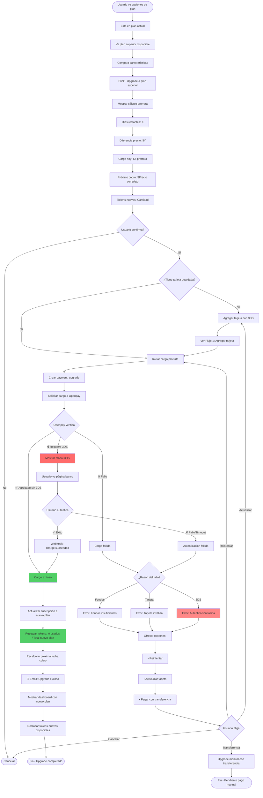

# Diagramas de Flujo de Usuario
## Sistema de Suscripciones - Agenda Médica SaaS

**Versión:** 1.1  
**Fecha:** Enero 2026  
**Actualización:** Integración 3D Secure (3DS)

---

## 📑 Tabla de Contenidos

1. [Flujo 1: Registro y Trial con 3DS](#flujo-1-registro-y-trial-con-3ds)
2. [Flujo 2: Renovación Automática con MIT/3DS](#flujo-2-renovación-automática-con-mit3ds)
3. [Flujo 3: Pagos Manuales (Transferencia)](#flujo-3-pagos-manuales-transferencia)
4. [Flujo 4: Upgrade de Plan con 3DS](#flujo-4-upgrade-de-plan-con-3ds)
5. [Flujo 5: Downgrade de Plan](#flujo-5-downgrade-de-plan)
6. [Flujo 6: Sistema de Referidos](#flujo-6-sistema-de-referidos)
7. [Flujo 7: Aplicación de Cupón](#flujo-7-aplicación-de-cupón)
8. [Flujo 8: Solicitud de Factura](#flujo-8-solicitud-de-factura)
9. [🆕 Flujo 9: Autenticación de Pago Pendiente (3DS)](#flujo-9-autenticación-de-pago-pendiente-3ds)

---

## Flujo 1: Registro y Trial con 3DS

**Objetivo:** Usuario nuevo se registra, agrega tarjeta con autenticación 3DS y activa su trial.

**Actores:** Usuario nuevo, Sistema, Openpay, Banco Emisor

**⚠️ Cambios vs versión anterior:** Agregado proceso completo de autenticación 3D Secure obligatorio.


**Puntos clave:**
- ✅ **3DS es obligatorio** en el primer pago
- ✅ Usuario ve **modal/iframe** (no redirect completo - mejor UX)
- ✅ Múltiples métodos de autenticación (SMS, app, biometría)
- ✅ Timeout de **15 minutos**
- ✅ Opciones de reintento claras
- ✅ Mensajes tranquilizadores ("Es por tu seguridad")

**Estados del pago durante el flujo:**
1. `pending` → Pago creado
2. `processing` → Enviado a Openpay
3. `requires_3ds` → Esperando autenticación usuario
4. `authenticating` → Usuario en modal del banco
5. `authenticated` → Autenticación exitosa
6. `completed` → Pago completado, trial activo

**Tiempo estimado:**
- Sin problemas: **3-5 minutos**
- Con reintento: **5-8 minutos**

---

## Flujo 2: Renovación Automática con MIT/3DS

**Objetivo:** Renovar suscripción automáticamente, usando MIT cuando sea posible, o solicitando autenticación 3DS si el banco lo requiere.

**Actores:** CronJob, Sistema, Openpay, Banco Emisor, Usuario

**⚠️ Cambios vs versión anterior:** Agregado manejo de MIT (exención 3DS) y flujo alternativo si se requiere autenticación.


**Decisiones clave del flujo:**

**1. ¿Cuándo usar MIT?**
- Siempre en renovaciones automáticas
- Solo funciona si primer pago tuvo 3DS exitoso
- El banco puede rechazarlo de todos modos

**2. ¿Qué pasa si el banco requiere 3DS en renovación?**
- Sistema NO puede procesar automáticamente (usuario no está presente)
- Se envía email urgente al usuario
- Usuario tiene 24h para actuar
- Si no actúa, cuenta como fallo → reintentos

**3. Tipos de fallo:**
- **Requiere 3DS:** Email especial, 24h para autenticar
- **Fondos/Tarjeta:** Reintentos automáticos
- **Técnico:** Reintentos automáticos

**Métricas a monitorear:**
- % de renovaciones con MIT exitoso (objetivo: >70%)
- % de renovaciones que requieren 3DS (baseline para detectar cambios)
- Tasa de respuesta a email #20 en 24h (objetivo: >60%)
- % de usuarios que completan autenticación solicitada (objetivo: >80%)

---

## Flujo 3: Pagos Manuales (Transferencia)

**Objetivo:** Usuario sin tarjeta (o que prefiere no agregar) puede pagar con transferencia bancaria.

**Actores:** Usuario, Sistema, Banco

**✅ Sin cambios:** Este flujo NO requiere 3DS porque no usa tarjeta.

```mermaid
flowchart TD
    Start([Usuario selecciona plan]) --> CheckMethod{¿Método de pago?}
    
    CheckMethod -->|Tarjeta| CardFlow[Ver Flujo 1/2]
    CheckMethod -->|Transferencia| SelectTransfer[Selecciona transferencia]
    
    SelectTransfer --> ConfirmPlan[Confirmar plan y monto]
    ConfirmPlan --> GenerateOrder[Sistema genera orden de pago]
    
    GenerateOrder --> CreateRef[Crear referencia única]
    CreateRef --> CalcDue[Calcular fecha límite]
    CalcDue --> SaveOrder[Guardar en payments:  status=pending]
    
    SaveOrder --> EmailInstructions[📧 Email:  Instrucciones de pago]
    
    EmailInstructions --> ShowDetails[Mostrar en email:]
    ShowDetails --> Detail1[• Referencia única]
    Detail1 --> Detail2[• Monto exacto]
    Detail2 --> Detail3[• Datos bancarios según país]
    Detail3 --> Detail4[• Fecha límite]
    Detail4 --> Detail5[• Instrucciones paso a paso]
    
    Detail5 --> UserReceives[Usuario recibe email]
    UserReceives --> UserDecision{Usuario decide}
    
    UserDecision -->|Paga en banco/app| UserTransfers[Realiza transferencia]
    UserDecision -->|No paga| Timeout{¿Pasó fecha límite?}
    
    UserTransfers --> BankProcesses[Banco procesa transferencia]
    
    BankProcesses --> DetectionMethod{¿Cómo se detecta?}
    
    DetectionMethod -->|Automático - Webhook| WebhookReceived[Webhook bancario]
    DetectionMethod -->|Manual - Admin| AdminChecks[Admin verifica en banco]
    
    WebhookReceived --> ValidateRef[Validar referencia]
    AdminChecks --> ValidateRef
    
    ValidateRef --> RefMatch{¿Referencia coincide?}
    
    RefMatch -->|Sí| UpdatePayment[Actualizar payment:  completed]
    RefMatch -->|No| ManualReview[Revisión manual]
    
    ManualReview --> AdminAction{Admin decide}
    AdminAction -->|Válido| UpdatePayment
    AdminAction -->|Inválido| ContactUser[Contactar usuario]
    
    UpdatePayment --> ActivateSub[Activar/renovar suscripción]
    ActivateSub --> AssignTokens[Asignar tokens]
    AssignTokens --> EmailConfirm[📧 Email:  Pago confirmado]
    EmailConfirm --> MarkInvoice[Marcar para factura]
    MarkInvoice --> End([Fin - Suscripción activa])
    
    Timeout -->|Sí| ExpireOrder[Expirar orden de pago]
    ExpireOrder --> EmailExpired[📧 Email:  Orden expirada]
    EmailExpired --> OfferNew{¿Generar nueva orden?}
    OfferNew -->|Sí| GenerateOrder
    OfferNew -->|No| EndExpired([Fin - Orden expirada])
    
    ContactUser --> EndContact([Fin - Pendiente resolución])
    
    style UserTransfers fill:#4dabf7
    style UpdatePayment fill:#51cf66
    style ExpireOrder fill:#ff8787
```



**Datos bancarios según país:**

**México (SPEI):**
- CLABE interbancaria
- Beneficiario: Nombre empresa
- Banco: Nombre del banco
- Referencia: REF-XXXX-XXXX

**Colombia:**
- Número de cuenta
- Tipo de cuenta (Ahorros/Corriente)
- Banco: Nombre del banco
- NIT beneficiario
- Referencia:  REF-XXXX-XXXX

**Fecha límite:**
- Trial: 24 horas
- Renovación: 3 días
- Pago único: 7 días

**Ventajas para usuario:**
- No requiere tarjeta
- No requiere 3DS
- Mayor control del pago

**Desventajas:**
- Proceso manual
- Puede tardar 24-48h en confirmarse
- Usuario debe pagar cada mes (no automático)

---

## Flujo 4: Upgrade de Plan con 3DS

**Objetivo:** Usuario quiere subir de plan inmediatamente para obtener más tokens.

**Actores:** Usuario, Sistema, Openpay, Banco Emisor

**⚠️ Cambios vs versión anterior:** Agregado manejo de 3DS si el banco lo solicita durante el upgrade.



**Cálculo de prorrata (ejemplo):**

```
Plan actual:  Básico
- Precio: $100 MXN/mes
- Tokens:  1,000
- Tokens usados: 400
- Día del mes: 20 (10 días restantes)

Plan nuevo: Pro
- Precio: $300 MXN/mes
- Tokens: 5,000

Cálculo:
- Diferencia precio: $300 - $100 = $200
- Prorrata: $200 × (10 días / 30 días) = $66.67
- Cargo hoy: $66.67
- Próximo cobro (día 20): $300 completos

Tokens después de upgrade:
- Usados: 0
- Disponibles: 5,000 (completos del plan Pro)
```

**⚠️ Consideraciones 3DS:**
- Upgrade es iniciado por usuario (está presente)
- Puede requerir 3DS según monto y políticas del banco
- UX:  Usuario debe saber que puede ser redirigido
- Mensaje:  "Por seguridad, tu banco puede pedirte confirmar este pago"

**Tiempo estimado:**
- Sin 3DS: **30 segundos - 1 minuto**
- Con 3DS: **2-4 minutos**

---

## Flujo 5: Downgrade de Plan

**Objetivo:** Usuario quiere bajar de plan para ahorrar en próximas renovaciones.

**Actores:** Usuario, Sistema

**✅ Sin cambios significativos:** No requiere pago inmediato, por lo tanto no hay 3DS.

```mermaid
flowchart TD
    Start([Usuario ve opciones de plan]) --> CurrentPlan[Está en plan actual]
    CurrentPlan --> SeeLower[Ve plan inferior disponible]
    SeeLower --> CompareFeatures[Compara características y precio]
    
    CompareFeatures --> ClickDowngrade[Click: Downgrade a plan inferior]
    
    ClickDowngrade --> ShowWarning[⚠️ Mostrar advertencia]
    ShowWarning --> Warn1[Cambio aplica al fin del período]
    Warn1 --> Warn2[Puedes usar tokens actuales hasta entonces]
    Warn2 --> Warn3[Nuevo plan tendrá menos tokens]
    Warn3 --> Warn4[Próximo cobro será menor]
    
    Warn4 --> ShowDetails[Mostrar detalles:]
    ShowDetails --> Detail1[Plan actual: X]
    Detail1 --> Detail2[Tokens actuales: Y usados / Z total]
    Detail2 --> Detail3[Fin período:  Fecha]
    Detail3 --> Detail4[Plan nuevo: A]
    Detail4 --> Detail5[Tokens nuevos: B/mes]
    Detail5 --> Detail6[Próximo cobro:  $C]
    
    Detail6 --> ConfirmDowngrade{Usuario confirma?}
    
    ConfirmDowngrade -->|No| Cancel([Cancelar])
    ConfirmDowngrade -->|Sí| ScheduleChange[Programar cambio de plan]
    
    ScheduleChange --> UpdateSub[Actualizar subscription:]
    UpdateSub --> SetPending[pending_plan_id = nuevo plan]
    SetPending --> SetDate[pending_plan_change_date = fin período]
    SetDate --> SetStatus[status = active cambio programado]
    
    SetStatus --> EmailConfirm[📧 Email: Downgrade programado]
    EmailConfirm --> EmailDetails[Detalles en email:]
    EmailDetails --> DetailEmail1[• Plan actual hasta:  Fecha]
    DetailEmail1 --> DetailEmail2[• Nuevo plan desde: Fecha]
    DetailEmail2 --> DetailEmail3[• Nuevo precio: $X]
    DetailEmail3 --> DetailEmail4[• Nuevos tokens: Y/mes]
    
    DetailEmail4 --> ShowDashboard[Mostrar dashboard]
    ShowDashboard --> IndicatorPending[Indicador:  Cambio programado]
    IndicatorPending --> AllowCancel[Opción: Cancelar cambio]
    
    AllowCancel --> UserContinues[Usuario continúa usando plan actual]
    UserContinues --> ConsumeTokens[Puede consumir tokens normalmente]
    
    ConsumeTokens --> WaitEndPeriod[Esperar fin de período]
    
    WaitEndPeriod --> CronCheck[CronJob: Verificar cambios programados]
    CronCheck --> ApplyChange[Aplicar cambio de plan]
    
    ApplyChange --> UpdatePlan[plan_id = pending_plan_id]
    UpdatePlan --> ClearPending[pending_plan_id = NULL]
    ClearPending --> NextBilling[Próximo cobro = nuevo precio]
    NextBilling --> EmailApplied[📧 Email:  Cambio aplicado]
    
    EmailApplied --> End([Fin - Downgrade completado])
    
    AllowCancel --> UserCancels{¿Usuario cancela cambio?}
    UserCancels -->|Sí| CancelSchedule[Cancelar cambio programado]
    UserCancels -->|No| UserContinues
    
    CancelSchedule --> ClearSchedule[Limpiar pending_plan_id]
    ClearSchedule --> EmailCancelled[📧 Email: Cambio cancelado]
    EmailCancelled --> StayCurrentPlan([Fin - Se mantiene plan actual])
    
    style ScheduleChange fill:#4dabf7
    style ApplyChange fill:#51cf66
    style ShowWarning fill:#ffd43b
```



**Ventanas de tiempo:**
- Usuario solicita downgrade: **En cualquier momento**
- Cambio se aplica: **Al finalizar período actual**
- Usuario puede cancelar el cambio programado: **Hasta 1 día antes del cambio**

**Diferencia vs Upgrade:**
- **Upgrade:** Inmediato (cobra prorrata hoy)
- **Downgrade:** Programado (cobra menos después)

**Razón:** No tiene sentido cobrar "menos" inmediatamente (usuario ya pagó el período completo).

**⚠️ Edge case:** Usuario en plan anual con cobros mensuales
- Debe completar 12 meses del compromiso
- Downgrade solo aplica después de cumplir contrato
- Sistema valida que hayan pasado 12 meses

---

## Flujo 6: Sistema de Referidos

**Objetivo:** Usuario invita a amigos y ambos obtienen beneficios cuando el referido hace su primer pago.

**Actores:** Referidor (usuario actual), Referido (nuevo usuario), Sistema

**✅ Sin cambios:** 3DS no afecta este flujo directamente (el pago del referido sigue su flujo normal).

```mermaid
flowchart TD
    Start([Usuario logueado]) --> AccessReferrals[Accede a sección Referidos]
    AccessReferrals --> ShowCode[Sistema muestra código único]
    ShowCode --> GenerateLink[Genera link único]
    
    GenerateLink --> Display[Mostrar en pantalla:]
    Display --> Code[Código: CESAR2026]
    Code --> Link[Link: app.com/register?ref=abc123]
    Link --> ShareButtons[Botones compartir:  WhatsApp, Email, Copy]
    
    ShareButtons --> UserShares{Usuario comparte}
    
    UserShares -->|WhatsApp| ShareWA[Envía por WhatsApp]
    UserShares -->|Email| ShareEmail[Envía por email]
    UserShares -->|Copy| CopyLink[Copia link]
    
    ShareWA --> FriendReceives[Amigo recibe invitación]
    ShareEmail --> FriendReceives
    CopyLink --> FriendReceives
    
    FriendReceives --> FriendClicks{Amigo hace clic? }
    
    FriendClicks -->|No| NoAction([No hay acción])
    FriendClicks -->|Sí| OpenLink[Abre link]
    
    OpenLink --> DetectRef[Sistema detecta parámetro ref]
    DetectRef --> ValidateCode{¿Código válido?}
    
    ValidateCode -->|No| NormalReg[Registro normal sin referido]
    ValidateCode -->|Sí| StoreRef[Guardar referido_por]
    
    StoreRef --> ShowBenefit[Mostrar beneficio al referido]
    ShowBenefit --> BenefitMsg[💰 Tienes 10% descuento primer mes]
    BenefitMsg --> RegisterFlow[Continúa registro normal]
    
    RegisterFlow --> FriendRegisters[Amigo completa registro]
    FriendRegisters --> FriendTrial[Amigo activa trial]
    
    FriendTrial --> CreateReferral[Crear registro en referrals:]
    CreateReferral --> RefStatus[status = pending]
    
    RefStatus --> WaitFirstPayment[Esperar primer pago del referido]
    
    WaitFirstPayment --> FriendPays{¿Referido hace primer pago?}
    
    FriendPays -->|No - Cancela trial| RefExpired[Referral:  status = expired]
    FriendPays -->|Sí - Paga después trial| ProcessBenefits[Procesar beneficios]
    
    RefExpired --> EndExpired([Fin - Sin beneficios])
    
    ProcessBenefits --> GrantReferrerBenefits[Otorgar a REFERIDOR:]
    GrantReferrerBenefits --> Benefit1[• Descuento 20% próximo mes]
    Benefit1 --> Benefit2[• 1,000 tokens extra]
    Benefit2 --> Benefit3[• $100 crédito plataforma]
    
    Benefit3 --> GrantReferredBenefits[Otorgar a REFERIDO:]
    GrantReferredBenefits --> Benefit4[• Descuento 10% primer mes]
    
    Benefit4 --> UpdateReferral[Actualizar referral:]
    UpdateReferral --> RefComplete[status = completed]
    RefComplete --> RefDate[completed_at = ahora]
    
    RefDate --> EmailReferrer[📧 Email a referidor:  Beneficios otorgados]
    EmailReferrer --> EmailReferred[📧 Email a referido:  Bienvenida con descuento]
    
    EmailReferred --> UpdateDashboard[Actualizar dashboard referidor]
    UpdateDashboard --> ShowStats[Mostrar estadísticas:]
    ShowStats --> Stat1[Referidos totales: X]
    Stat1 --> Stat2[Beneficios ganados: $Y]
    Stat2 --> Stat3[Tokens extra obtenidos: Z]
    
    Stat3 --> CheckLimit{¿Alcanzó límite referidos?}
    
    CheckLimit -->|No| CanRefer[Puede seguir refiriendo]
    CheckLimit -->|Sí| MaxReached[Límite alcanzado]
    
    CanRefer --> End([Fin - Puede referir más])
    MaxReached --> EndMax([Fin - Máximo alcanzado])
    NormalReg --> EndNormal([Fin - Registro sin referido])
    
    style ProcessBenefits fill:#51cf66
    style GrantReferrerBenefits fill:#51cf66
    style RefComplete fill:#51cf66
```



**Configuración de beneficios (ejemplo):**

**Referidor obtiene:**
- ✅ Descuento:  20% en próximo mes
- ✅ Tokens extra: 1,000 tokens bonus (únicos, no mensuales)
- ✅ Crédito:  $100 MXN para pagar futuras facturas

**Referido obtiene:**
- ✅ Descuento: 10% en primer mes de pago

**Reglas:**
- ✅ Beneficio se otorga al **primer pago del referido** (no en trial)
- ✅ Un referido = un beneficio (no renovable)
- ✅ Repetible:  Puede referir múltiples amigos
- ✅ Límite: Configurable (ej: máximo 10 referidos)

**Tracking:**
- Cookie/localStorage:  30 días
- Si usuario no se registra inmediato, código persiste
- Si limpia cookies, se pierde tracking

**Prevención de abuso:**
- ✅ Validar que referido sea usuario nuevo (email no existe)
- ✅ Validar que referido complete trial y pague
- ✅ Límite máximo por referidor
- ✅ Detección de patrones sospechosos (misma IP, mismo método pago)

---

## Flujo 7: Aplicación de Cupón

**Objetivo:** Usuario aplica un cupón de descuento al seleccionar plan o durante suscripción activa.

**Actores:** Usuario, Sistema

**✅ Sin cambios:** 3DS no afecta validación de cupones (solo reduce monto a cobrar).

```mermaid
flowchart TD
    Start([Usuario en selección de plan]) --> SeePlan[Ve plan con precio normal]
    SeePlan --> SeeField[Ve campo:  Código de cupón opcional]
    
    SeeField --> HasCoupon{¿Tiene cupón?}
    
    HasCoupon -->|No| NoCoupon[Continúa sin cupón]
    HasCoupon -->|Sí| EnterCode[Ingresa código]
    
    EnterCode --> ClickApply[Click: Aplicar cupón]
    ClickApply --> SendCode[Envía código al backend]
    
    SendCode --> ValidateCoupon[Backend valida cupón]
    ValidateCoupon --> Check1{¿Cupón existe?}
    
    Check1 -->|No| ErrorNotFound[❌ Error: Cupón no encontrado]
    Check1 -->|Sí| Check2{¿Está activo?}
    
    Check2 -->|No| ErrorInactive[❌ Error:  Cupón inactivo]
    Check2 -->|Sí| Check3{¿No expiró?}
    
    Check3 -->|Expiró| ErrorExpired[❌ Error: Cupón expirado]
    Check3 -->|Vigente| Check4{¿Aplica al plan seleccionado?}
    
    Check4 -->|No| ErrorPlan[❌ Error: No aplica a este plan]
    Check4 -->|Sí| Check5{¿Usuario no lo usó antes?}
    
    Check5 -->|Ya lo usó| ErrorUsed[❌ Error:  Ya usaste este cupón]
    Check5 -->|No usó| Check6{¿No alcanzó límite de usos?}
    
    Check6 -->|Límite alcanzado| ErrorLimit[❌ Error: Cupón agotado]
    Check6 -->|Disponible| CouponValid[✅ Cupón válido]
    
    ErrorNotFound --> ShowError[Mostrar mensaje de error]
    ErrorInactive --> ShowError
    ErrorExpired --> ShowError
    ErrorPlan --> ShowError
    ErrorUsed --> ShowError
    ErrorLimit --> ShowError
    
    ShowError --> RetryOption{¿Reintentar?}
    RetryOption -->|Sí| EnterCode
    RetryOption -->|No| NoCoupon
    
    CouponValid --> CalcDiscount[Calcular descuento]
    CalcDiscount --> TypeCheck{¿Tipo cupón?}
    
    TypeCheck -->|Porcentaje| CalcPercentage[Descuento = Precio × Porcentaje%]
    TypeCheck -->|Fijo| CalcFixed[Descuento = Monto fijo]
    
    CalcPercentage --> ShowNewPrice[Mostrar precio con descuento]
    CalcFixed --> ShowNewPrice
    
    ShowNewPrice --> Display[Mostrar en pantalla:]
    Display --> Price1[Precio original: $X]
    Price1 --> Discount[Descuento: -$Y]
    Discount --> Price2[Precio final: $Z]
    Price2 --> Duration[Duración descuento: N meses o permanente]
    
    Duration --> UserConfirms{Usuario confirma?}
    
    UserConfirms -->|No| RemoveCoupon[Quitar cupón]
    UserConfirms -->|Sí| ApplyCoupon[Aplicar cupón]
    
    RemoveCoupon --> NoCoupon
    
    ApplyCoupon --> SaveCoupon[Guardar en user_coupons]
    SaveCoupon --> IncrementUsage[Incrementar current_usage del cupón]
    IncrementUsage --> StoreSub[Asociar cupón a suscripción]
    
    StoreSub --> ProcessPayment[Procesar pago con descuento]
    ProcessPayment --> ChargeAmount[Cobra monto con descuento]
    
    ChargeAmount --> Success{¿Pago exitoso?}
    
    Success -->|Sí| Activate[Activar suscripción]
    Success -->|No| HandleFailure[Manejar fallo pago]
    
    Activate --> EmailConfirm[📧 Email: Confirmación con descuento]
    EmailConfirm --> ShowDashboard[Mostrar dashboard]
    ShowDashboard --> IndicateCoupon[Indicador: Descuento activo]
    
    IndicateCoupon --> CheckRenewal[En cada renovación:]
    CheckRenewal --> ValidateDuration{¿Descuento aún aplica?}
    
    ValidateDuration -->|Sí| ApplyRenewal[Aplicar descuento]
    ValidateDuration -->|No - Expiró duración| RemoveExpired[Remover descuento]
    
    ApplyRenewal --> ChargeDiscounted[Cobrar con descuento]
    RemoveExpired --> ChargeNormal[Cobrar precio normal]
    
    ChargeDiscounted --> End([Fin - Con descuento])
    ChargeNormal --> EndNormal([Fin - Precio normal])
    
    NoCoupon --> EndNoCoupon([Fin - Sin cupón])
    HandleFailure --> EndFail([Fin - Pago fallido])
    
    style CouponValid fill:#51cf66
    style ShowNewPrice fill:#4dabf7
    style ApplyCoupon fill:#51cf66
    style ShowError fill:#ff8787
```



**Tipos de cupón:**

**1. Porcentaje:**
```
Código:  PROMO20
Tipo: Porcentaje
Valor: 20%
Precio original: $300 MXN
Descuento: $60 MXN
Precio final: $240 MXN
```

**2. Precio fijo:**
```
Código: DESC50
Tipo: Fijo
Valor: $50 MXN
Precio original: $300 MXN
Descuento: $50 MXN
Precio final: $250 MXN
```

**Duración:**
- **Permanente:** Aplica mientras mantenga suscripción
- **Temporal:** Solo X meses (ej: 3 meses, luego precio normal)

**Validaciones completas:**
1. ✅ Cupón existe en BD
2. ✅ Estado activo (`active=true`)
3. ✅ No expiró (`expires_at > now()` o `NULL`)
4. ✅ Aplica al plan (`applicable_plans` incluye plan o es `NULL`)
5. ✅ Usuario no lo usó (`user_coupons` no tiene registro)
6. ✅ No alcanzó límite (`current_usage < usage_limit` o `NULL`)

**Edge cases:**
- **Usuario cambia de plan:** Cupón puede o no aplicar al nuevo plan (validar)
- **Usuario cancela y regresa:** No puede reusar mismo cupón
- **Cupón expira durante suscripción:** Próxima renovación ya no tiene descuento

---

## Flujo 8: Solicitud de Factura

**Objetivo:** Usuario solicita factura electrónica de un pago realizado. 

**Actores:** Usuario, Sistema, Admin, PAC/DIAN (externo)

**✅ Sin cambios:** 3DS no afecta facturación (solo confirmación de pago ya realizado).

```mermaid
flowchart TD
    Start([Usuario logueado]) --> AccessInvoices[Accede a sección Facturas]
    AccessInvoices --> SeePayments[Ve historial de pagos]
    
    SeePayments --> SelectPayment{Selecciona pago sin factura}
    
    SelectPayment --> CheckTime{¿Dentro del límite de tiempo?}
    
    CheckTime -->|No - México >1 mes| ErrorTimeMX[❌ Error: Límite 1 mes vencido]
    CheckTime -->|No - Colombia >5 días| ErrorTimeCO[❌ Error: Límite 5 días vencido]
    CheckTime -->|Sí| CheckBillingData{¿Tiene datos fiscales?}
    
    ErrorTimeMX --> EndError([Fin - Fuera de tiempo])
    ErrorTimeCO --> EndError
    
    CheckBillingData -->|No| RedirectBilling[Redirigir a completar datos]
    CheckBillingData -->|Sí| ValidateBilling{¿Datos completos?}
    
    RedirectBilling --> FillBillingForm[Formulario datos fiscales]
    
    FillBillingForm --> CountryCheck{¿País? }
    
    CountryCheck -->|México| FillMX[RFC, Razón social, Régimen, CP, Uso CFDI]
    CountryCheck -->|Colombia| FillCO[NIT, Razón social, Tipo persona, Dirección, Ciudad, Depto]
    
    FillMX --> SaveBilling[Guardar en billing_data]
    FillCO --> SaveBilling
    SaveBilling --> ValidateBilling
    
    ValidateBilling -->|No - Incompletos| ErrorBilling[❌ Error:  Datos incompletos]
    ValidateBilling -->|Sí| ShowSummary[Mostrar resumen:]
    
    ErrorBilling --> FillBillingForm
    
    ShowSummary --> Sum1[Pago: $X Fecha]
    Sum1 --> Sum2[Datos fiscales: Y]
    Sum2 --> Sum3[Factura se enviará a:  email]
    
    Sum3 --> UserConfirms{Usuario confirma solicitud?}
    
    UserConfirms -->|No| Cancel([Cancelar])
    UserConfirms -->|Sí| CreateRequest[Crear solicitud]
    
    CreateRequest --> UpdateInvoice[Crear registro invoices:]
    UpdateInvoice --> InvStatus[status = requested]
    InvStatus --> InvRequested[requested_at = ahora]
    InvRequested --> InvNull[sent_at = NULL, file_url = NULL]
    
    InvNull --> EmailUser[📧 Email a usuario:  Solicitud recibida]
    EmailUser --> NotifyAdmin[🔔 Notificar admin]
    
    NotifyAdmin --> AdminDashboard[Admin ve en dashboard:]
    AdminDashboard --> PendingList[Lista solicitudes pendientes]
    
    PendingList --> AdminAccess[Admin accede a solicitud]
    AdminAccess --> SeeDetails[Ve detalles completos:]
    SeeDetails --> Det1[Usuario, monto, fecha pago]
    Det1 --> Det2[Datos fiscales completos]
    Det2 --> Det3[Botón:  Generar factura]
    
    Det3 --> AdminGenerates{Admin genera factura}
    
    AdminGenerates --> ExternalSystem[Sistema externo PAC/DIAN]
    ExternalSystem --> GeneratePDF[Genera factura PDF]
    
    GeneratePDF --> DownloadPDF[Admin descarga PDF]
    DownloadPDF --> UploadToPlatform[Admin sube PDF a plataforma]
    
    UploadToPlatform --> SaveFile[Guardar archivo en storage]
    SaveFile --> UpdateInvoiceRecord[Actualizar invoice:]
    UpdateInvoiceRecord --> InvFile[file_url = ruta_archivo]
    InvFile --> InvSent[sent_at = ahora]
    InvSent --> InvComplete[status = completed]
    
    InvComplete --> EmailInvoice[📧 Email a usuario con PDF adjunto]
    EmailInvoice --> UserReceives[Usuario recibe factura]
    
    UserReceives --> UserDashboard[Usuario ve en dashboard]
    UserDashboard --> DownloadOption[Opción:  Descargar factura]
    
    DownloadOption --> End([Fin - Factura entregada])
    
    style CreateRequest fill:#4dabf7
    style GeneratePDF fill:#51cf66
    style EmailInvoice fill:#51cf66
    style ErrorTimeMX fill:#ff8787
    style ErrorTimeCO fill:#ff8787
```



**Límites de tiempo por país:**

**México:**
- ✅ **Mismo mes del pago**
- Ejemplo:  Pago el 25 de enero → Límite: 31 de enero 23:59
- Razón:  Normativa SAT

**Colombia:**
- ✅ **5 días hábiles después del pago**
- Ejemplo: Pago lunes → Límite: lunes siguiente
- Razón: Normativa DIAN

**Datos fiscales requeridos:**

**México (CFDI):**
```
RFC:  XAXX010101000
Razón social:  Empresa SA de CV
Régimen fiscal: 612 - Personas Físicas con Actividades Empresariales
Código postal: 06600
Uso CFDI: G03 - Gastos en general
```

**Colombia (DIAN):**
```
NIT: 900123456-7
Razón social: Empresa SAS
Tipo persona: Jurídica
Dirección: Calle 123 #45-67
Ciudad: Bogotá
Departamento: Cundinamarca
```

**Generación externa:**
- **México:** PAC (Proveedor Autorizado Certificación) - ej:  Facturama, FacturAPI
- **Colombia:** Plataforma DIAN - ej: Siigo, Alegra

**Almacenamiento:**
- PDF se guarda en servidor (FTP mismo servidor)
- Ruta: `/storage/invoices/YYYY/MM/invoice_{id}.pdf`
- Disponible para descarga por usuario indefinidamente

---

## 🆕 Flujo 9: Autenticación de Pago Pendiente (3DS)

**Objetivo:** Usuario recibe notificación de que su pago requiere autenticación y completa el proceso.

**Actores:** Usuario, Sistema, Openpay, Banco Emisor

**✨ NUEVO:** Este flujo es específico para cuando una renovación automática requiere 3DS.

```mermaid
flowchart TD
    Start([Usuario recibe Email #20]) --> EmailReceived[📧 Email:  Acción requerida - Autentica tu pago]
    
    EmailReceived --> EmailContent[Ve contenido:]
    EmailContent --> Content1[Asunto: 🔒 Acción requerida]
    Content1 --> Content2[Pago de $X requiere autenticación]
    Content2 --> Content3[Botón: Autenticar mi pago ahora]
    Content3 --> Content4[Tiempo límite: 24 horas]
    Content4 --> Content5[Razón: Seguridad de tu banco]
    
    Content5 --> UserDecision{Usuario decide}
    
    UserDecision -->|Ignora email| Timeout24h[Timeout 24h]
    UserDecision -->|Hace clic en botón| ClickLink[Clic en link email]
    
    ClickLink --> CheckLogin{¿Usuario logueado?}
    
    CheckLogin -->|No| RedirectLogin[Redirigir a login]
    CheckLogin -->|Sí| LoadAuthPage[Cargar página autenticación]
    
    RedirectLogin --> UserLogin[Usuario hace login]
    UserLogin --> LoadAuthPage
    
    LoadAuthPage --> ShowPage[Mostrar página de autenticación]
    ShowPage --> DisplayInfo[Mostrar información:]
    
    DisplayInfo --> Info1[💳 Pago pendiente de autenticación]
    Info1 --> Info2[Plan: X]
    Info2 --> Info3[Monto: $Y]
    Info3 --> Info4[Fecha: Z]
    Info4 --> Info5[Estado: Requiere autenticación]
    
    Info5 --> ExplainWhy[Explicar por qué:]
    ExplainWhy --> Why1[🔒 Tu banco requiere verificar tu identidad]
    Why1 --> Why2[✅ Es un proceso seguro y rápido]
    Why2 --> Why3[⏱️ Toma menos de 1 minuto]
    Why3 --> Why4[🛡️ Protege tu dinero de fraude]
    
    Why4 --> ButtonAuth[Botón grande: Autenticar mi pago]
    
    ButtonAuth --> UserClicks{Usuario hace clic? }
    
    UserClicks -->|No| UserLeaves[Usuario sale de página]
    UserClicks -->|Sí| InitAuth[Iniciar proceso 3DS]
    
    UserLeaves --> Timeout24h
    
    InitAuth --> RetryCharge[Reintentar cargo con 3DS]
    RetryCharge --> OpenpayRequest[Solicitar a Openpay con 3DS=true]
    
    OpenpayRequest --> OpenpayResponse{Respuesta Openpay}
    
    OpenpayResponse -->|Requiere 3DS| Get3DSURL[Obtener URL autenticación]
    OpenpayResponse -->|Error técnico| ErrorTech[Error técnico]
    
    Get3DSURL --> Show3DSModal[Mostrar modal/iframe 3DS]
    Show3DSModal --> LoadingMsg[Mensaje:  Cargando...]
    LoadingMsg --> BankPage[Cargar página del banco]
    
    BankPage --> PageLoaded{¿Página carga OK?}
    
    PageLoaded -->|No - Timeout| Error3DSLoad[Error:  No se pudo cargar]
    PageLoaded -->|Sí| ShowBankAuth[Mostrar opciones del banco]
    
    ShowBankAuth --> BankOptions[Opciones presentadas:]
    BankOptions --> Opt1[• Enviar código SMS]
    Opt1 --> Opt2[• Confirmar en app bancaria]
    Opt2 --> Opt3[• Biometría huella/Face ID]
    
    Opt3 --> UserAuthenticates{Usuario autentica}
    
    UserAuthenticates -->|✅ SMS correcto| AuthSuccess[Autenticación exitosa]
    UserAuthenticates -->|✅ App confirmada| AuthSuccess
    UserAuthenticates -->|✅ Biometría OK| AuthSuccess
    UserAuthenticates -->|❌ Código incorrecto| AuthFailed[Autenticación fallida]
    UserAuthenticates -->|❌ Rechaza en app| AuthFailed
    UserAuthenticates -->|❌ Biometría falla| AuthFailed
    UserAuthenticates -->|⏱️ Timeout 15min| AuthTimeout[Timeout autenticación]
    UserAuthenticates -->|⏱️ Usuario cierra modal| UserCancels[Usuario cancela]
    
    AuthSuccess --> BankConfirm[Banco confirma a Openpay]
    BankConfirm --> WebhookSuccess[Webhook: charge. succeeded]
    WebhookSuccess --> UpdatePayment[Actualizar payment:  completed]
    
    UpdatePayment --> RenewSub[Renovar suscripción]
    RenewSub --> ResetTokens[Resetear tokens]
    ResetTokens --> CloseModal[Cerrar modal 3DS]
    
    CloseModal --> ShowSuccess[✅ Mostrar mensaje éxito]
    ShowSuccess --> SuccessMsg[¡Pago completado exitosamente!]
    SuccessMsg --> SuccessDetails[Tu suscripción se renovó]
    SuccessDetails --> EmailConfirm[📧 Email:  Pago exitoso]
    
    EmailConfirm --> RedirectDashboard[Redirigir a dashboard]
    RedirectDashboard --> End([Fin - Pago completado])
    
    AuthFailed --> ShowErrorAuth[Mostrar error autenticación]
    AuthTimeout --> ShowErrorAuth
    UserCancels --> ShowErrorAuth
    Error3DSLoad --> ShowErrorAuth
    ErrorTech --> ShowErrorAuth
    
    ShowErrorAuth --> ExplainError[Explicar qué pasó]
    ExplainError --> OfferRetry[Ofrecer opciones:]
    
    OfferRetry --> RetryOpt1[• Reintentar autenticación]
    RetryOpt1 --> RetryOpt2[• Actualizar tarjeta]
    RetryOpt2 --> RetryOpt3[• Contactar soporte]
    
    RetryOpt3 --> UserChoice{Usuario elige}
    
    UserChoice -->|Reintentar| InitAuth
    UserChoice -->|Actualizar tarjeta| UpdateCard[Ir a actualizar tarjeta]
    UserChoice -->|Soporte| ContactSupport[Abrir chat soporte]
    UserChoice -->|Salir| UserExits[Usuario sale]
    
    UpdateCard --> UpdateCardFlow[Ver Flujo 1: Agregar tarjeta]
    UpdateCardFlow --> EndUpdate([Fin - Tarjeta actualizada])
    
    ContactSupport --> EndSupport([Fin - Ticket soporte])
    
    UserExits --> CountFail[Contar como fallo]
    Timeout24h --> CountFail
    
    CountFail --> MarkFailed[Marcar payment:  failed]
    MarkFailed --> TriggerRetries[Activar lógica de reintentos]
    TriggerRetries --> EndFailed([Fin - Fallo, reintentos programados])
    
    style EmailReceived fill:#ffd43b
    style Show3DSModal fill:#ff6b6b
    style AuthSuccess fill:#51cf66
    style ShowSuccess fill:#51cf66
    style ShowErrorAuth fill:#ff8787
    style Timeout24h fill:#ff8787
```



**Métricas de este flujo:**

| Métrica | Objetivo | Alertar si |
|---------|----------|------------|
| **Tasa de apertura email #20** | >60% | <50% |
| **Tasa de clic en botón** | >80% (de los que abren) | <70% |
| **Tasa de autenticación exitosa** | >85% (de los que intentan) | <75% |
| **Tiempo promedio completar** | <3 minutos | >5 minutos |
| **Tasa de abandono en modal** | <10% | >15% |
| **Timeout 24h (no actúan)** | <20% | >30% |

**Mensajes clave en la página:**

**Encabezado:**
```
🔒 Tu pago requiere autenticación adicional
```

**Explicación:**
```
Por seguridad, tu banco necesita verificar que realmente eres tú 
quien está autorizando este pago. 

Este es un proceso estándar de seguridad bancaria que protege 
tu dinero de fraude. 

Solo tomará 1 minuto completarlo.
```

**CTA (Call to Action):**
```
[Botón grande azul]
Autenticar mi pago de $300 MXN ahora
```

**Ayuda:**
```
¿Qué opciones de autenticación veré? 
• Código por SMS a tu celular
• Confirmación en tu app bancaria
• Huella digital o Face ID

¿Necesitas ayuda?   [Chat con soporte]
```

**Tiempo esperado por paso:**
1. Email → Clic:  **<5 minutos** (depende de usuario)
2. Clic → Login (si aplica): **30 segundos**
3. Página cargada → Clic botón: **30 segundos** (leer info)
4. Modal 3DS cargando:  **5-10 segundos**
5. Autenticación en banco: **30 segundos - 2 minutos**
6. Confirmación y cierre: **10 segundos**

**Total ideal:** **2-4 minutos**

---

## 📊 Resumen de Cambios por 3DS

| Flujo | Cambio | Impacto |
|-------|--------|---------|
| **Flujo 1: Registro + Trial** | 🔴 Alto | Agregado proceso 3DS obligatorio |
| **Flujo 2: Renovación Automática** | 🔴 Alto | MIT + manejo 3DS requerido |
| **Flujo 3: Transferencia** | 🟢 Ninguno | No usa tarjeta |
| **Flujo 4: Upgrade** | 🟡 Medio | Puede requerir 3DS |
| **Flujo 5: Downgrade** | 🟢 Ninguno | No cobra inmediato |
| **Flujo 6: Referidos** | 🟢 Ninguno | No afecta lógica |
| **Flujo 7: Cupones** | 🟢 Ninguno | Solo reduce monto |
| **Flujo 8: Factura** | 🟢 Ninguno | Post-pago |
| **🆕 Flujo 9: Auth 3DS** | 🔴 Nuevo | Flujo completo nuevo |

---

## 📚 Referencias

- [Documento 3DS Integration](./3